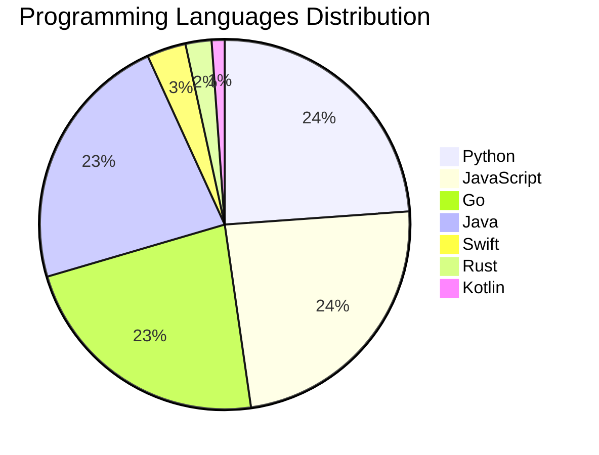

# 🚀 DevTech Auto News - Enhanced Edition


**DevTech Auto News Enhanced** is an advanced automated bot that aggregates trending topics in **AI**, **Web Development**, **Mobile**, **Cloud**, **DevOps**, and more from multiple sources including:

- 📰 [Dev.to](https://dev.to) - Developer community articles
- 🔥 [HackerNews](https://news.ycombinator.com) - Tech news discussions  
- 💻 [GitHub Trending](https://github.com/trending) - Trending repositories
- 🎯 Curated Interview Questions from multiple languages

## ✨ Features

✅ **Multi-Source Aggregation**: Combines articles from Dev.to, HackerNews, and GitHub  
✅ **Smart Categorization**: Automatically categorizes content into 10+ topics  
✅ **Image Support**: Displays cover images for visual appeal  
✅ **Pagination**: Fetches 50+ articles per update with deduplication  
✅ **Language Statistics**: Tracks programming language trends with charts  
✅ **Interview Questions**: Daily coding interview questions in multiple languages  
✅ **GitHub Actions**: Runs every 15 minutes automatically  

---

## 📊 Statistics Dashboard

### 📊 Articles by Category

**AI**: 🟦🟦🟦🟦🟦🟦🟦🟦🟦🟦🟦🟦🟦🟦🟦🟦🟦🟦🟦🟦 52 (49.5%)

**Tools**: 🟦🟦🟦🟦🟦🟦🟦🟦🟦🟦 26 (24.8%)

**Python**: 🟦🟦🟦🟦🟦🟦🟦🟦 22 (21.0%)

**JavaScript**: 🟦🟦🟦🟦🟦🟦🟦🟦 21 (20.0%)

**Security**: 🟦🟦🟦 9 (8.6%)

**DevOps**: 🟦🟦 6 (5.7%)

**WebDev**: 🟦🟦 6 (5.7%)

**Cloud**: 🟦🟦 6 (5.7%)

**Mobile**: 🟦 3 (2.9%)

**Database**: 🟦 2 (1.9%)


### 📡 Sources

- **Dev.to**: 60 articles
- **HackerNews**: 30 articles
- **GitHub**: 15 articles


### 💻 Programming Language Trends

```
Python          ██████████████████████████████ 23.9 (23.9%)
JavaScript      ██████████████████████████████ 23.9 (23.9%)
Go              ████████████████████████████ 22.7 (22.7%)
Java            ████████████████████████████ 22.7 (22.7%)
Swift           ████ 3.4 (3.4%)
Rust            ███ 2.3 (2.3%)
Kotlin          █ 1.1 (1.1%)

```




### 🏷️ Trending Tags

               


---

## 🛠️ How It Works

1. **Multi-Source Fetch**: Pulls from Dev.to (2 pages), HackerNews (3 topics), GitHub (3 languages)
2. **Smart Filter**: Uses keyword matching across 10+ categories  
3. **Deduplication**: Removes duplicate URLs  
4. **Image Extraction**: Captures cover images when available  
5. **Statistics**: Generates language trends and category breakdowns  
6. **Update Files**: Regenerates README and appends to comprehensive log  

---

## 📦 Installation & Usage

```bash
# Clone the repository
git clone https://github.com/Derrick-MUGISHA/github-activity-bot.git
cd github-activity-bot

# Install dependencies  
npm install

# Run manually
npm start

# Test mode
npm run test
```

---


# 🚀 DevTech Auto News - Enhanced Edition

## 📅 Latest Updates (2026-03-25 17:00 CAT)


### 🖼️ Featured Articles

<table>
<tr>
  <td align="center" width="33%">
    <a href="https://dev.to/francistrdev/check-up-with-each-other-2ogc">
      
      <br/>
      <b>Check Up with Each Other</b>
    </a>
    <br/>
    <sub>Dev.to</sub>
  </td>
  <td align="center" width="33%">
    <a href="https://dev.to/devteam/top-7-featured-dev-posts-of-the-week-4ig2">
      
      <br/>
      <b>Top 7 Featured DEV Posts of the Week</b>
    </a>
    <br/>
    <sub>Dev.to</sub>
  </td>
  <td align="center" width="33%">
    <a href="https://dev.to/ben/meme-monday-1bec">
      
      <br/>
      <b>Meme Monday</b>
    </a>
    <br/>
    <sub>Dev.to</sub>
  </td>
</tr>
<tr>
  <td align="center" width="33%">
    <a href="https://dev.to/ghostbuild/your-agent-can-think-it-cant-remember-5e1o">
      
      <br/>
      <b>your agent can think. it can't remember.</b>
    </a>
    <br/>
    <sub>Dev.to</sub>
  </td>
  <td align="center" width="33%">
    <a href="https://dev.to/helderberto/ai-writes-code-you-own-quality-19g0">
      
      <br/>
      <b>AI Writes Code. You Own Quality.</b>
    </a>
    <br/>
    <sub>Dev.to</sub>
  </td>
  <td align="center" width="33%">
    <a href="https://dev.to/gde/building-a-multimodal-cross-cloud-live-agent-with-adk-amazon-lightsail-and-gemini-cli-4p56">
      
      <br/>
      <b>Building a Multimodal Cross Cloud Live Agent with ...</b>
    </a>
    <br/>
    <sub>Dev.to</sub>
  </td>
</tr>
</table>


### 📰 Top Headlines

- [Check Up with Each Other](https://dev.to/francistrdev/check-up-with-each-other-2ogc) _[Dev.to]_
- [Top 7 Featured DEV Posts of the Week](https://dev.to/devteam/top-7-featured-dev-posts-of-the-week-4ig2) _[Dev.to]_
- [Meme Monday](https://dev.to/ben/meme-monday-1bec) _[Dev.to]_
- [your agent can think. it can't remember.](https://dev.to/ghostbuild/your-agent-can-think-it-cant-remember-5e1o) _[Dev.to]_
- [AI Writes Code. You Own Quality.](https://dev.to/helderberto/ai-writes-code-you-own-quality-19g0) _[Dev.to]_
- [Building a Multimodal Cross Cloud Live Agent with ADK, Amazon Lightsail, and Gemini CLI](https://dev.to/gde/building-a-multimodal-cross-cloud-live-agent-with-adk-amazon-lightsail-and-gemini-cli-4p56) _[Dev.to]_
- [Tend (and about Vibe Coding)](https://dev.to/iamschulz/tend-and-about-vibe-coding-2501) _[Dev.to]_
- [Generating an aerial view of your project with OpenRewrite](https://dev.to/onepoint/generating-an-aerial-view-of-your-project-with-openrewrite-49kk) _[Dev.to]_
- [The Missing Link Between AI Agents and the Code They Modify](https://dev.to/jimutt/the-missing-link-between-ai-agents-and-the-code-they-modify-kke) _[Dev.to]_
- [AI Crash Course: Hallucinations](https://dev.to/kathryngrayson/ai-crash-course-hallucinations-1jeg) _[Dev.to]_
- [Mastering Google Apps Script CI/CD: Seamless GitHub Actions Integration with gas-fakes](https://dev.to/gde/mastering-google-apps-script-cicd-seamless-github-actions-integration-with-gas-fakes-4c6h) _[Dev.to]_
- [A Small Hardening Trick for .env.local: dotenvx + OS Keychain](https://dev.to/ustun/a-small-hardening-trick-for-envlocal-dotenvx-os-keychain-2533) _[Dev.to]_
- [Implementing a RAG system: Crawl](https://dev.to/gde/implementing-a-rag-system-crawl-5li) _[Dev.to]_
- [PageSpeed 35 to 90: What I Got Wrong, Then Right](https://dev.to/genuineswe/pagespeed-35-to-90-what-i-got-wrong-then-right-1o2m) _[Dev.to]_
- [I have never written a line of Python in my life. And yet, this week I built my first Python project. 🐍](https://dev.to/lkrryba/i-have-never-written-a-line-of-python-in-my-life-and-yet-this-week-i-built-my-first-python-3g0a) _[Dev.to]_
- [Building a Weather Station Using an Old Raspberry Pi](https://dev.to/nandofm/building-a-weather-station-using-an-old-raspberry-pi-5333) _[Dev.to]_
- [I’m Learning AI in Public, and I Think Developers Need to Chill a Bit](https://dev.to/jon_at_backboardio/im-learning-ai-in-public-and-i-think-developers-need-to-chill-a-bit-31d2) _[Dev.to]_
- [Deploy a Multi Agent ADK Application to Google Cloud Run](https://dev.to/gde/deploy-a-multi-agent-adk-application-to-google-cloud-run-59on) _[Dev.to]_
- [Engram: A new type of AI](https://dev.to/nodefiend/engram-a-new-type-of-ai-1jbd) _[Dev.to]_
- [HTML Was a Miracle. Now It’s a Bottleneck. What if we started over?](https://dev.to/niklabh/html-was-a-miracle-now-its-a-bottleneck-what-if-we-started-over-43bp) _[Dev.to]_

_Last automated update: Wed, 25 Mar 2026 17:48:26 CAT_


## 💡 Daily Interview Questions

_Sharpen your skills with these curated questions_

### 1. React: What is the Virtual DOM and how does React use it?

**Difficulty**: Easy | **Topics**: rendering, performance

<details>
<summary>💡 Hint</summary>

Diffing algorithm, reconciliation, efficiency

</details>

### 2. Java: What are Java Streams and how do they work?

**Difficulty**: Medium | **Topics**: functional programming, collections

<details>
<summary>💡 Hint</summary>

Lazy evaluation, pipeline, terminal operations

</details>

### 3. Database: Design a database schema for a social media platform

**Difficulty**: Hard | **Topics**: design, scalability

<details>
<summary>💡 Hint</summary>

Users, posts, relationships, indexes, partitioning

</details>


---

## 📚 Resources

- [Full News Archive](./data/news_log.md) - Complete history of all fetched articles
- [Statistics JSON](./data/stats.json) - Raw statistics data
- [Categorized Data](./data/categorized.json) - Articles organized by category
- [Interview Questions](./data/interview_questions.json) - Complete question bank

---

## 🤝 Contributing

Want to add more sources, categories, or interview questions? Feel free to:

1. Fork this repository
2. Add your improvements
3. Submit a pull request

---

## 📄 License

MIT License - Feel free to use and modify!

---

<p align="center">
  <b>Last automated update: Wed, 25 Mar 2026 15:48:26 GMT</b><br/>
  <sub>Powered by GitHub Actions | Made with ❤️ for developers</sub>
</p>

---

## 🔗 Quick Links

- [View Workflow](https://github.com/Derrick-MUGISHA/github-activity-bot/actions)
- [Report Issue](https://github.com/Derrick-MUGISHA/github-activity-bot/issues)
- [Suggest Feature](https://github.com/Derrick-MUGISHA/github-activity-bot/issues/new)
