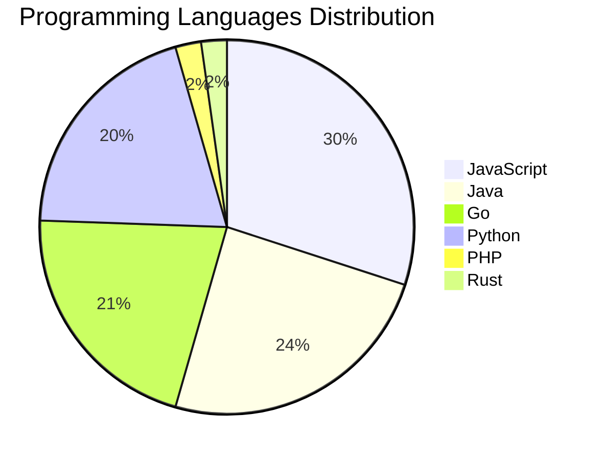

# 🚀 DevTech Auto News - Enhanced Edition


**DevTech Auto News Enhanced** is an advanced automated bot that aggregates trending topics in **AI**, **Web Development**, **Mobile**, **Cloud**, **DevOps**, and more from multiple sources including:

- 📰 [Dev.to](https://dev.to) - Developer community articles
- 🔥 [HackerNews](https://news.ycombinator.com) - Tech news discussions  
- 💻 [GitHub Trending](https://github.com/trending) - Trending repositories
- 🎯 Curated Interview Questions from multiple languages

## ✨ Features

✅ **Multi-Source Aggregation**: Combines articles from Dev.to, HackerNews, and GitHub  
✅ **Smart Categorization**: Automatically categorizes content into 10+ topics  
✅ **Image Support**: Displays cover images for visual appeal  
✅ **Pagination**: Fetches 50+ articles per update with deduplication  
✅ **Language Statistics**: Tracks programming language trends with charts  
✅ **Interview Questions**: Daily coding interview questions in multiple languages  
✅ **GitHub Actions**: Runs every 15 minutes automatically  

---

## 📊 Statistics Dashboard

### 📊 Articles by Category

**AI**: 🟦🟦🟦🟦🟦🟦🟦🟦🟦🟦🟦🟦🟦🟦🟦🟦🟦🟦🟦🟦 47 (44.8%)

**Tools**: 🟦🟦🟦🟦🟦🟦🟦🟦🟦🟦🟦🟦🟦 30 (28.6%)

**JavaScript**: 🟦🟦🟦🟦🟦🟦🟦🟦🟦🟦🟦 27 (25.7%)

**Python**: 🟦🟦🟦🟦🟦🟦🟦🟦 18 (17.1%)

**WebDev**: 🟦🟦🟦 8 (7.6%)

**Cloud**: 🟦🟦🟦 6 (5.7%)

**DevOps**: 🟦 3 (2.9%)

**Database**: 🟦 3 (2.9%)

**Security**: 🟦 3 (2.9%)

**Mobile**:  1 (1.0%)


### 📡 Sources

- **Dev.to**: 60 articles
- **HackerNews**: 30 articles
- **GitHub**: 15 articles


### 💻 Programming Language Trends

```
JavaScript      ██████████████████████████████ 30.0 (30.0%)
Java            ████████████████████████ 24.4 (24.4%)
Go              █████████████████████ 21.1 (21.1%)
Python          ████████████████████ 20.0 (20.0%)
PHP             ██ 2.2 (2.2%)
Rust            ██ 2.2 (2.2%)

```




### 🏷️ Trending Tags

               


---

## 🛠️ How It Works

1. **Multi-Source Fetch**: Pulls from Dev.to (2 pages), HackerNews (3 topics), GitHub (3 languages)
2. **Smart Filter**: Uses keyword matching across 10+ categories  
3. **Deduplication**: Removes duplicate URLs  
4. **Image Extraction**: Captures cover images when available  
5. **Statistics**: Generates language trends and category breakdowns  
6. **Update Files**: Regenerates README and appends to comprehensive log  

---

## 📦 Installation & Usage

```bash
# Clone the repository
git clone https://github.com/Derrick-MUGISHA/github-activity-bot.git
cd github-activity-bot

# Install dependencies  
npm install

# Run manually
npm start

# Test mode
npm run test
```

---


# 🚀 DevTech Auto News - Enhanced Edition

## 📅 Latest Updates (2026-03-04 3:00 CAT)


### 🖼️ Featured Articles

<table>
<tr>
  <td align="center" width="33%">
    <a href="https://dev.to/iamovi/i-built-a-social-platform-where-everything-vanishes-after-24-hours-3imk">
      
      <br/>
      <b>i built a social platform where everything vanishe...</b>
    </a>
    <br/>
    <sub>Dev.to</sub>
  </td>
  <td align="center" width="33%">
    <a href="https://dev.to/anchildress1/i-stopped-reviewing-code-a-backend-devs-experiment-with-google-gemini-5424">
      
      <br/>
      <b>I Stopped Reviewing Code: A Backend Dev’s Experime...</b>
    </a>
    <br/>
    <sub>Dev.to</sub>
  </td>
  <td align="center" width="33%">
    <a href="https://dev.to/thisisryanswift/saas-companies-fear-me-cloning-granola-for-linux-3pk0">
      
      <br/>
      <b>SaaS Companies Fear Me: Cloning* Granola for Linux</b>
    </a>
    <br/>
    <sub>Dev.to</sub>
  </td>
</tr>
<tr>
  <td align="center" width="33%">
    <a href="https://dev.to/francistrdev/i-used-google-gemini-for-the-first-time-a-deep-analysis-of-my-experience-so-far-2n12">
      
      <br/>
      <b>I used Google Gemini for the First Time. A Deep An...</b>
    </a>
    <br/>
    <sub>Dev.to</sub>
  </td>
  <td align="center" width="33%">
    <a href="https://dev.to/astrodeeptej/fusing-nasa-data-with-ai-how-i-built-cosmodex-and-won-the-mlh-data-hackfest-5fmm">
      
      <br/>
      <b>Fusing NASA Data with AI: How I Built CosmoDex and...</b>
    </a>
    <br/>
    <sub>Dev.to</sub>
  </td>
  <td align="center" width="33%">
    <a href="https://dev.to/devteam/top-7-featured-dev-posts-of-the-week-2of0">
      
      <br/>
      <b>Top 7 Featured DEV Posts of the Week</b>
    </a>
    <br/>
    <sub>Dev.to</sub>
  </td>
</tr>
</table>


### 📰 Top Headlines

- [i built a social platform where everything vanishes after 24 hours](https://dev.to/iamovi/i-built-a-social-platform-where-everything-vanishes-after-24-hours-3imk) _[Dev.to]_
- [I Stopped Reviewing Code: A Backend Dev’s Experiment with Google Gemini](https://dev.to/anchildress1/i-stopped-reviewing-code-a-backend-devs-experiment-with-google-gemini-5424) _[Dev.to]_
- [SaaS Companies Fear Me: Cloning* Granola for Linux](https://dev.to/thisisryanswift/saas-companies-fear-me-cloning-granola-for-linux-3pk0) _[Dev.to]_
- [I used Google Gemini for the First Time. A Deep Analysis of my Experience so far! ✨](https://dev.to/francistrdev/i-used-google-gemini-for-the-first-time-a-deep-analysis-of-my-experience-so-far-2n12) _[Dev.to]_
- [Fusing NASA Data with AI: How I Built CosmoDex and Won the MLH Data Hackfest!](https://dev.to/astrodeeptej/fusing-nasa-data-with-ai-how-i-built-cosmodex-and-won-the-mlh-data-hackfest-5fmm) _[Dev.to]_
- [Top 7 Featured DEV Posts of the Week](https://dev.to/devteam/top-7-featured-dev-posts-of-the-week-2of0) _[Dev.to]_
- [I Plugged Gemini Into My 10,000-Line Rental Platform. Here's What Happened.](https://dev.to/wilhelm_tell/i-plugged-gemini-into-my-10000-line-rental-platform-heres-what-happened-2epi) _[Dev.to]_
- [We had a big team offsite and I forgot meme monday yesterday 😭

But here is another post](https://dev.to/ben/we-had-a-big-team-offsite-and-i-forgot-meme-monday-yesterday-but-here-is-another-post-20j3) _[Dev.to]_
- [Building a Local PR Review Interface for Claude Code Plans](https://dev.to/eduardmaghakyan/building-a-local-pr-review-interface-for-claude-code-plans-57o2) _[Dev.to]_
- [Oooh very interesting](https://dev.to/ben/oooh-very-interesting-ohk) _[Dev.to]_
- [Mastering JavaScript Array Methods: A Beginner's Guide](https://dev.to/ritam369/mastering-javascript-array-methods-a-beginners-guide-3p89) _[Dev.to]_
- [Gemini 3.1 Flash-Lite: Built for intelligence at scale](https://dev.to/googleai/gemini-31-flash-lite-built-for-intelligence-at-scale-3i8e) _[Dev.to]_
- [Gemini 3.1 Flash-Lite: Developer guide and use cases](https://dev.to/googleai/gemini-31-flash-lite-developer-guide-and-use-cases-1hh) _[Dev.to]_
- [Serverless Bedrock: How I invoke Claude from Lambda in warrantyAI](https://dev.to/harisharavindan/serverless-bedrock-how-i-invoke-claude-from-lambda-in-warrantyai-3hk) _[Dev.to]_
- [Detecting and Editing Visual Objects with Gemini](https://dev.to/googleai/detecting-and-editing-visual-objects-with-gemini-116p) _[Dev.to]_
- [Meet BlokJS - 9 KB, No Build Step, Standalone, Full FE Framework](https://dev.to/maleta/meet-blokjs-9-kb-no-build-step-standalone-full-fe-framework-3gfg) _[Dev.to]_
- [How to make your first contribution to an open source project](https://dev.to/whitep4nth3r/how-to-make-your-first-contribution-to-an-open-source-project-5e50) _[Dev.to]_
- [I ship software with 13 AI agents. Here's what that actually looks like](https://dev.to/nmelo/i-ship-software-with-13-ai-agents-heres-what-that-actually-looks-like-420c) _[Dev.to]_
- [I Built a CLI to Find the Riskiest Code in Any Repo — Introducing Hotspots](https://dev.to/stephenc222/i-built-a-cli-to-find-the-riskiest-code-in-any-repo-introducing-hotspots-19ob) _[Dev.to]_
- [What should I do and learn in 2026?](https://dev.to/missamarakay/what-should-i-do-and-learn-in-2026-4enc) _[Dev.to]_

_Last automated update: Wed, 04 Mar 2026 03:47:03 CAT_


## 💡 Daily Interview Questions

_Sharpen your skills with these curated questions_

### 1. Java: What are Java Streams and how do they work?

**Difficulty**: Medium | **Topics**: functional programming, collections

<details>
<summary>💡 Hint</summary>

Lazy evaluation, pipeline, terminal operations

</details>

### 2. Database: Explain database indexing and when to use it

**Difficulty**: Medium | **Topics**: optimization, performance

<details>
<summary>💡 Hint</summary>

B-tree, trade-offs, query performance

</details>

### 3. JavaScript: Explain event delegation and why it's useful

**Difficulty**: Medium | **Topics**: events, DOM

<details>
<summary>💡 Hint</summary>

Event bubbling, single listener for multiple elements

</details>


---

## 📚 Resources

- [Full News Archive](./data/news_log.md) - Complete history of all fetched articles
- [Statistics JSON](./data/stats.json) - Raw statistics data
- [Categorized Data](./data/categorized.json) - Articles organized by category
- [Interview Questions](./data/interview_questions.json) - Complete question bank

---

## 🤝 Contributing

Want to add more sources, categories, or interview questions? Feel free to:

1. Fork this repository
2. Add your improvements
3. Submit a pull request

---

## 📄 License

MIT License - Feel free to use and modify!

---

<p align="center">
  <b>Last automated update: Wed, 04 Mar 2026 01:47:03 GMT</b><br/>
  <sub>Powered by GitHub Actions | Made with ❤️ for developers</sub>
</p>

---

## 🔗 Quick Links

- [View Workflow](https://github.com/Derrick-MUGISHA/github-activity-bot/actions)
- [Report Issue](https://github.com/Derrick-MUGISHA/github-activity-bot/issues)
- [Suggest Feature](https://github.com/Derrick-MUGISHA/github-activity-bot/issues/new)
