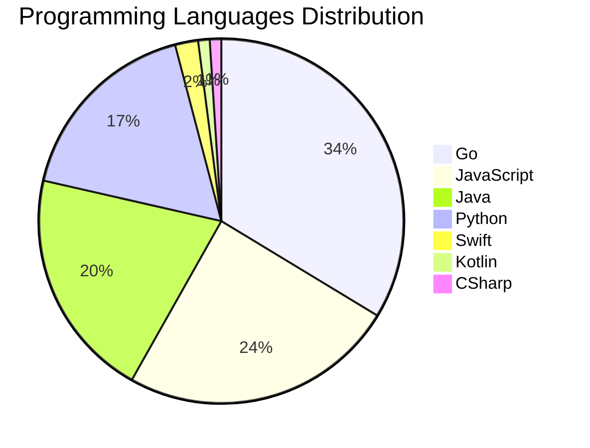

# 🚀 DevTech Auto News - Enhanced Edition


**DevTech Auto News Enhanced** is an advanced automated bot that aggregates trending topics in **AI**, **Web Development**, **Mobile**, **Cloud**, **DevOps**, and more from multiple sources including:

- 📰 [Dev.to](https://dev.to) - Developer community articles
- 🔥 [HackerNews](https://news.ycombinator.com) - Tech news discussions  
- 💻 [GitHub Trending](https://github.com/trending) - Trending repositories
- 🎯 Curated Interview Questions from multiple languages

## ✨ Features

✅ **Multi-Source Aggregation**: Combines articles from Dev.to, HackerNews, and GitHub  
✅ **Smart Categorization**: Automatically categorizes content into 10+ topics  
✅ **Image Support**: Displays cover images for visual appeal  
✅ **Pagination**: Fetches 50+ articles per update with deduplication  
✅ **Language Statistics**: Tracks programming language trends with charts  
✅ **Interview Questions**: Daily coding interview questions in multiple languages  
✅ **GitHub Actions**: Runs every 15 minutes automatically  

---

## 📊 Statistics Dashboard

### 📊 Articles by Category

**AI**: 🟦🟦🟦🟦🟦🟦🟦🟦🟦🟦🟦🟦🟦🟦🟦🟦🟦🟦🟦🟦 55 (52.4%)

**Tools**: 🟦🟦🟦🟦🟦🟦🟦🟦🟦🟦 28 (26.7%)

**JavaScript**: 🟦🟦🟦🟦🟦🟦🟦🟦🟦 24 (22.9%)

**Python**: 🟦🟦🟦🟦🟦🟦 17 (16.2%)

**Cloud**: 🟦🟦🟦🟦🟦 13 (12.4%)

**DevOps**: 🟦🟦🟦 7 (6.7%)

**WebDev**: 🟦🟦 5 (4.8%)

**Mobile**: 🟦 4 (3.8%)

**Security**: 🟦 4 (3.8%)

**Database**:  1 (1.0%)


### 📡 Sources

- **Dev.to**: 60 articles
- **HackerNews**: 30 articles
- **GitHub**: 15 articles


### 💻 Programming Language Trends

```
Go              ██████████████████████████████ 33.7 (33.7%)
JavaScript      ██████████████████████ 24.5 (24.5%)
Java            ██████████████████ 20.4 (20.4%)
Python          ███████████████ 17.3 (17.3%)
Swift           ██ 2.0 (2.0%)
Kotlin          █ 1.0 (1.0%)
CSharp          █ 1.0 (1.0%)

```




### 🏷️ Trending Tags

               


---

## 🛠️ How It Works

1. **Multi-Source Fetch**: Pulls from Dev.to (2 pages), HackerNews (3 topics), GitHub (3 languages)
2. **Smart Filter**: Uses keyword matching across 10+ categories  
3. **Deduplication**: Removes duplicate URLs  
4. **Image Extraction**: Captures cover images when available  
5. **Statistics**: Generates language trends and category breakdowns  
6. **Update Files**: Regenerates README and appends to comprehensive log  

---

## 📦 Installation & Usage

```bash
# Clone the repository
git clone https://github.com/Derrick-MUGISHA/github-activity-bot.git
cd github-activity-bot

# Install dependencies  
npm install

# Run manually
npm start

# Test mode
npm run test
```

---


# 🚀 DevTech Auto News - Enhanced Edition

## 📅 Latest Updates (2026-06-12 12:00 CAT)


### 🖼️ Featured Articles

<table>
<tr>
  <td align="center" width="33%">
    <a href="https://dev.to/devteam/congrats-to-the-google-io-writing-challenge-winners-1364">
      
      <br/>
      <b>Congrats to the Google I/O 2026 Writing Challenge ...</b>
    </a>
    <br/>
    <sub>Dev.to</sub>
  </td>
  <td align="center" width="33%">
    <a href="https://dev.to/googleai/my-daughter-asked-if-developers-used-to-write-code-by-hand-but-it-was-the-follow-up-question-that-1bh8">
      
      <br/>
      <b>My daughter asked if developers used to write code...</b>
    </a>
    <br/>
    <sub>Dev.to</sub>
  </td>
  <td align="center" width="33%">
    <a href="https://dev.to/ingosteinke/css-only-a-nerdy-hobby-17hf">
      
      <br/>
      <b>CSS – only a Nerdy Hobby?</b>
    </a>
    <br/>
    <sub>Dev.to</sub>
  </td>
</tr>
<tr>
  <td align="center" width="33%">
    <a href="https://dev.to/mlh/your-vibe-coded-app-works-is-it-any-good-28co">
      
      <br/>
      <b>Your Vibe-Coded App Works. Is It Any Good?</b>
    </a>
    <br/>
    <sub>Dev.to</sub>
  </td>
  <td align="center" width="33%">
    <a href="https://dev.to/moderncpp/why-new-language-features-need-to-target-ai-agents-not-developers-4h07">
      
      <br/>
      <b>Why New Language Features Need to Target AI Agents...</b>
    </a>
    <br/>
    <sub>Dev.to</sub>
  </td>
  <td align="center" width="33%">
    <a href="https://dev.to/harshattray/system-design-a-frontend-engineers-deep-dive-nh5">
      
      <br/>
      <b>System Design - A Frontend Engineer's Deep Dive</b>
    </a>
    <br/>
    <sub>Dev.to</sub>
  </td>
</tr>
</table>


### 📰 Top Headlines

- [Congrats to the Google I/O 2026 Writing Challenge Winners!](https://dev.to/devteam/congrats-to-the-google-io-writing-challenge-winners-1364) _[Dev.to]_
- [My daughter asked if developers used to write code by hand, but it was the follow-up question that surprised me.](https://dev.to/googleai/my-daughter-asked-if-developers-used-to-write-code-by-hand-but-it-was-the-follow-up-question-that-1bh8) _[Dev.to]_
- [CSS – only a Nerdy Hobby?](https://dev.to/ingosteinke/css-only-a-nerdy-hobby-17hf) _[Dev.to]_
- [Your Vibe-Coded App Works. Is It Any Good?](https://dev.to/mlh/your-vibe-coded-app-works-is-it-any-good-28co) _[Dev.to]_
- [Why New Language Features Need to Target AI Agents, Not Developers](https://dev.to/moderncpp/why-new-language-features-need-to-target-ai-agents-not-developers-4h07) _[Dev.to]_
- [System Design - A Frontend Engineer's Deep Dive](https://dev.to/harshattray/system-design-a-frontend-engineers-deep-dive-nh5) _[Dev.to]_
- [Lessons Learned: Deployment Trade-offs with Gemma4, NVIDIA L4, Cloud Run, and Antigravity CLI](https://dev.to/gde/lessons-learned-deployment-trade-offs-with-gemma4-nvidia-l4-cloud-run-and-antigravity-cli-lnl) _[Dev.to]_
- [How I Built a Treasure-Run Game Where Australia Saves the Sun](https://dev.to/ujja/how-i-built-a-treasure-run-game-where-australia-saves-the-sun-kck) _[Dev.to]_
- [Go Packages and Modules explained](https://dev.to/ferztyle/go-packages-and-modules-explained-4j4c) _[Dev.to]_
- [Mastering Self-Hosted Convex: A Complete Deployment Guide](https://dev.to/jookllo/mastering-self-hosted-convex-a-complete-deployment-guide-3mp5) _[Dev.to]_
- [I tried to make an AI agent answer more. It answered less.](https://dev.to/ankushchadha/i-tried-to-make-an-ai-agent-answer-more-it-answered-less-3d7a) _[Dev.to]_
- [Deployment Planning with Gemma 26B, NVIDIA L4, MCP, Cloud Run, and Antigravity CLI](https://dev.to/gde/deployment-planning-with-gemma-26b-nvidia-l4-mcp-cloud-run-and-antigravity-cli-kn0) _[Dev.to]_
- [12B Gemma 4 QAT Deployment with NVIDIA L4, Cloud Run, MCP, and Antigravity CLI](https://dev.to/gde/12b-gemma-4-qat-deployment-with-nvidia-l4-cloud-run-mcp-and-antigravity-cli-21l2) _[Dev.to]_
- [Debugging Deployments with Gemma 12B, NVIDIA L4, MCP, Cloud Run, and Antigravity CLI](https://dev.to/gde/debugging-deployments-with-gemma-12b-nvidia-l4-mcp-cloud-run-and-antigravity-cli-32eg) _[Dev.to]_
- [G4 Fractional VMs are now available on Google Cloud!](https://dev.to/googleai/g4-fractional-vms-are-now-available-on-google-cloud-knp) _[Dev.to]_
- [Flutter Midsommer Madnesss](https://dev.to/gde/flutter-midsommer-madnesss-kkb) _[Dev.to]_
- [Claude Fable 5 is Now Generally Available on Google Cloud! 🚀](https://dev.to/googleai/claude-fable-5-is-now-generally-available-on-google-cloud-3gog) _[Dev.to]_
- [Antigravity Managed Agents Tutorial: Ship Production AI Agents](https://dev.to/googleai/antigravity-managed-agents-tutorial-ship-production-ai-agents-21c0) _[Dev.to]_
- [Top 7 Featured DEV Posts of the Week](https://dev.to/devteam/top-7-featured-dev-posts-of-the-week-14hj) _[Dev.to]_
- [Seamless scaling with VPA In-place Pod Resize on GKE](https://dev.to/googlecloud/seamless-scaling-with-vpa-in-place-pod-resize-on-gke-117p) _[Dev.to]_

_Last automated update: Fri, 12 Jun 2026 12:47:28 CAT_


## 💡 Daily Interview Questions

_Sharpen your skills with these curated questions_

### 1. JavaScript: Implement a debounce function from scratch

**Difficulty**: Hard | **Topics**: functions, timing

<details>
<summary>💡 Hint</summary>

setTimeout, clearTimeout, wrapper function

</details>

### 2. Database: Explain database indexing and when to use it

**Difficulty**: Medium | **Topics**: optimization, performance

<details>
<summary>💡 Hint</summary>

B-tree, trade-offs, query performance

</details>

### 3. Java: What is the difference between abstract class and interface?

**Difficulty**: Easy | **Topics**: OOP, design

<details>
<summary>💡 Hint</summary>

Multiple inheritance, method implementation, use cases

</details>


---

## 📚 Resources

- [Full News Archive](./data/news_log.md) - Complete history of all fetched articles
- [Statistics JSON](./data/stats.json) - Raw statistics data
- [Categorized Data](./data/categorized.json) - Articles organized by category
- [Interview Questions](./data/interview_questions.json) - Complete question bank

---

## 🤝 Contributing

Want to add more sources, categories, or interview questions? Feel free to:

1. Fork this repository
2. Add your improvements
3. Submit a pull request

---

## 📄 License

MIT License - Feel free to use and modify!

---

<p align="center">
  <b>Last automated update: Fri, 12 Jun 2026 10:47:28 GMT</b><br/>
  <sub>Powered by GitHub Actions | Made with ❤️ for developers</sub>
</p>

---

## 🔗 Quick Links

- [View Workflow](https://github.com/Derrick-MUGISHA/github-activity-bot/actions)
- [Report Issue](https://github.com/Derrick-MUGISHA/github-activity-bot/issues)
- [Suggest Feature](https://github.com/Derrick-MUGISHA/github-activity-bot/issues/new)
