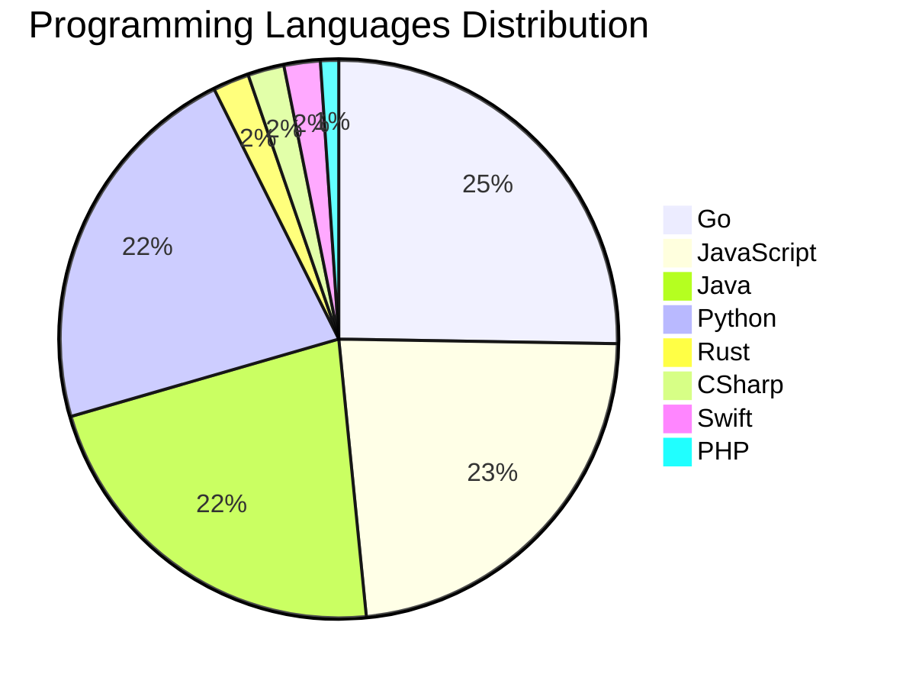

# 🚀 DevTech Auto News - Enhanced Edition


**DevTech Auto News Enhanced** is an advanced automated bot that aggregates trending topics in **AI**, **Web Development**, **Mobile**, **Cloud**, **DevOps**, and more from multiple sources including:

- 📰 [Dev.to](https://dev.to) - Developer community articles
- 🔥 [HackerNews](https://news.ycombinator.com) - Tech news discussions  
- 💻 [GitHub Trending](https://github.com/trending) - Trending repositories
- 🎯 Curated Interview Questions from multiple languages

## ✨ Features

✅ **Multi-Source Aggregation**: Combines articles from Dev.to, HackerNews, and GitHub  
✅ **Smart Categorization**: Automatically categorizes content into 10+ topics  
✅ **Image Support**: Displays cover images for visual appeal  
✅ **Pagination**: Fetches 50+ articles per update with deduplication  
✅ **Language Statistics**: Tracks programming language trends with charts  
✅ **Interview Questions**: Daily coding interview questions in multiple languages  
✅ **GitHub Actions**: Runs every 15 minutes automatically  

---

## 📊 Statistics Dashboard

### 📊 Articles by Category

**AI**: 🟦🟦🟦🟦🟦🟦🟦🟦🟦🟦🟦🟦🟦🟦🟦🟦🟦🟦🟦🟦 55 (52.9%)

**Tools**: 🟦🟦🟦🟦🟦🟦🟦🟦🟦 26 (25.0%)

**JavaScript**: 🟦🟦🟦🟦🟦🟦🟦🟦 22 (21.2%)

**Python**: 🟦🟦🟦🟦🟦🟦🟦🟦 21 (20.2%)

**Cloud**: 🟦🟦🟦🟦 10 (9.6%)

**Security**: 🟦🟦 6 (5.8%)

**WebDev**: 🟦🟦 5 (4.8%)

**Database**: 🟦 4 (3.8%)

**DevOps**: 🟦 2 (1.9%)

**Mobile**: 🟦 2 (1.9%)


### 📡 Sources

- **Dev.to**: 59 articles
- **HackerNews**: 30 articles
- **GitHub**: 15 articles


### 💻 Programming Language Trends

```
Go              ██████████████████████████████ 25.3 (25.3%)
JavaScript      ████████████████████████████ 23.2 (23.2%)
Java            ██████████████████████████ 22.1 (22.1%)
Python          ██████████████████████████ 22.1 (22.1%)
Rust            ██ 2.1 (2.1%)
CSharp          ██ 2.1 (2.1%)
Swift           ██ 2.1 (2.1%)
PHP             █ 1.1 (1.1%)

```




### 🏷️ Trending Tags

               


---

## 🛠️ How It Works

1. **Multi-Source Fetch**: Pulls from Dev.to (2 pages), HackerNews (3 topics), GitHub (3 languages)
2. **Smart Filter**: Uses keyword matching across 10+ categories  
3. **Deduplication**: Removes duplicate URLs  
4. **Image Extraction**: Captures cover images when available  
5. **Statistics**: Generates language trends and category breakdowns  
6. **Update Files**: Regenerates README and appends to comprehensive log  

---

## 📦 Installation & Usage

```bash
# Clone the repository
git clone https://github.com/Derrick-MUGISHA/github-activity-bot.git
cd github-activity-bot

# Install dependencies  
npm install

# Run manually
npm start

# Test mode
npm run test
```

---


# 🚀 DevTech Auto News - Enhanced Edition

## 📅 Latest Updates (2026-03-29 12:00 CAT)


### 🖼️ Featured Articles

<table>
<tr>
  <td align="center" width="33%">
    <a href="https://dev.to/thormeier/how-to-use-timberborn-yes-the-beaver-city-building-game-as-a-database-489c">
      
      <br/>
      <b>How to use Timberborn 🦫 (yes, the beaver city-bui...</b>
    </a>
    <br/>
    <sub>Dev.to</sub>
  </td>
  <td align="center" width="33%">
    <a href="https://dev.to/gde/decoding-bronze-age-paperwork-modern-ai-vs-ancient-assyrian-clay-tablets-5adf">
      
      <br/>
      <b>Decoding Bronze Age Paperwork: Modern AI vs. Ancie...</b>
    </a>
    <br/>
    <sub>Dev.to</sub>
  </td>
  <td align="center" width="33%">
    <a href="https://dev.to/oler/why-daily-standups-are-becoming-useless-in-the-ai-era-iao">
      
      <br/>
      <b>Why Daily Standups Are Becoming Useless in the AI ...</b>
    </a>
    <br/>
    <sub>Dev.to</sub>
  </td>
</tr>
<tr>
  <td align="center" width="33%">
    <a href="https://dev.to/ghostbuild/your-agent-can-think-it-cant-remember-5e1o">
      
      <br/>
      <b>your agent can think. it can't remember.</b>
    </a>
    <br/>
    <sub>Dev.to</sub>
  </td>
  <td align="center" width="33%">
    <a href="https://dev.to/gde/cross-cloud-multi-agent-comic-builder-with-adk-amazon-fargate-and-gemini-cli-16k9">
      
      <br/>
      <b>Cross Cloud Multi Agent Comic Builder with ADK, Am...</b>
    </a>
    <br/>
    <sub>Dev.to</sub>
  </td>
  <td align="center" width="33%">
    <a href="https://dev.to/ritam369/understanding-object-oriented-programming-in-javascript-570e">
      
      <br/>
      <b>Understanding Object-Oriented Programming in JavaS...</b>
    </a>
    <br/>
    <sub>Dev.to</sub>
  </td>
</tr>
</table>


### 📰 Top Headlines

- [How to use Timberborn 🦫 (yes, the beaver city-building game) as a database 💾](https://dev.to/thormeier/how-to-use-timberborn-yes-the-beaver-city-building-game-as-a-database-489c) _[Dev.to]_
- [Decoding Bronze Age Paperwork: Modern AI vs. Ancient Assyrian Clay Tablets](https://dev.to/gde/decoding-bronze-age-paperwork-modern-ai-vs-ancient-assyrian-clay-tablets-5adf) _[Dev.to]_
- [Why Daily Standups Are Becoming Useless in the AI Era](https://dev.to/oler/why-daily-standups-are-becoming-useless-in-the-ai-era-iao) _[Dev.to]_
- [your agent can think. it can't remember.](https://dev.to/ghostbuild/your-agent-can-think-it-cant-remember-5e1o) _[Dev.to]_
- [Cross Cloud Multi Agent Comic Builder with ADK, Amazon Fargate, and Gemini CLI](https://dev.to/gde/cross-cloud-multi-agent-comic-builder-with-adk-amazon-fargate-and-gemini-cli-16k9) _[Dev.to]_
- [Understanding Object-Oriented Programming in JavaScript](https://dev.to/ritam369/understanding-object-oriented-programming-in-javascript-570e) _[Dev.to]_
- [I'm so sick of my editor telling me how great I am. Not that I'm not great.](https://dev.to/ben/im-so-sick-of-my-editor-telling-me-how-great-i-am-not-that-im-not-great-2oam) _[Dev.to]_
- [Building a Error Library](https://dev.to/fafhrd91/building-a-error-library-3kda) _[Dev.to]_
- [How to Store Secrets in the Mac Keychain (and Use Them Like Environment Variables)](https://dev.to/alsaheem/how-to-store-secrets-in-the-mac-keychain-and-use-them-like-environment-variables-1aj7) _[Dev.to]_
- [Stop Writing Custom Importers: Import Multilingual Data in Drupal with Migrate API](https://dev.to/baikho/stop-writing-custom-importers-import-multilingual-data-in-drupal-with-migrate-api-m35) _[Dev.to]_
- [This is Cloud Run: Configuration](https://dev.to/gde/this-is-cloud-run-configuration-2gi2) _[Dev.to]_
- [Modular Monolith Architecture in .NET: The Pragmatic Middle Ground](https://dev.to/aldacosta/modular-monolith-architecture-in-net-the-pragmatic-middle-ground-2fm5) _[Dev.to]_
- [Self-improving Coding Agents](https://dev.to/raphaelpor/self-improving-coding-agents-435l) _[Dev.to]_
- [Finding Slow Queries in PostgreSQL (Without Guessing)](https://dev.to/labeeb-ahmad/finding-slow-queries-in-postgresql-without-guessing-1p5j) _[Dev.to]_
- [Reflections on my Trainings: Gemini for Google Workspace](https://dev.to/gde/reflections-on-my-trainings-gemini-for-google-workspace-4fj3) _[Dev.to]_
- [AI Writes Daily Without My Involvement](https://dev.to/maksugr/ai-writes-daily-without-my-involvement-4jfc) _[Dev.to]_
- [Turning Weekly GitHub Activity Into Blog Posts on Notion + DEV.to](https://dev.to/yashksaini/i-built-a-3-agent-pipeline-that-turns-my-github-activity-into-weekly-blog-posts-on-notion-devto-1ndn) _[Dev.to]_
- [Cross Cloud ADK with Python, and the Azure App Service](https://dev.to/gde/cross-cloud-adk-with-python-and-the-azure-app-service-1i47) _[Dev.to]_
- [MCP Development with Python, and Azure Container Apps](https://dev.to/gde/mcp-development-with-python-and-azure-container-apps-448f) _[Dev.to]_
- [I Built Jira for AI Agents - Here's why your AI Coding Assistant needs its own project management](https://dev.to/rpostulart/i-built-jira-for-ai-agents-heres-why-your-ai-coding-assistant-needs-its-own-project-management-1m5f) _[Dev.to]_

_Last automated update: Sun, 29 Mar 2026 12:53:15 CAT_


## 💡 Daily Interview Questions

_Sharpen your skills with these curated questions_

### 1. NodeJS: Explain middleware in Express.js

**Difficulty**: Easy | **Topics**: express, architecture

<details>
<summary>💡 Hint</summary>

Request/response cycle, next(), chain of functions

</details>

### 2. SystemDesign: Design a URL shortening service like bit.ly

**Difficulty**: Medium | **Topics**: system design, scalability

<details>
<summary>💡 Hint</summary>

Hash function, database design, caching, analytics

</details>

### 3. SystemDesign: How would you design a rate limiter?

**Difficulty**: Medium | **Topics**: system design, algorithms

<details>
<summary>💡 Hint</summary>

Token bucket, sliding window, distributed systems

</details>


---

## 📚 Resources

- [Full News Archive](./data/news_log.md) - Complete history of all fetched articles
- [Statistics JSON](./data/stats.json) - Raw statistics data
- [Categorized Data](./data/categorized.json) - Articles organized by category
- [Interview Questions](./data/interview_questions.json) - Complete question bank

---

## 🤝 Contributing

Want to add more sources, categories, or interview questions? Feel free to:

1. Fork this repository
2. Add your improvements
3. Submit a pull request

---

## 📄 License

MIT License - Feel free to use and modify!

---

<p align="center">
  <b>Last automated update: Sun, 29 Mar 2026 10:53:15 GMT</b><br/>
  <sub>Powered by GitHub Actions | Made with ❤️ for developers</sub>
</p>

---

## 🔗 Quick Links

- [View Workflow](https://github.com/Derrick-MUGISHA/github-activity-bot/actions)
- [Report Issue](https://github.com/Derrick-MUGISHA/github-activity-bot/issues)
- [Suggest Feature](https://github.com/Derrick-MUGISHA/github-activity-bot/issues/new)
