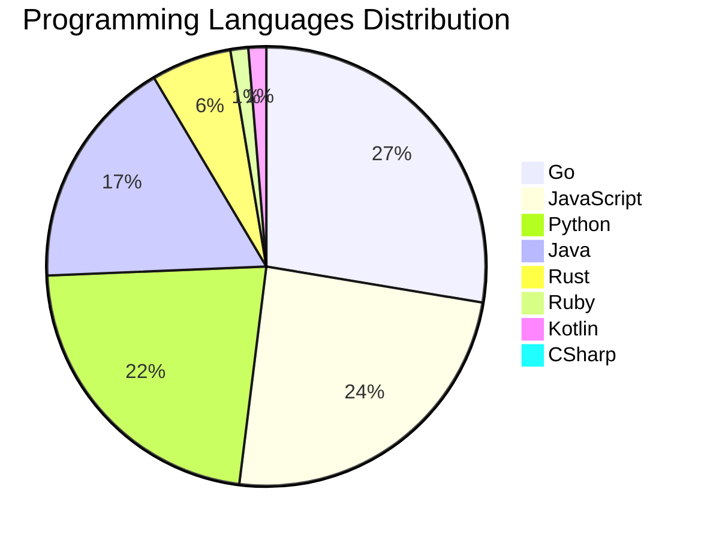

<div align="center">

# 📰 DevTech Auto News

**Your always-fresh digest of developer & AI tech news — curated automatically, around the clock.**


Aggregating [Dev.to](https://dev.to) · [Hacker News](https://news.ycombinator.com) · [GitHub Trending](https://github.com/trending) · [Lobste.rs](https://lobste.rs) · [Stack Overflow](https://stackoverflow.com) · [TechCrunch](https://techcrunch.com) · [freeCodeCamp](https://www.freecodecamp.org/news) — refreshed by GitHub Actions around the clock.

**[📰 Headlines](#-latest-headlines) · [💡 Interview Prep](#-interview-question-of-the-hour) · [📊 Statistics](#-statistics) · [⚙️ How It Works](#%EF%B8%8F-how-it-works)**

</div>

---

## 📰 Latest Headlines

> 🕐 Edition of **2026-09-18 3:00 CAT** — refreshed automatically, all day, every day.

### ✨ Featured Stories

<table>
<tr>
  <td align="center" width="33%">
    <a href="https://dev.to/devteam/congrats-to-the-dev-weekend-challenge-dog-days-edition-winners-300g">
      
      <br/>
      <b>Congrats to the DEV Weekend Challenge: Dog Days Ed...</b>
    </a>
    <br/>
    <sub>Dev.to</sub>
  </td>
  <td align="center" width="33%">
    <a href="https://dev.to/sloan/welcome-thread-v-393-5f09">
      
      <br/>
      <b>Welcome Thread - v 393</b>
    </a>
    <br/>
    <sub>Dev.to</sub>
  </td>
  <td align="center" width="33%">
    <a href="https://dev.to/devteam/a-quick-update-on-the-summer-bug-smash-winners-3021">
      
      <br/>
      <b>A Quick Update on the Summer Bug Smash Winners</b>
    </a>
    <br/>
    <sub>Dev.to</sub>
  </td>
</tr>
<tr>
  <td align="center" width="33%">
    <a href="https://dev.to/googleai/how-we-built-a-desktop-companion-robot-with-gemma-4-and-raspberry-pi-2oke">
      
      <br/>
      <b>How we built a desktop companion robot with Gemma ...</b>
    </a>
    <br/>
    <sub>Dev.to</sub>
  </td>
  <td align="center" width="33%">
    <a href="https://dev.to/gde/the-symmetry-of-state-why-flutter-deserves-contextvalue-and-contextstate-4250">
      
      <br/>
      <b>The Symmetry of State: Why Flutter Deserves contex...</b>
    </a>
    <br/>
    <sub>Dev.to</sub>
  </td>
  <td align="center" width="33%">
    <a href="https://dev.to/gde/build-in-the-vm-think-on-the-mac-gpu-debian-13-on-apple-container-with-a-local-gemma-4-2d8b">
      
      <br/>
      <b>Build in the VM, Think on the Mac GPU: Debian 13 o...</b>
    </a>
    <br/>
    <sub>Dev.to</sub>
  </td>
</tr>
</table>


### 🗞️ Top Stories

| # | Headline | Source |
|---|----------|--------|
| 1 | [Congrats to the DEV Weekend Challenge: Dog Days Edition Winners!](https://dev.to/devteam/congrats-to-the-dev-weekend-challenge-dog-days-edition-winners-300g) | Dev.to |
| 2 | [Welcome Thread - v 393](https://dev.to/sloan/welcome-thread-v-393-5f09) | Dev.to |
| 3 | [A Quick Update on the Summer Bug Smash Winners](https://dev.to/devteam/a-quick-update-on-the-summer-bug-smash-winners-3021) | Dev.to |
| 4 | [How we built a desktop companion robot with Gemma 4 and Raspberry Pi](https://dev.to/googleai/how-we-built-a-desktop-companion-robot-with-gemma-4-and-raspberry-pi-2oke) | Dev.to |
| 5 | [The Symmetry of State: Why Flutter Deserves context.value and context.state](https://dev.to/gde/the-symmetry-of-state-why-flutter-deserves-contextvalue-and-contextstate-4250) | Dev.to |
| 6 | [Build in the VM, Think on the Mac GPU: Debian 13 on Apple container With a Local Gemma 4](https://dev.to/gde/build-in-the-vm-think-on-the-mac-gpu-debian-13-on-apple-container-with-a-local-gemma-4-2d8b) | Dev.to |
| 7 | [The Modern Pitch for BlocSignal: Why Engineering Leads Are Moving to Reactive Primitives](https://dev.to/gde/the-modern-pitch-for-blocsignal-why-engineering-leads-are-moving-to-reactive-primitives-5d5h) | Dev.to |
| 8 | [Gemma 4 on an 2021 4 GB Laptop GPU: QAT Takes It From 9.5 GiB to 1.6](https://dev.to/gde/gemma-4-on-an-old-4-gb-laptop-gpu-qat-takes-it-from-95-gib-to-16-b5l) | Dev.to |
| 9 | [Four Iceberg Tools, Three Agent Frameworks: What Ports, and What Doesn't](https://dev.to/gde/four-iceberg-tools-three-agent-frameworks-what-ports-and-what-doesnt-a5g) | Dev.to |
| 10 | [Nano Banana 2 Lite, Revisited: MCP 2.0, the New Interactions API, and Three Agent CLIs](https://dev.to/gde/nano-banana-2-lite-revisited-mcp-20-the-new-interactions-api-and-three-agent-clis-37g5) | Dev.to |
| 11 | [Harness engineering doesn't mean building your own harness](https://dev.to/annthurium/harness-engineering-doesnt-mean-building-your-own-harness-16pk) | Dev.to |
| 12 | [20 Agentic AI Terms Every Developer Should Know (Explained Simply)](https://dev.to/sylwia-lask/20-agentic-ai-terms-every-developer-should-know-explained-simply-jii) | Dev.to |
| 13 | [2B Gemma 4 Deployment with Cloud Run, NVIDIA L4, MCP SDK 2.x, and Claude Code](https://dev.to/gde/2b-gemma-4-deployment-with-cloud-run-nvidia-l4-mcp-sdk-2x-and-claude-code-4ml3) | Dev.to |
| 14 | [Nano Banana 2 Lite in Kiro CLI 3: MCP 2.0, the New Interactions API, and Headless Permissions](https://dev.to/gde/nano-banana-2-lite-in-kiro-cli-3-mcp-20-the-new-interactions-api-and-headless-permissions-3faj) | Dev.to |
| 15 | [Serverless Multimodal Vector Search on Apache Iceberg via Google Apps Script](https://dev.to/gde/serverless-multimodal-vector-search-on-apache-iceberg-via-google-apps-script-4fg) | Dev.to |
| 16 | [Building With AI When You Don't Know Architecture: A Survival Guide](https://dev.to/james_anderson_h/building-with-ai-when-you-dont-know-architecture-a-survival-guide-1ma3) | Dev.to |
| 17 | [Learn Trapping Rain Water, Top K Frequent and Selection Sort with Step-by-Step Visualization in DSA View View 👀👀](https://dev.to/nyaomaru/learn-trapping-rain-water-top-k-frequent-and-selection-sort-with-step-by-step-visualization-in-dsa-1flg) | Dev.to |
| 18 | [Top 7 Featured DEV Posts of the Week](https://dev.to/devteam/top-7-featured-dev-posts-of-the-week-272b) | Dev.to |
| 19 | [Two-step control plane upgrades in GKE: How minor version rollbacks work under the hood](https://dev.to/googlecloud/two-step-control-plane-upgrades-in-gke-how-minor-version-rollbacks-work-under-the-hood-i1l) | Dev.to |
| 20 | [Cross Cloud A2A Agent Card Field Comparison](https://dev.to/gde/cross-cloud-a2a-agent-card-field-comparison-2hod) | Dev.to |

<sub>Last fetched: Fri, 18 Sep 2026 03:35:59 CAT</sub>


---

## 💡 Interview Question of the Hour

> Sharpen your skills — new questions selected on every update. Try answering before opening the hint!

**1. `JavaScript` — What are closures and provide a practical example?**

&nbsp;&nbsp;&nbsp;&nbsp;🎯 Medium · 🏷 functions, scope

<details>
<summary>&nbsp;&nbsp;&nbsp;&nbsp;💡 Show hint</summary>

> Function + lexical environment, data privacy, callbacks

</details>

**2. `Database` — Design a database schema for a social media platform**

&nbsp;&nbsp;&nbsp;&nbsp;🎯 Hard · 🏷 design, scalability

<details>
<summary>&nbsp;&nbsp;&nbsp;&nbsp;💡 Show hint</summary>

> Users, posts, relationships, indexes, partitioning

</details>

**3. `Python` — What are generators and when would you use them?**

&nbsp;&nbsp;&nbsp;&nbsp;🎯 Medium · 🏷 iterators, memory

<details>
<summary>&nbsp;&nbsp;&nbsp;&nbsp;💡 Show hint</summary>

> yield keyword, lazy evaluation, memory efficiency

</details>


---

## 📊 Statistics

#### 🗂 Articles by Category

| Category | Articles | Share | |
|----------|---------:|------:|---|
| **AI** | 77 | 41.8% | `████████████████████` |
| **Tools** | 39 | 21.2% | `██████████░░░░░░░░░░` |
| **JavaScript** | 37 | 20.1% | `██████████░░░░░░░░░░` |
| **Python** | 34 | 18.5% | `█████████░░░░░░░░░░░` |
| **Cloud** | 22 | 12.0% | `██████░░░░░░░░░░░░░░` |
| **Security** | 20 | 10.9% | `█████░░░░░░░░░░░░░░░` |
| **DevOps** | 19 | 10.3% | `█████░░░░░░░░░░░░░░░` |
| **WebDev** | 9 | 4.9% | `██░░░░░░░░░░░░░░░░░░` |
| **Mobile** | 7 | 3.8% | `██░░░░░░░░░░░░░░░░░░` |
| **Database** | 4 | 2.2% | `█░░░░░░░░░░░░░░░░░░░` |

<sub>Articles can match more than one category, so shares may sum to over 100%.</sub>


#### 📡 Articles by Source

| Source | Articles |
|--------|---------:|
| Dev.to | 60 |
| HackerNews | 49 |
| GitHub | 25 |
| Lobste.rs | 10 |
| StackOverflow | 20 |
| TechCrunch | 10 |
| freeCodeCamp | 10 |


#### 💻 Programming Language Trends

```
Go              ██████████████████████████████ 27.1%
JavaScript      ██████████████████████████ 23.9%
Python          ████████████████████████ 21.9%
Java            ███████████████████ 16.8%
Rust            ██████ 5.8%
Ruby            █ 1.3%
Kotlin          █ 1.3%
CSharp          █ 0.6%
PHP             █ 0.6%
Swift           █ 0.6%

```




#### 🏷 Trending Topics

            


---

## ⚙️ How It Works

This repository is a fully automated news pipeline. On every run, GitHub Actions:

1. **Fetches** the latest articles from seven sources: Dev.to, Hacker News, GitHub Trending, Lobste.rs, Stack Overflow, TechCrunch, and freeCodeCamp
2. **Deduplicates and categorizes** them across 10+ topics using keyword matching
3. **Extracts cover images** and computes language & category statistics
4. **Rebuilds this README** and appends everything to the [full archive](./data/news_log.md)
5. **Commits and pushes** the result — no human intervention needed

<details>
<summary><b>🚀 Run it yourself</b></summary>

```bash
git clone https://github.com/Derrick-MUGISHA/github-activity-bot.git
cd github-activity-bot
npm install
npm start
```

Fork the repo, enable GitHub Actions, and you have your own self-updating news feed.

</details>

<details>
<summary><b>📚 Data & resources</b></summary>

- [Full news archive](./data/news_log.md) — complete history of every fetched article
- [Statistics](./data/stats.json) — raw stats data (JSON)
- [Categorized articles](./data/categorized.json) — articles grouped by topic
- [Interview question bank](./data/interview_questions.json) — the full question set

</details>

---

## 🤝 Contributing

Ideas for new sources, categories, or interview questions are welcome — [open an issue](https://github.com/Derrick-MUGISHA/github-activity-bot/issues/new) or submit a pull request.

## 📄 License

Released under the [MIT License](https://opensource.org/licenses/MIT) — free to use, fork, and modify.

---

<div align="center">
  <sub>🤖 Last automated update: <b>Fri, 18 Sep 2026 01:35:59 GMT</b></sub><br/>
  <sub>Powered by GitHub Actions · Built with ❤️ by <a href="https://github.com/Derrick-MUGISHA">Derrick MUGISHA</a></sub>
</div>
