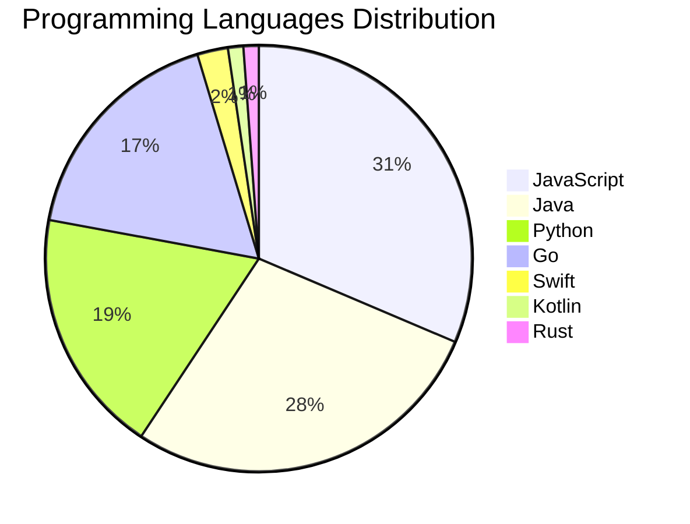

# 🚀 DevTech Auto News - Enhanced Edition


**DevTech Auto News Enhanced** is an advanced automated bot that aggregates trending topics in **AI**, **Web Development**, **Mobile**, **Cloud**, **DevOps**, and more from multiple sources including:

- 📰 [Dev.to](https://dev.to) - Developer community articles
- 🔥 [HackerNews](https://news.ycombinator.com) - Tech news discussions  
- 💻 [GitHub Trending](https://github.com/trending) - Trending repositories
- 🎯 Curated Interview Questions from multiple languages

## ✨ Features

✅ **Multi-Source Aggregation**: Combines articles from Dev.to, HackerNews, and GitHub  
✅ **Smart Categorization**: Automatically categorizes content into 10+ topics  
✅ **Image Support**: Displays cover images for visual appeal  
✅ **Pagination**: Fetches 50+ articles per update with deduplication  
✅ **Language Statistics**: Tracks programming language trends with charts  
✅ **Interview Questions**: Daily coding interview questions in multiple languages  
✅ **GitHub Actions**: Runs every 15 minutes automatically  

---

## 📊 Statistics Dashboard

### 📊 Articles by Category

**AI**: 🟦🟦🟦🟦🟦🟦🟦🟦🟦🟦🟦🟦🟦🟦🟦🟦🟦🟦🟦🟦 55 (52.4%)

**JavaScript**: 🟦🟦🟦🟦🟦🟦🟦🟦🟦🟦 27 (25.7%)

**Tools**: 🟦🟦🟦🟦🟦🟦🟦🟦🟦🟦 27 (25.7%)

**Python**: 🟦🟦🟦🟦🟦🟦 17 (16.2%)

**WebDev**: 🟦🟦🟦 7 (6.7%)

**Security**: 🟦🟦 5 (4.8%)

**Cloud**: 🟦 4 (3.8%)

**DevOps**: 🟦 3 (2.9%)

**Database**: 🟦 3 (2.9%)

**Mobile**: 🟦 2 (1.9%)


### 📡 Sources

- **Dev.to**: 60 articles
- **HackerNews**: 30 articles
- **GitHub**: 15 articles


### 💻 Programming Language Trends

```
JavaScript      ██████████████████████████████ 31.4 (31.4%)
Java            ███████████████████████████ 27.9 (27.9%)
Python          ██████████████████ 18.6 (18.6%)
Go              █████████████████ 17.4 (17.4%)
Swift           ██ 2.3 (2.3%)
Kotlin          █ 1.2 (1.2%)
Rust            █ 1.2 (1.2%)

```




### 🏷️ Trending Tags

               


---

## 🛠️ How It Works

1. **Multi-Source Fetch**: Pulls from Dev.to (2 pages), HackerNews (3 topics), GitHub (3 languages)
2. **Smart Filter**: Uses keyword matching across 10+ categories  
3. **Deduplication**: Removes duplicate URLs  
4. **Image Extraction**: Captures cover images when available  
5. **Statistics**: Generates language trends and category breakdowns  
6. **Update Files**: Regenerates README and appends to comprehensive log  

---

## 📦 Installation & Usage

```bash
# Clone the repository
git clone https://github.com/Derrick-MUGISHA/github-activity-bot.git
cd github-activity-bot

# Install dependencies  
npm install

# Run manually
npm start

# Test mode
npm run test
```

---


# 🚀 DevTech Auto News - Enhanced Edition

## 📅 Latest Updates (2026-03-24 21:00 CAT)


### 🖼️ Featured Articles

<table>
<tr>
  <td align="center" width="33%">
    <a href="https://dev.to/francistrdev/check-up-with-each-other-2ogc">
      
      <br/>
      <b>Check Up with Each Other</b>
    </a>
    <br/>
    <sub>Dev.to</sub>
  </td>
  <td align="center" width="33%">
    <a href="https://dev.to/ben/meme-monday-1bec">
      
      <br/>
      <b>Meme Monday</b>
    </a>
    <br/>
    <sub>Dev.to</sub>
  </td>
  <td align="center" width="33%">
    <a href="https://dev.to/helderberto/ai-writes-code-you-own-quality-19g0">
      
      <br/>
      <b>AI Writes Code. You Own Quality.</b>
    </a>
    <br/>
    <sub>Dev.to</sub>
  </td>
</tr>
<tr>
  <td align="center" width="33%">
    <a href="https://dev.to/jonoherrington/jargon-doesnt-make-you-senior-50fd">
      
      <br/>
      <b>Jargon Doesn't Make You Senior</b>
    </a>
    <br/>
    <sub>Dev.to</sub>
  </td>
  <td align="center" width="33%">
    <a href="https://dev.to/mischa/kigumi-same-components-any-stack-bn0">
      
      <br/>
      <b>Kigumi: Same components, any stack</b>
    </a>
    <br/>
    <sub>Dev.to</sub>
  </td>
  <td align="center" width="33%">
    <a href="https://dev.to/gde/implementing-a-rag-system-crawl-5li">
      
      <br/>
      <b>Implementing a RAG system: Crawl</b>
    </a>
    <br/>
    <sub>Dev.to</sub>
  </td>
</tr>
</table>


### 📰 Top Headlines

- [Check Up with Each Other](https://dev.to/francistrdev/check-up-with-each-other-2ogc) _[Dev.to]_
- [Meme Monday](https://dev.to/ben/meme-monday-1bec) _[Dev.to]_
- [AI Writes Code. You Own Quality.](https://dev.to/helderberto/ai-writes-code-you-own-quality-19g0) _[Dev.to]_
- [Jargon Doesn't Make You Senior](https://dev.to/jonoherrington/jargon-doesnt-make-you-senior-50fd) _[Dev.to]_
- [Kigumi: Same components, any stack](https://dev.to/mischa/kigumi-same-components-any-stack-bn0) _[Dev.to]_
- [Implementing a RAG system: Crawl](https://dev.to/gde/implementing-a-rag-system-crawl-5li) _[Dev.to]_
- [Building a Weather Station Using an Old Raspberry Pi](https://dev.to/nandofm/building-a-weather-station-using-an-old-raspberry-pi-5333) _[Dev.to]_
- [TypeScript deserved a real DDD framework - so I built one](https://dev.to/dogganidhal/typescript-deserved-a-real-ddd-framework-so-i-built-one-4dpf) _[Dev.to]_
- [Introducing Aerostack: Workflows, MCPs, and Intelligent Bots on the Edge](https://dev.to/aerostack/introducing-aerostack-workflows-mcps-and-intelligent-bots-on-the-edge-4pla) _[Dev.to]_
- [Agentic Engineering: Lessons Learned Vol. 2](https://dev.to/duske/agentic-engineering-lessons-learned-vol-2-7mh) _[Dev.to]_
- [AI context management across Claude, Cursor, Kiro, Gemini and custom agents](https://dev.to/madeburo/ai-context-management-across-claude-cursor-kiro-gemini-and-custom-agents-2n1f) _[Dev.to]_
- [Git-Native Agent Orchestration: A Stateless Maker-Checker Pattern](https://dev.to/szkiba/git-native-agent-orchestration-a-stateless-maker-checker-pattern-4956) _[Dev.to]_
- [How I Moved a React Component Across the DOM Without Losing Its State — A Checkout Story](https://dev.to/gowdagold/how-i-moved-a-react-component-across-the-dom-without-losing-its-state-a-checkout-story-57g8) _[Dev.to]_
- [How We Use AWS CDK to Deploy OpenClaw for Enterprise Teams — API Key Management Without the Chaos](https://dev.to/chenkuansun/how-we-use-aws-cdk-to-deploy-openclaw-for-enterprise-teams-api-key-management-without-the-chaos-2p1b) _[Dev.to]_
- [I Built a Claude Code Agent That Doesn't Need Me Anymore](https://dev.to/jkheadley/i-built-a-claude-code-agent-that-doesnt-need-me-anymore-dfm) _[Dev.to]_
- [OpenClaw Setup, Configuration, and Key Takeaways](https://dev.to/blove/openclaw-setup-configuration-and-key-takeaways-5ce8) _[Dev.to]_
- [FE/BE - Unite Them!](https://dev.to/danieluhl/febe-unite-them-3kh3) _[Dev.to]_
- [We Can't Code Anymore. AI Won't. What Then?](https://dev.to/bagro/we-cant-code-anymore-ai-wont-what-then-46h3) _[Dev.to]_
- [I Talk to AI While I Code. Here's What Works, What Fails, and Where I Stop.](https://dev.to/sudodevesh/i-talk-to-ai-while-i-code-heres-what-works-what-fails-and-where-i-stop-22jk) _[Dev.to]_
- [Getting Started with Qwen3.5 Vision-Language Models](https://dev.to/digitalocean/getting-started-with-qwen35-vision-language-models-3ej3) _[Dev.to]_

_Last automated update: Tue, 24 Mar 2026 21:40:03 CAT_


## 💡 Daily Interview Questions

_Sharpen your skills with these curated questions_

### 1. Python: What is the difference between list and tuple in Python?

**Difficulty**: Easy | **Topics**: data structures, mutability

<details>
<summary>💡 Hint</summary>

Mutability, performance, use cases

</details>

### 2. SystemDesign: Design Twitter's timeline feature

**Difficulty**: Hard | **Topics**: system design, scalability

<details>
<summary>💡 Hint</summary>

Fan-out, caching, ranking, real-time updates

</details>

### 3. JavaScript: What are closures and provide a practical example?

**Difficulty**: Medium | **Topics**: functions, scope

<details>
<summary>💡 Hint</summary>

Function + lexical environment, data privacy, callbacks

</details>


---

## 📚 Resources

- [Full News Archive](./data/news_log.md) - Complete history of all fetched articles
- [Statistics JSON](./data/stats.json) - Raw statistics data
- [Categorized Data](./data/categorized.json) - Articles organized by category
- [Interview Questions](./data/interview_questions.json) - Complete question bank

---

## 🤝 Contributing

Want to add more sources, categories, or interview questions? Feel free to:

1. Fork this repository
2. Add your improvements
3. Submit a pull request

---

## 📄 License

MIT License - Feel free to use and modify!

---

<p align="center">
  <b>Last automated update: Tue, 24 Mar 2026 19:40:03 GMT</b><br/>
  <sub>Powered by GitHub Actions | Made with ❤️ for developers</sub>
</p>

---

## 🔗 Quick Links

- [View Workflow](https://github.com/Derrick-MUGISHA/github-activity-bot/actions)
- [Report Issue](https://github.com/Derrick-MUGISHA/github-activity-bot/issues)
- [Suggest Feature](https://github.com/Derrick-MUGISHA/github-activity-bot/issues/new)
