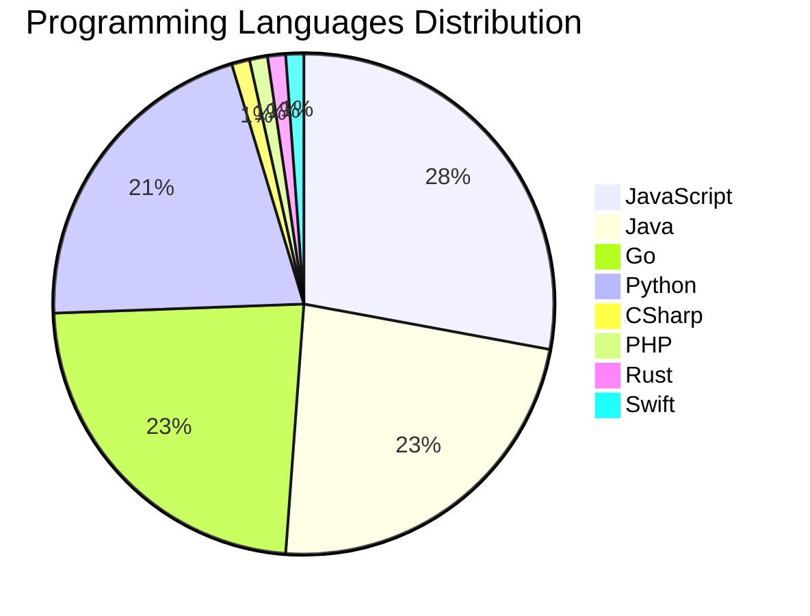

# 🚀 DevTech Auto News - Enhanced Edition


**DevTech Auto News Enhanced** is an advanced automated bot that aggregates trending topics in **AI**, **Web Development**, **Mobile**, **Cloud**, **DevOps**, and more from multiple sources including:

- 📰 [Dev.to](https://dev.to) - Developer community articles
- 🔥 [HackerNews](https://news.ycombinator.com) - Tech news discussions  
- 💻 [GitHub Trending](https://github.com/trending) - Trending repositories
- 🎯 Curated Interview Questions from multiple languages

## ✨ Features

✅ **Multi-Source Aggregation**: Combines articles from Dev.to, HackerNews, and GitHub  
✅ **Smart Categorization**: Automatically categorizes content into 10+ topics  
✅ **Image Support**: Displays cover images for visual appeal  
✅ **Pagination**: Fetches 50+ articles per update with deduplication  
✅ **Language Statistics**: Tracks programming language trends with charts  
✅ **Interview Questions**: Daily coding interview questions in multiple languages  
✅ **GitHub Actions**: Runs every 15 minutes automatically  

---

## 📊 Statistics Dashboard

### 📊 Articles by Category

**AI**: 🟦🟦🟦🟦🟦🟦🟦🟦🟦🟦🟦🟦🟦🟦🟦🟦🟦🟦🟦🟦 53 (50.5%)

**Tools**: 🟦🟦🟦🟦🟦🟦🟦🟦🟦 25 (23.8%)

**JavaScript**: 🟦🟦🟦🟦🟦🟦🟦🟦🟦 24 (22.9%)

**Python**: 🟦🟦🟦🟦🟦🟦🟦 18 (17.1%)

**WebDev**: 🟦🟦🟦 8 (7.6%)

**Security**: 🟦🟦 6 (5.7%)

**Cloud**: 🟦🟦 4 (3.8%)

**Database**: 🟦🟦 4 (3.8%)

**DevOps**: 🟦 3 (2.9%)

**Mobile**:  1 (1.0%)


### 📡 Sources

- **Dev.to**: 60 articles
- **HackerNews**: 30 articles
- **GitHub**: 15 articles


### 💻 Programming Language Trends

```
JavaScript      ██████████████████████████████ 27.9 (27.9%)
Java            █████████████████████████ 23.3 (23.3%)
Go              █████████████████████████ 23.3 (23.3%)
Python          ██████████████████████ 20.9 (20.9%)
CSharp          █ 1.2 (1.2%)
PHP             █ 1.2 (1.2%)
Rust            █ 1.2 (1.2%)
Swift           █ 1.2 (1.2%)

```




### 🏷️ Trending Tags

               


---

## 🛠️ How It Works

1. **Multi-Source Fetch**: Pulls from Dev.to (2 pages), HackerNews (3 topics), GitHub (3 languages)
2. **Smart Filter**: Uses keyword matching across 10+ categories  
3. **Deduplication**: Removes duplicate URLs  
4. **Image Extraction**: Captures cover images when available  
5. **Statistics**: Generates language trends and category breakdowns  
6. **Update Files**: Regenerates README and appends to comprehensive log  

---

## 📦 Installation & Usage

```bash
# Clone the repository
git clone https://github.com/Derrick-MUGISHA/github-activity-bot.git
cd github-activity-bot

# Install dependencies  
npm install

# Run manually
npm start

# Test mode
npm run test
```

---


# 🚀 DevTech Auto News - Enhanced Edition

## 📅 Latest Updates (2026-03-13 20:00 CAT)


### 🖼️ Featured Articles

<table>
<tr>
  <td align="center" width="33%">
    <a href="https://dev.to/sylwia-lask/why-are-we-still-doing-gpu-work-in-javascript-live-webgpu-benchmark-demo-4j6i">
      
      <br/>
      <b>Why Are We Still Doing GPU Work in JavaScript? (Li...</b>
    </a>
    <br/>
    <sub>Dev.to</sub>
  </td>
  <td align="center" width="33%">
    <a href="https://dev.to/sag1v/the-internet-is-getting-quieter-who-will-feed-the-next-generation-of-ai-4bl1">
      
      <br/>
      <b>The Internet Is Getting Quieter - Who Will Feed th...</b>
    </a>
    <br/>
    <sub>Dev.to</sub>
  </td>
  <td align="center" width="33%">
    <a href="https://dev.to/devteam/an-update-on-how-we-judge-dev-challenges-34eg">
      
      <br/>
      <b>An Update on How We Judge DEV Challenges</b>
    </a>
    <br/>
    <sub>Dev.to</sub>
  </td>
</tr>
<tr>
  <td align="center" width="33%">
    <a href="https://dev.to/googleai/deployments-made-easy-cloud-run-101-11ma">
      
      <br/>
      <b>Deployments made easy: Cloud Run 101</b>
    </a>
    <br/>
    <sub>Dev.to</sub>
  </td>
  <td align="center" width="33%">
    <a href="https://dev.to/davidcuy/por-que-pusimos-un-cdn-frente-a-nuestro-balanceador-de-carga-y-por-que-las-cookies-fueron-el-4mfh">
      
      <br/>
      <b>Por qué pusimos un CDN frente a nuestro balanceado...</b>
    </a>
    <br/>
    <sub>Dev.to</sub>
  </td>
  <td align="center" width="33%">
    <a href="https://dev.to/mfairchild365/embedding-accessibility-into-ai-based-software-development-282k">
      
      <br/>
      <b>Embedding Accessibility into AI based software dev...</b>
    </a>
    <br/>
    <sub>Dev.to</sub>
  </td>
</tr>
</table>


### 📰 Top Headlines

- [Why Are We Still Doing GPU Work in JavaScript? (Live WebGPU Benchmark & Demo🚀)](https://dev.to/sylwia-lask/why-are-we-still-doing-gpu-work-in-javascript-live-webgpu-benchmark-demo-4j6i) _[Dev.to]_
- [The Internet Is Getting Quieter - Who Will Feed the Next Generation of AI?](https://dev.to/sag1v/the-internet-is-getting-quieter-who-will-feed-the-next-generation-of-ai-4bl1) _[Dev.to]_
- [An Update on How We Judge DEV Challenges](https://dev.to/devteam/an-update-on-how-we-judge-dev-challenges-34eg) _[Dev.to]_
- [Deployments made easy: Cloud Run 101](https://dev.to/googleai/deployments-made-easy-cloud-run-101-11ma) _[Dev.to]_
- [Por qué pusimos un CDN frente a nuestro balanceador de carga (y por qué las cookies fueron el verdadero problema)](https://dev.to/davidcuy/por-que-pusimos-un-cdn-frente-a-nuestro-balanceador-de-carga-y-por-que-las-cookies-fueron-el-4mfh) _[Dev.to]_
- [Embedding Accessibility into AI based software development](https://dev.to/mfairchild365/embedding-accessibility-into-ai-based-software-development-282k) _[Dev.to]_
- [Your AI code reviewer has no one to disagree with](https://dev.to/spencermarx/your-ai-code-reviewer-has-no-one-to-disagree-with-f1j) _[Dev.to]_
- [Gemini 2.5 Flash vs Claude 3.7 Sonnet: 4 Production Constraints That Made the Decision for Me](https://dev.to/dumebii/gemini-25-flash-vs-claude-37-sonnet-4-production-constraints-that-made-the-decision-for-me-bib) _[Dev.to]_
- [MCP Server with .Net](https://dev.to/antdimot/mcp-server-with-net-5cih) _[Dev.to]_
- [We built a video recording API at $0.01/min. Here's the tech that made it possible.](https://dev.to/danger_cris/we-built-a-video-recording-api-at-001min-heres-the-tech-that-made-it-possible-872) _[Dev.to]_
- [Clojure Inheritance… Sort Of](https://dev.to/quoll/clojure-inheritance-sort-of-2i6i) _[Dev.to]_
- [experience report: coding a framework with AI](https://dev.to/theodordiaconu/experience-report-coding-a-framework-with-ai-hlj) _[Dev.to]_
- [Bridging the Gap - How We Made AI Agents 10x Developers in Our Organization](https://dev.to/sag1v/bridging-the-gap-how-we-made-ai-agents-10x-developers-in-our-organization-p44) _[Dev.to]_
- [AI did a good job... and almost deleted everything](https://dev.to/eecolor/ai-did-a-good-job-and-almost-deleted-everything-1g8g) _[Dev.to]_
- [The one question that made me turn down a job offer](https://dev.to/etienneburdet/the-one-question-that-made-me-turn-down-a-job-offer-5g1c) _[Dev.to]_
- [Multi-Connector OAuth: Meeting Scheduler Agent using Google Calendar, Gmail, Scalekit](https://dev.to/saif_shines/multi-connector-oauth-meeting-scheduler-agent-using-google-calendar-gmail-scalekit-89e) _[Dev.to]_
- [The Cognitive Costs of AI Chatbots and a Framework for Better Design](https://dev.to/yaaooo/the-cognitive-costs-of-ai-chatbots-and-a-framework-for-better-design-533l) _[Dev.to]_
- [I Built and Authorized a Planning Agent with MCP and Keycard](https://dev.to/kimmaida/i-built-a-secure-planning-agent-with-mcp-and-keycard-324a) _[Dev.to]_
- [Elvis (?:) vs Null Coalescing (??) in PHP: A Practical Guide for WordPress Developers](https://dev.to/abbeymaniak/elvis-vs-null-coalescing-in-php-a-practical-guide-for-wordpress-developers-3ih4) _[Dev.to]_
- [When AI Writes the Code… Who Takes Responsibility?](https://dev.to/subhrangsu90/when-ai-writes-the-code-who-takes-responsibility-19fc) _[Dev.to]_

_Last automated update: Fri, 13 Mar 2026 20:51:57 CAT_


## 💡 Daily Interview Questions

_Sharpen your skills with these curated questions_

### 1. Python: Implement a context manager using __enter__ and __exit__

**Difficulty**: Hard | **Topics**: context managers, resource management

<details>
<summary>💡 Hint</summary>

with statement, setup/teardown, exception handling

</details>

### 2. JavaScript: What are closures and provide a practical example?

**Difficulty**: Medium | **Topics**: functions, scope

<details>
<summary>💡 Hint</summary>

Function + lexical environment, data privacy, callbacks

</details>

### 3. Java: What are Java Streams and how do they work?

**Difficulty**: Medium | **Topics**: functional programming, collections

<details>
<summary>💡 Hint</summary>

Lazy evaluation, pipeline, terminal operations

</details>


---

## 📚 Resources

- [Full News Archive](./data/news_log.md) - Complete history of all fetched articles
- [Statistics JSON](./data/stats.json) - Raw statistics data
- [Categorized Data](./data/categorized.json) - Articles organized by category
- [Interview Questions](./data/interview_questions.json) - Complete question bank

---

## 🤝 Contributing

Want to add more sources, categories, or interview questions? Feel free to:

1. Fork this repository
2. Add your improvements
3. Submit a pull request

---

## 📄 License

MIT License - Feel free to use and modify!

---

<p align="center">
  <b>Last automated update: Fri, 13 Mar 2026 18:51:57 GMT</b><br/>
  <sub>Powered by GitHub Actions | Made with ❤️ for developers</sub>
</p>

---

## 🔗 Quick Links

- [View Workflow](https://github.com/Derrick-MUGISHA/github-activity-bot/actions)
- [Report Issue](https://github.com/Derrick-MUGISHA/github-activity-bot/issues)
- [Suggest Feature](https://github.com/Derrick-MUGISHA/github-activity-bot/issues/new)
