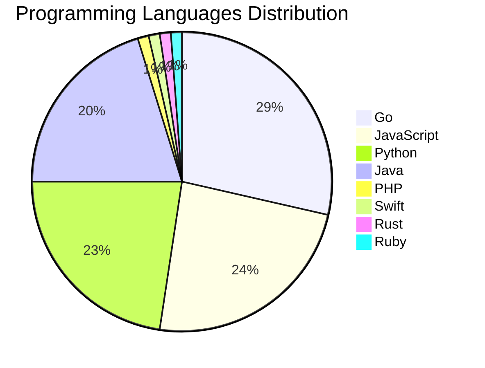

# 🚀 DevTech Auto News - Enhanced Edition


**DevTech Auto News Enhanced** is an advanced automated bot that aggregates trending topics in **AI**, **Web Development**, **Mobile**, **Cloud**, **DevOps**, and more from multiple sources including:

- 📰 [Dev.to](https://dev.to) - Developer community articles
- 🔥 [HackerNews](https://news.ycombinator.com) - Tech news discussions  
- 💻 [GitHub Trending](https://github.com/trending) - Trending repositories
- 🎯 Curated Interview Questions from multiple languages

## ✨ Features

✅ **Multi-Source Aggregation**: Combines articles from Dev.to, HackerNews, and GitHub  
✅ **Smart Categorization**: Automatically categorizes content into 10+ topics  
✅ **Image Support**: Displays cover images for visual appeal  
✅ **Pagination**: Fetches 50+ articles per update with deduplication  
✅ **Language Statistics**: Tracks programming language trends with charts  
✅ **Interview Questions**: Daily coding interview questions in multiple languages  
✅ **GitHub Actions**: Runs every 15 minutes automatically  

---

## 📊 Statistics Dashboard

### 📊 Articles by Category

**AI**: 🟦🟦🟦🟦🟦🟦🟦🟦🟦🟦🟦🟦🟦🟦🟦🟦🟦🟦🟦🟦 50 (47.6%)

**Tools**: 🟦🟦🟦🟦🟦🟦🟦🟦🟦🟦🟦 28 (26.7%)

**JavaScript**: 🟦🟦🟦🟦🟦🟦🟦🟦 20 (19.0%)

**Python**: 🟦🟦🟦🟦🟦🟦🟦🟦 19 (18.1%)

**Cloud**: 🟦🟦🟦🟦 9 (8.6%)

**WebDev**: 🟦🟦 6 (5.7%)

**DevOps**: 🟦🟦 5 (4.8%)

**Database**: 🟦 3 (2.9%)

**Security**: 🟦 3 (2.9%)

**Mobile**:  1 (1.0%)


### 📡 Sources

- **Dev.to**: 60 articles
- **HackerNews**: 30 articles
- **GitHub**: 15 articles


### 💻 Programming Language Trends

```
Go              ██████████████████████████████ 28.6 (28.6%)
JavaScript      █████████████████████████ 23.8 (23.8%)
Python          ████████████████████████ 22.6 (22.6%)
Java            █████████████████████ 20.2 (20.2%)
PHP             █ 1.2 (1.2%)
Swift           █ 1.2 (1.2%)
Rust            █ 1.2 (1.2%)
Ruby            █ 1.2 (1.2%)

```




### 🏷️ Trending Tags

               


---

## 🛠️ How It Works

1. **Multi-Source Fetch**: Pulls from Dev.to (2 pages), HackerNews (3 topics), GitHub (3 languages)
2. **Smart Filter**: Uses keyword matching across 10+ categories  
3. **Deduplication**: Removes duplicate URLs  
4. **Image Extraction**: Captures cover images when available  
5. **Statistics**: Generates language trends and category breakdowns  
6. **Update Files**: Regenerates README and appends to comprehensive log  

---

## 📦 Installation & Usage

```bash
# Clone the repository
git clone https://github.com/Derrick-MUGISHA/github-activity-bot.git
cd github-activity-bot

# Install dependencies  
npm install

# Run manually
npm start

# Test mode
npm run test
```

---


# 🚀 DevTech Auto News - Enhanced Edition

## 📅 Latest Updates (2026-05-12 15:00 CAT)


### 🖼️ Featured Articles

<table>
<tr>
  <td align="center" width="33%">
    <a href="https://dev.to/konark_13/does-ai-behave-like-a-toxic-ex-498n">
      
      <br/>
      <b>Does AI Behave Like a Toxic Ex?</b>
    </a>
    <br/>
    <sub>Dev.to</sub>
  </td>
  <td align="center" width="33%">
    <a href="https://dev.to/jarvisscript/what-are-your-goals-for-the-week-178-bkp">
      
      <br/>
      <b>What are your goals for the week? #178</b>
    </a>
    <br/>
    <sub>Dev.to</sub>
  </td>
  <td align="center" width="33%">
    <a href="https://dev.to/devteam/top-7-featured-dev-posts-of-the-week-4nik">
      
      <br/>
      <b>Top 7 Featured DEV Posts of the Week</b>
    </a>
    <br/>
    <sub>Dev.to</sub>
  </td>
</tr>
<tr>
  <td align="center" width="33%">
    <a href="https://dev.to/ben/meme-monday-55e2">
      
      <br/>
      <b>Meme Monday</b>
    </a>
    <br/>
    <sub>Dev.to</sub>
  </td>
  <td align="center" width="33%">
    <a href="https://dev.to/miry/building-team-a-an-ai-system-for-turning-volunteer-chaos-into-structured-engineering-work-mgo">
      
      <br/>
      <b>Building Team A: An AI System for Turning Voluntee...</b>
    </a>
    <br/>
    <sub>Dev.to</sub>
  </td>
  <td align="center" width="33%">
    <a href="https://dev.to/satyamsoni2211/i-built-a-one-command-macos-terminal-setup-ghostty-zsh-30-modern-cli-tools-43f5">
      
      <br/>
      <b>I Built a One-Command macOS Terminal Setup — Ghost...</b>
    </a>
    <br/>
    <sub>Dev.to</sub>
  </td>
</tr>
</table>


### 📰 Top Headlines

- [Does AI Behave Like a Toxic Ex?](https://dev.to/konark_13/does-ai-behave-like-a-toxic-ex-498n) _[Dev.to]_
- [What are your goals for the week? #178](https://dev.to/jarvisscript/what-are-your-goals-for-the-week-178-bkp) _[Dev.to]_
- [Top 7 Featured DEV Posts of the Week](https://dev.to/devteam/top-7-featured-dev-posts-of-the-week-4nik) _[Dev.to]_
- [Meme Monday](https://dev.to/ben/meme-monday-55e2) _[Dev.to]_
- [Building Team A: An AI System for Turning Volunteer Chaos into Structured Engineering Work](https://dev.to/miry/building-team-a-an-ai-system-for-turning-volunteer-chaos-into-structured-engineering-work-mgo) _[Dev.to]_
- [I Built a One-Command macOS Terminal Setup — Ghostty + Zsh + 30 Modern CLI Tools](https://dev.to/satyamsoni2211/i-built-a-one-command-macos-terminal-setup-ghostty-zsh-30-modern-cli-tools-43f5) _[Dev.to]_
- [Playwright is Powerful, But Managing It at Scale? That's Another Story](https://dev.to/prakashm88/playwright-is-powerful-but-managing-it-at-scale-thats-another-story-2g37) _[Dev.to]_
- [I Built a Chrome Extension to Sync AI Studio System Instructions. Here's Why chrome.storage.sync Couldn't Do It](https://dev.to/codewithahsan/i-built-a-chrome-extension-to-sync-ai-studio-system-instructions-heres-why-chromestoragesync-2llm) _[Dev.to]_
- [MCP Configuration for Google Workspace with Gemini CLI](https://dev.to/gde/mcp-configuration-for-google-workspace-with-gemini-cli-3nd2) _[Dev.to]_
- [Join the Gemma 4 Challenge: $3,000 prize pool for TEN winners!](https://dev.to/devteam/join-the-gemma-4-challenge-3000-prize-pool-for-ten-winners-23in) _[Dev.to]_
- [I Didn’t Stop Building. I Just Left My Laptop.](https://dev.to/itsugo/i-didnt-stop-building-i-just-left-my-laptop-27da) _[Dev.to]_
- [Speed, caching, and the 40x cost wall](https://dev.to/sanketsahu/speed-caching-and-the-40x-cost-wall-2gn0) _[Dev.to]_
- [Computers and upgrades](https://dev.to/unsungnovelty/computers-and-upgrades-3n7f) _[Dev.to]_
- [Congrats to the OpenClaw Challenge Winners!](https://dev.to/devteam/congrats-to-the-openclaw-challenge-winners-1lha) _[Dev.to]_
- [Getting Started with the Cluster Inventory API on OCM (Part 1: ClusterProfile)](https://dev.to/kahirokunn/build-an-open-cluster-management-hub-spoke-environment-and-enable-cluster-inventory-api-kk6) _[Dev.to]_
- [Landscape of ODE Solvers in R: A Practical Overview](https://dev.to/metelkin/landscape-of-ode-solvers-in-r-a-practical-overview-4cc7) _[Dev.to]_
- [What Platform Teams Can Expect From Crossplane v2.2](https://dev.to/todea/what-platform-teams-can-expect-from-crossplane-v22-1pm1) _[Dev.to]_
- [CSS - The single coolest API technique you can imagine.](https://dev.to/janeori/css-the-single-coolest-api-technique-you-can-imagine-4ma8) _[Dev.to]_
- [I Grounded Gemma 4 in 118,000 Real Stars — Here's What It Can Do](https://dev.to/imjoseangel/starlens-gemma-4-as-your-personal-planetarium-guide-36a4) _[Dev.to]_
- [What was your win this week??](https://dev.to/devteam/what-was-your-win-this-week-96l) _[Dev.to]_

_Last automated update: Tue, 12 May 2026 15:24:56 CAT_


## 💡 Daily Interview Questions

_Sharpen your skills with these curated questions_

### 1. Python: What is the difference between list and tuple in Python?

**Difficulty**: Easy | **Topics**: data structures, mutability

<details>
<summary>💡 Hint</summary>

Mutability, performance, use cases

</details>

### 2. JavaScript: What is the event loop and how does it work?

**Difficulty**: Hard | **Topics**: async, runtime

<details>
<summary>💡 Hint</summary>

Call stack, callback queue, microtask queue

</details>

### 3. React: Implement a custom hook for fetching data

**Difficulty**: Medium | **Topics**: hooks, async

<details>
<summary>💡 Hint</summary>

useState, useEffect, loading states, error handling

</details>


---

## 📚 Resources

- [Full News Archive](./data/news_log.md) - Complete history of all fetched articles
- [Statistics JSON](./data/stats.json) - Raw statistics data
- [Categorized Data](./data/categorized.json) - Articles organized by category
- [Interview Questions](./data/interview_questions.json) - Complete question bank

---

## 🤝 Contributing

Want to add more sources, categories, or interview questions? Feel free to:

1. Fork this repository
2. Add your improvements
3. Submit a pull request

---

## 📄 License

MIT License - Feel free to use and modify!

---

<p align="center">
  <b>Last automated update: Tue, 12 May 2026 13:24:56 GMT</b><br/>
  <sub>Powered by GitHub Actions | Made with ❤️ for developers</sub>
</p>

---

## 🔗 Quick Links

- [View Workflow](https://github.com/Derrick-MUGISHA/github-activity-bot/actions)
- [Report Issue](https://github.com/Derrick-MUGISHA/github-activity-bot/issues)
- [Suggest Feature](https://github.com/Derrick-MUGISHA/github-activity-bot/issues/new)
