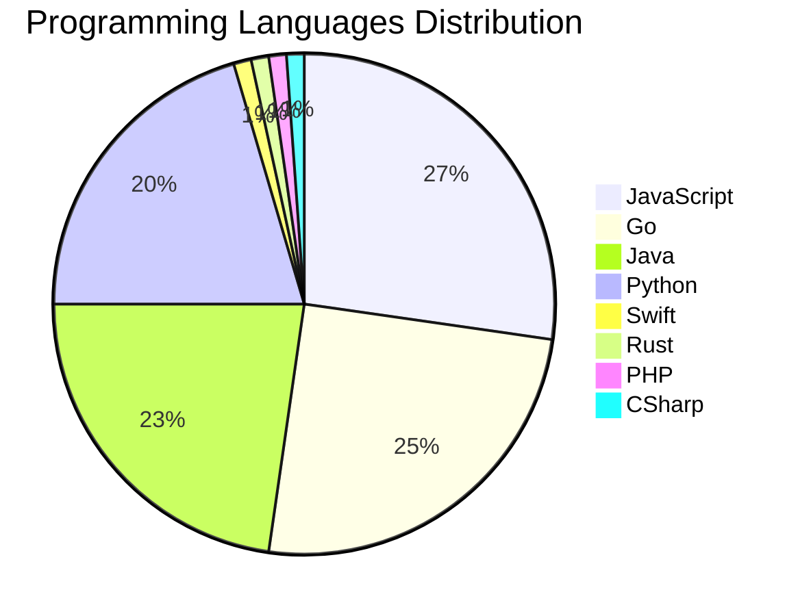

# 🚀 DevTech Auto News - Enhanced Edition


**DevTech Auto News Enhanced** is an advanced automated bot that aggregates trending topics in **AI**, **Web Development**, **Mobile**, **Cloud**, **DevOps**, and more from multiple sources including:

- 📰 [Dev.to](https://dev.to) - Developer community articles
- 🔥 [HackerNews](https://news.ycombinator.com) - Tech news discussions  
- 💻 [GitHub Trending](https://github.com/trending) - Trending repositories
- 🎯 Curated Interview Questions from multiple languages

## ✨ Features

✅ **Multi-Source Aggregation**: Combines articles from Dev.to, HackerNews, and GitHub  
✅ **Smart Categorization**: Automatically categorizes content into 10+ topics  
✅ **Image Support**: Displays cover images for visual appeal  
✅ **Pagination**: Fetches 50+ articles per update with deduplication  
✅ **Language Statistics**: Tracks programming language trends with charts  
✅ **Interview Questions**: Daily coding interview questions in multiple languages  
✅ **GitHub Actions**: Runs every 15 minutes automatically  

---

## 📊 Statistics Dashboard

### 📊 Articles by Category

**AI**: 🟦🟦🟦🟦🟦🟦🟦🟦🟦🟦🟦🟦🟦🟦🟦🟦🟦🟦🟦🟦 46 (43.8%)

**Tools**: 🟦🟦🟦🟦🟦🟦🟦🟦🟦🟦🟦🟦🟦 31 (29.5%)

**JavaScript**: 🟦🟦🟦🟦🟦🟦🟦🟦🟦🟦 24 (22.9%)

**Python**: 🟦🟦🟦🟦🟦🟦🟦🟦 18 (17.1%)

**Cloud**: 🟦🟦🟦🟦🟦🟦 14 (13.3%)

**DevOps**: 🟦🟦🟦 7 (6.7%)

**WebDev**: 🟦🟦 5 (4.8%)

**Security**: 🟦🟦 4 (3.8%)

**Mobile**: 🟦 2 (1.9%)

**Database**: 🟦 2 (1.9%)


### 📡 Sources

- **Dev.to**: 60 articles
- **HackerNews**: 30 articles
- **GitHub**: 15 articles


### 💻 Programming Language Trends

```
JavaScript      ██████████████████████████████ 27.0 (27.0%)
Go              ███████████████████████████ 24.7 (24.7%)
Java            █████████████████████████ 22.5 (22.5%)
Python          ██████████████████████ 20.2 (20.2%)
Swift           █ 1.1 (1.1%)
Rust            █ 1.1 (1.1%)
PHP             █ 1.1 (1.1%)
CSharp          █ 1.1 (1.1%)
Kotlin          █ 1.1 (1.1%)

```




### 🏷️ Trending Tags

               


---

## 🛠️ How It Works

1. **Multi-Source Fetch**: Pulls from Dev.to (2 pages), HackerNews (3 topics), GitHub (3 languages)
2. **Smart Filter**: Uses keyword matching across 10+ categories  
3. **Deduplication**: Removes duplicate URLs  
4. **Image Extraction**: Captures cover images when available  
5. **Statistics**: Generates language trends and category breakdowns  
6. **Update Files**: Regenerates README and appends to comprehensive log  

---

## 📦 Installation & Usage

```bash
# Clone the repository
git clone https://github.com/Derrick-MUGISHA/github-activity-bot.git
cd github-activity-bot

# Install dependencies  
npm install

# Run manually
npm start

# Test mode
npm run test
```

---


# 🚀 DevTech Auto News - Enhanced Edition

## 📅 Latest Updates (2026-06-06 13:00 CAT)


### 🖼️ Featured Articles

<table>
<tr>
  <td align="center" width="33%">
    <a href="https://dev.to/devteam/join-the-june-solstice-game-jam-1000-in-prizes-3jla">
      
      <br/>
      <b>Join the June Solstice Game Jam: $1,000 in prizes!</b>
    </a>
    <br/>
    <sub>Dev.to</sub>
  </td>
  <td align="center" width="33%">
    <a href="https://dev.to/jenlooper/magnificent-humanity-building-cities-and-a-special-announcement-54pf">
      
      <br/>
      <b>Magnificent Humanity, Building Cities, and a Speci...</b>
    </a>
    <br/>
    <sub>Dev.to</sub>
  </td>
  <td align="center" width="33%">
    <a href="https://dev.to/googlecloud/seamless-scaling-with-vpa-in-place-pod-resize-on-gke-117p">
      
      <br/>
      <b>Seamless scaling with VPA In-place Pod Resize on G...</b>
    </a>
    <br/>
    <sub>Dev.to</sub>
  </td>
</tr>
<tr>
  <td align="center" width="33%">
    <a href="https://dev.to/rodrigovidal/physics-engineering-and-architecture-in-software-systems-and-the-obsession-with-architecture-68j">
      
      <br/>
      <b>Physics, Engineering, and Architecture in Software...</b>
    </a>
    <br/>
    <sub>Dev.to</sub>
  </td>
  <td align="center" width="33%">
    <a href="https://dev.to/natheesh_kumar_8ad28dbe85/i-finished-what-i-started-adding-ai-to-every-layer-of-a-form-builder-with-github-copilot-942">
      
      <br/>
      <b>I Finished What I Started: Adding AI to Every Laye...</b>
    </a>
    <br/>
    <sub>Dev.to</sub>
  </td>
  <td align="center" width="33%">
    <a href="https://dev.to/gde/gubernator-the-kill-ku8s-2g0e">
      
      <br/>
      <b>Gubernator [the kill ku8s]</b>
    </a>
    <br/>
    <sub>Dev.to</sub>
  </td>
</tr>
</table>


### 📰 Top Headlines

- [Join the June Solstice Game Jam: $1,000 in prizes!](https://dev.to/devteam/join-the-june-solstice-game-jam-1000-in-prizes-3jla) _[Dev.to]_
- [Magnificent Humanity, Building Cities, and a Special Announcement!](https://dev.to/jenlooper/magnificent-humanity-building-cities-and-a-special-announcement-54pf) _[Dev.to]_
- [Seamless scaling with VPA In-place Pod Resize on GKE](https://dev.to/googlecloud/seamless-scaling-with-vpa-in-place-pod-resize-on-gke-117p) _[Dev.to]_
- [Physics, Engineering, and Architecture in Software Systems and the obsession with Architecture](https://dev.to/rodrigovidal/physics-engineering-and-architecture-in-software-systems-and-the-obsession-with-architecture-68j) _[Dev.to]_
- [I Finished What I Started: Adding AI to Every Layer of a Form Builder (With GitHub Copilot)](https://dev.to/natheesh_kumar_8ad28dbe85/i-finished-what-i-started-adding-ai-to-every-layer-of-a-form-builder-with-github-copilot-942) _[Dev.to]_
- [Gubernator [the kill ku8s]](https://dev.to/gde/gubernator-the-kill-ku8s-2g0e) _[Dev.to]_
- [Dystopian Civilization Scenarios](https://dev.to/ingosteinke/dystopian-civilization-scenarios-4422) _[Dev.to]_
- [Introducing Gemma 4 12B: a unified, encoder-free multimodal model](https://dev.to/googleai/introducing-gemma-4-12b-a-unified-encoder-free-multimodal-model-3ge5) _[Dev.to]_
- [26B Gemma 4 Deployment with NVIDIA L4, MCP, Cloud Run, and Antigravity CLI](https://dev.to/gde/26b-gemma-4-deployment-with-nvidia-l4-mcp-cloud-run-and-antigravity-cli-194p) _[Dev.to]_
- [Winner Announcement Delayed for the Google I/O 2026 Writing Challenge](https://dev.to/devteam/winner-announcement-delayed-for-the-google-io-2026-writing-challenge-ibb) _[Dev.to]_
- [Retour sur le Google I/O 2026 | Focus Antigravity 2.0](https://dev.to/gde/retour-sur-le-google-io-2026-focus-antigravity-20-33jh) _[Dev.to]_
- [Characterize the AWS Graviton memory subsystem using ASCT](https://dev.to/aws-builders/characterize-the-aws-graviton-memory-subsystem-using-asct-4e24) _[Dev.to]_
- [Agent Factory Recap: Building with Gemini 3, AI Studio, Antigravity, and Nano Banana](https://dev.to/googleai/agent-factory-recap-building-with-gemini-3-ai-studio-antigravity-and-nano-banana-186h) _[Dev.to]_
- [Am I Becoming Too Slow for the AI World?](https://dev.to/marcosomma/am-i-becoming-too-slow-for-the-ai-world-1904) _[Dev.to]_
- [I Built a Terminal Dashboard to Keep Track of All My Local Projects](https://dev.to/roie/i-built-a-terminal-dashboard-to-keep-track-of-all-my-local-projects-19k3) _[Dev.to]_
- [Multi-step form without the overhead](https://dev.to/ovidem/multi-step-form-without-the-overhead-5bjc) _[Dev.to]_
- [LiveKnowledge: Engineering Verifiable Knowledge](https://dev.to/adamrybinski/liveknowledge-engineering-verifiable-knowledge-5gkl) _[Dev.to]_
- [Malicious npm Packages With Valid SLSA Provenance: Inside the TanStack Attack](https://dev.to/olivrg/malicious-npm-packages-with-valid-slsa-provenance-inside-the-tanstack-attack-2gi9) _[Dev.to]_
- [Stop writing prompts to classify text: make evaluation declarative](https://dev.to/ayoolasolomon/stop-writing-prompts-to-classify-text-make-evaluation-declarative-5555) _[Dev.to]_
- [Strategies for running AI workloads on GKE without committed quota](https://dev.to/googlecloud/strategies-for-running-ai-workloads-on-gke-without-committed-quota-484l) _[Dev.to]_

_Last automated update: Sat, 06 Jun 2026 13:22:37 CAT_


## 💡 Daily Interview Questions

_Sharpen your skills with these curated questions_

### 1. SystemDesign: How would you design a rate limiter?

**Difficulty**: Medium | **Topics**: system design, algorithms

<details>
<summary>💡 Hint</summary>

Token bucket, sliding window, distributed systems

</details>

### 2. Java: What is the difference between abstract class and interface?

**Difficulty**: Easy | **Topics**: OOP, design

<details>
<summary>💡 Hint</summary>

Multiple inheritance, method implementation, use cases

</details>

### 3. NodeJS: What is the difference between process.nextTick() and setImmediate()?

**Difficulty**: Medium | **Topics**: event loop, async

<details>
<summary>💡 Hint</summary>

Execution timing, event loop phases

</details>


---

## 📚 Resources

- [Full News Archive](./data/news_log.md) - Complete history of all fetched articles
- [Statistics JSON](./data/stats.json) - Raw statistics data
- [Categorized Data](./data/categorized.json) - Articles organized by category
- [Interview Questions](./data/interview_questions.json) - Complete question bank

---

## 🤝 Contributing

Want to add more sources, categories, or interview questions? Feel free to:

1. Fork this repository
2. Add your improvements
3. Submit a pull request

---

## 📄 License

MIT License - Feel free to use and modify!

---

<p align="center">
  <b>Last automated update: Sat, 06 Jun 2026 11:22:37 GMT</b><br/>
  <sub>Powered by GitHub Actions | Made with ❤️ for developers</sub>
</p>

---

## 🔗 Quick Links

- [View Workflow](https://github.com/Derrick-MUGISHA/github-activity-bot/actions)
- [Report Issue](https://github.com/Derrick-MUGISHA/github-activity-bot/issues)
- [Suggest Feature](https://github.com/Derrick-MUGISHA/github-activity-bot/issues/new)
