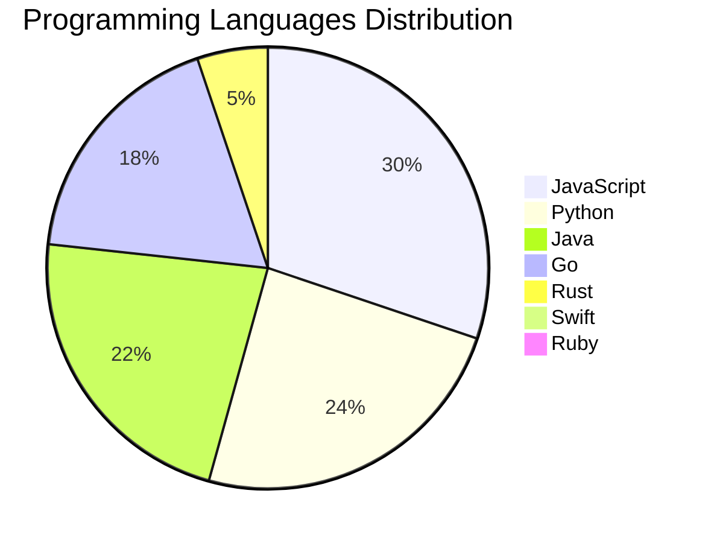

<div align="center">

# 📰 DevTech Auto News

**Your always-fresh digest of developer & AI tech news — curated automatically, around the clock.**


Aggregating [Dev.to](https://dev.to) · [Hacker News](https://news.ycombinator.com) · [GitHub Trending](https://github.com/trending) · [Lobste.rs](https://lobste.rs) · [Stack Overflow](https://stackoverflow.com) · [TechCrunch](https://techcrunch.com) · [freeCodeCamp](https://www.freecodecamp.org/news) — refreshed by GitHub Actions around the clock.

**[📰 Headlines](#-latest-headlines) · [💡 Interview Prep](#-interview-question-of-the-hour) · [📊 Statistics](#-statistics) · [⚙️ How It Works](#%EF%B8%8F-how-it-works)**

</div>

---

## 📰 Latest Headlines

> 🕐 Edition of **2026-09-04 7:00 CAT** — refreshed automatically, all day, every day.

### ✨ Featured Stories

<table>
<tr>
  <td align="center" width="33%">
    <a href="https://dev.to/sylwia-lask/20-agentic-ai-terms-every-developer-should-know-explained-simply-jii">
      
      <br/>
      <b>20 Agentic AI Terms Every Developer Should Know (E...</b>
    </a>
    <br/>
    <sub>Dev.to</sub>
  </td>
  <td align="center" width="33%">
    <a href="https://dev.to/hemapriya_kanagala/i-built-my-first-aws-agent-workflow-and-the-hardest-part-was-getting-it-to-stop-assuming-things-8fg">
      
      <br/>
      <b>I Built My First AWS Agent Workflow, and the Harde...</b>
    </a>
    <br/>
    <sub>Dev.to</sub>
  </td>
  <td align="center" width="33%">
    <a href="https://dev.to/nfrankel/ai-assisted-genealogy-9cn">
      
      <br/>
      <b>AI-assisted genealogy</b>
    </a>
    <br/>
    <sub>Dev.to</sub>
  </td>
</tr>
<tr>
  <td align="center" width="33%">
    <a href="https://dev.to/gde/taming-flutter-infinite-scroll-part-2-turning-scrollcontroller-into-a-reactive-state-machine-cgh">
      
      <br/>
      <b>Taming Flutter Infinite Scroll (Part 2): Turning S...</b>
    </a>
    <br/>
    <sub>Dev.to</sub>
  </td>
  <td align="center" width="33%">
    <a href="https://dev.to/gde/chromeos-lookalikes-two-ways-one-with-drivers-one-without-83m">
      
      <br/>
      <b>ChromeOS Lookalikes, Two Ways: One With Drivers, O...</b>
    </a>
    <br/>
    <sub>Dev.to</sub>
  </td>
  <td align="center" width="33%">
    <a href="https://dev.to/gde/taming-flutter-infinite-scroll-why-3-lines-of-async-missed-the-point-and-how-blocsignal-fixes-it-3n48">
      
      <br/>
      <b>Taming Flutter Infinite Scroll: Why 3 Lines of asy...</b>
    </a>
    <br/>
    <sub>Dev.to</sub>
  </td>
</tr>
</table>


### 🗞️ Top Stories

| # | Headline | Source |
|---|----------|--------|
| 1 | [20 Agentic AI Terms Every Developer Should Know (Explained Simply)](https://dev.to/sylwia-lask/20-agentic-ai-terms-every-developer-should-know-explained-simply-jii) | Dev.to |
| 2 | [I Built My First AWS Agent Workflow, and the Hardest Part Was Getting It to Stop Assuming Things](https://dev.to/hemapriya_kanagala/i-built-my-first-aws-agent-workflow-and-the-hardest-part-was-getting-it-to-stop-assuming-things-8fg) | Dev.to |
| 3 | [AI-assisted genealogy](https://dev.to/nfrankel/ai-assisted-genealogy-9cn) | Dev.to |
| 4 | [Taming Flutter Infinite Scroll (Part 2): Turning ScrollController into a Reactive State Machine with CubitSignalMixin](https://dev.to/gde/taming-flutter-infinite-scroll-part-2-turning-scrollcontroller-into-a-reactive-state-machine-cgh) | Dev.to |
| 5 | [ChromeOS Lookalikes, Two Ways: One With Drivers, One Without](https://dev.to/gde/chromeos-lookalikes-two-ways-one-with-drivers-one-without-83m) | Dev.to |
| 6 | [Taming Flutter Infinite Scroll: Why 3 Lines of async* Missed the Point, and How BlocSignal Fixes It](https://dev.to/gde/taming-flutter-infinite-scroll-why-3-lines-of-async-missed-the-point-and-how-blocsignal-fixes-it-3n48) | Dev.to |
| 7 | [Your First AI Agent: A Beginner's Guide to Building an AI Trend finder with ADK](https://dev.to/googleai/your-first-ai-agent-a-beginners-guide-to-building-an-ai-trend-finder-with-adk-5f8k) | Dev.to |
| 8 | [Join our DEV Weekend Challenge: Generosity Edition! $1,000 in Prizes Across FIVE Winners. Submissions Due September 7 at 6:59 AM UTC.](https://dev.to/devteam/join-our-dev-weekend-challenge-generosity-edition-1000-in-prizes-across-five-winners-20en) | Dev.to |
| 9 | [Kong AI Gateway 2.0 on Google Cloud: Securing GKE, Cloud Run, and Vertex AI(Agent Platform)](https://dev.to/gde/kong-ai-gateway-20-on-google-cloud-securing-gke-cloud-run-and-vertex-ai-219o) | Dev.to |
| 10 | [Your First Multi-agent system: A Beginner's Guide to Building an AI Trend finder with ADK](https://dev.to/googleai/your-first-multi-agent-system-a-beginners-guide-to-building-an-ai-trend-finder-with-adk-48jp) | Dev.to |
| 11 | [[AI in Practice] Building a Dynamic LINE Group Buying Bot with Edit and Unsend Webhooks](https://dev.to/gde/ai-in-practice-building-a-dynamic-line-group-buying-bot-with-edit-and-unsend-webhooks-1clh) | Dev.to |
| 12 | [Build a Long-Running Agent in the Cloud for $5.70/Month](https://dev.to/googleai/build-a-long-running-agent-in-the-cloud-for-570month-113c) | Dev.to |
| 13 | [💎 Introducing Community Gems: Celebrating Human Curation and the Best of Our Community](https://dev.to/devteam/introducing-community-gems-celebrating-human-curation-and-the-best-of-our-community-58c8) | Dev.to |
| 14 | [What is harness engineering and why should I care?](https://dev.to/googleai/what-is-harness-engineering-and-why-should-i-care-8n0) | Dev.to |
| 15 | [Overcoming Dart's Single Inheritance Wall: Composable CubitSignalMixin & BlocSignalMixin in Flutter](https://dev.to/gde/overcoming-darts-single-inheritance-wall-composable-cubitsignalmixin-blocsignalmixin-in-flutter-43bf) | Dev.to |
| 16 | [Kubeflow Without Kubernetes? Deploy a Complete MLOps Suite in 60 Seconds with Gubernator](https://dev.to/gde/kubeflow-without-kubernetes-deploy-a-complete-mlops-suite-in-60-seconds-with-gubernator-3moo) | Dev.to |
| 17 | [Three Gemma 4 Deployments on One T4G for Under $3: What the Runtime Changes, and What It Doesn't](https://dev.to/gde/three-gemma-4-deployments-on-one-t4g-for-under-3-what-the-runtime-changes-and-what-it-doesnt-jo3) | Dev.to |
| 18 | [Two-step control plane upgrades in GKE: How minor version rollbacks work under the hood](https://dev.to/googlecloud/two-step-control-plane-upgrades-in-gke-how-minor-version-rollbacks-work-under-the-hood-i1l) | Dev.to |
| 19 | [Cross Cloud A2A Agent Card Field Comparison](https://dev.to/gde/cross-cloud-a2a-agent-card-field-comparison-2hod) | Dev.to |
| 20 | [Build Real-Time Client-Side TTS in Angular Using Firebase AI Logic and Gemini](https://dev.to/gde/build-real-time-client-side-tts-in-angular-using-firebase-ai-logic-and-gemini-37hc) | Dev.to |

<sub>Last fetched: Fri, 04 Sep 2026 07:57:04 CAT</sub>


---

## 💡 Interview Question of the Hour

> Sharpen your skills — new questions selected on every update. Try answering before opening the hint!

**1. `JavaScript` — Explain event delegation and why it's useful**

&nbsp;&nbsp;&nbsp;&nbsp;🎯 Medium · 🏷 events, DOM

<details>
<summary>&nbsp;&nbsp;&nbsp;&nbsp;💡 Show hint</summary>

> Event bubbling, single listener for multiple elements

</details>

**2. `SystemDesign` — Design a distributed cache system**

&nbsp;&nbsp;&nbsp;&nbsp;🎯 Hard · 🏷 distributed systems, caching

<details>
<summary>&nbsp;&nbsp;&nbsp;&nbsp;💡 Show hint</summary>

> Consistency, partitioning, replication, eviction policies

</details>

**3. `NodeJS` — How do you handle errors in async/await?**

&nbsp;&nbsp;&nbsp;&nbsp;🎯 Medium · 🏷 error handling, async

<details>
<summary>&nbsp;&nbsp;&nbsp;&nbsp;💡 Show hint</summary>

> try/catch, .catch(), error middleware

</details>


---

## 📊 Statistics

#### 🗂 Articles by Category

| Category | Articles | Share | |
|----------|---------:|------:|---|
| **AI** | 65 | 42.2% | `████████████████████` |
| **JavaScript** | 35 | 22.7% | `███████████░░░░░░░░░` |
| **Tools** | 35 | 22.7% | `███████████░░░░░░░░░` |
| **Python** | 28 | 18.2% | `█████████░░░░░░░░░░░` |
| **DevOps** | 15 | 9.7% | `█████░░░░░░░░░░░░░░░` |
| **Security** | 15 | 9.7% | `█████░░░░░░░░░░░░░░░` |
| **WebDev** | 10 | 6.5% | `███░░░░░░░░░░░░░░░░░` |
| **Cloud** | 10 | 6.5% | `███░░░░░░░░░░░░░░░░░` |
| **Mobile** | 7 | 4.5% | `██░░░░░░░░░░░░░░░░░░` |
| **Database** | 2 | 1.3% | `█░░░░░░░░░░░░░░░░░░░` |

<sub>Articles can match more than one category, so shares may sum to over 100%.</sub>


#### 📡 Articles by Source

| Source | Articles |
|--------|---------:|
| Dev.to | 30 |
| HackerNews | 49 |
| GitHub | 25 |
| Lobste.rs | 10 |
| StackOverflow | 20 |
| TechCrunch | 10 |
| freeCodeCamp | 10 |


#### 💻 Programming Language Trends

```
JavaScript      ██████████████████████████████ 29.7%
Python          ████████████████████████ 23.7%
Java            ██████████████████████ 22.0%
Go              ██████████████████ 17.8%
Rust            █████ 5.1%
Swift           █ 0.8%
Ruby            █ 0.8%

```




#### 🏷 Trending Topics

            


---

## ⚙️ How It Works

This repository is a fully automated news pipeline. On every run, GitHub Actions:

1. **Fetches** the latest articles from seven sources: Dev.to, Hacker News, GitHub Trending, Lobste.rs, Stack Overflow, TechCrunch, and freeCodeCamp
2. **Deduplicates and categorizes** them across 10+ topics using keyword matching
3. **Extracts cover images** and computes language & category statistics
4. **Rebuilds this README** and appends everything to the [full archive](./data/news_log.md)
5. **Commits and pushes** the result — no human intervention needed

<details>
<summary><b>🚀 Run it yourself</b></summary>

```bash
git clone https://github.com/Derrick-MUGISHA/github-activity-bot.git
cd github-activity-bot
npm install
npm start
```

Fork the repo, enable GitHub Actions, and you have your own self-updating news feed.

</details>

<details>
<summary><b>📚 Data & resources</b></summary>

- [Full news archive](./data/news_log.md) — complete history of every fetched article
- [Statistics](./data/stats.json) — raw stats data (JSON)
- [Categorized articles](./data/categorized.json) — articles grouped by topic
- [Interview question bank](./data/interview_questions.json) — the full question set

</details>

---

## 🤝 Contributing

Ideas for new sources, categories, or interview questions are welcome — [open an issue](https://github.com/Derrick-MUGISHA/github-activity-bot/issues/new) or submit a pull request.

## 📄 License

Released under the [MIT License](https://opensource.org/licenses/MIT) — free to use, fork, and modify.

---

<div align="center">
  <sub>🤖 Last automated update: <b>Fri, 04 Sep 2026 05:57:04 GMT</b></sub><br/>
  <sub>Powered by GitHub Actions · Built with ❤️ by <a href="https://github.com/Derrick-MUGISHA">Derrick MUGISHA</a></sub>
</div>
