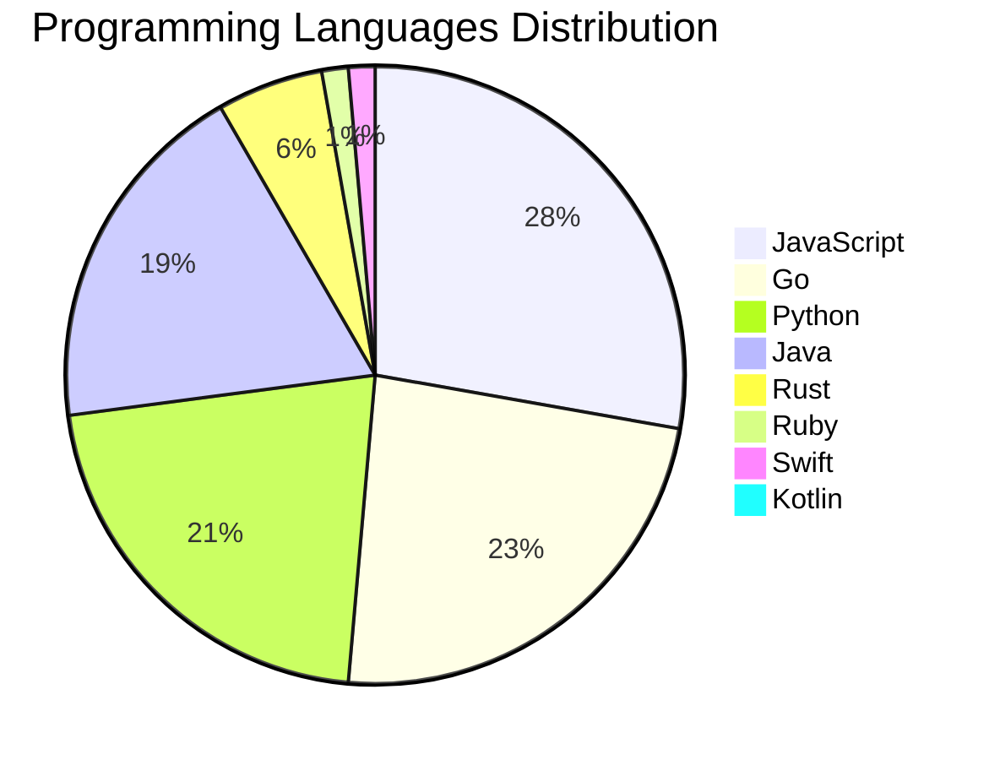

<div align="center">

# 📰 DevTech Auto News

**Your always-fresh digest of developer & AI tech news — curated automatically, around the clock.**


Aggregating [Dev.to](https://dev.to) · [Hacker News](https://news.ycombinator.com) · [GitHub Trending](https://github.com/trending) · [Lobste.rs](https://lobste.rs) · [Stack Overflow](https://stackoverflow.com) · [TechCrunch](https://techcrunch.com) · [freeCodeCamp](https://www.freecodecamp.org/news) — refreshed by GitHub Actions around the clock.

**[📰 Headlines](#-latest-headlines) · [💡 Interview Prep](#-interview-question-of-the-hour) · [📊 Statistics](#-statistics) · [⚙️ How It Works](#%EF%B8%8F-how-it-works)**

</div>

---

## 📰 Latest Headlines

> 🕐 Edition of **2026-09-10 0:00 CAT** — refreshed automatically, all day, every day.

### ✨ Featured Stories

<table>
<tr>
  <td align="center" width="33%">
    <a href="https://dev.to/sloan/welcome-thread-v-392-1kj4">
      
      <br/>
      <b>Welcome Thread - v 392</b>
    </a>
    <br/>
    <sub>Dev.to</sub>
  </td>
  <td align="center" width="33%">
    <a href="https://dev.to/devteam/top-7-featured-dev-posts-of-the-week-40ma">
      
      <br/>
      <b>Top 7 Featured DEV Posts of the Week</b>
    </a>
    <br/>
    <sub>Dev.to</sub>
  </td>
  <td align="center" width="33%">
    <a href="https://dev.to/googleai/interactive-ai-eval-dashboards-with-data-studio-1kl9">
      
      <br/>
      <b>Interactive AI Eval Dashboards with Data Studio</b>
    </a>
    <br/>
    <sub>Dev.to</sub>
  </td>
</tr>
<tr>
  <td align="center" width="33%">
    <a href="https://dev.to/sylwia-lask/20-agentic-ai-terms-every-developer-should-know-explained-simply-jii">
      
      <br/>
      <b>20 Agentic AI Terms Every Developer Should Know (E...</b>
    </a>
    <br/>
    <sub>Dev.to</sub>
  </td>
  <td align="center" width="33%">
    <a href="https://dev.to/gde/stop-rebuilding-from-scratch-cache-docker-layers-on-cloud-build-41m0">
      
      <br/>
      <b>Stop rebuilding from scratch: cache Docker layers ...</b>
    </a>
    <br/>
    <sub>Dev.to</sub>
  </td>
  <td align="center" width="33%">
    <a href="https://dev.to/dannwaneri/my-grandmother-ran-ajo-i-built-the-version-where-the-pot-cant-walk-away-5gkn">
      
      <br/>
      <b>My Grandmother Ran Ajo. I Built the Version Where ...</b>
    </a>
    <br/>
    <sub>Dev.to</sub>
  </td>
</tr>
</table>


### 🗞️ Top Stories

| # | Headline | Source |
|---|----------|--------|
| 1 | [Welcome Thread - v 392](https://dev.to/sloan/welcome-thread-v-392-1kj4) | Dev.to |
| 2 | [Top 7 Featured DEV Posts of the Week](https://dev.to/devteam/top-7-featured-dev-posts-of-the-week-40ma) | Dev.to |
| 3 | [Interactive AI Eval Dashboards with Data Studio](https://dev.to/googleai/interactive-ai-eval-dashboards-with-data-studio-1kl9) | Dev.to |
| 4 | [20 Agentic AI Terms Every Developer Should Know (Explained Simply)](https://dev.to/sylwia-lask/20-agentic-ai-terms-every-developer-should-know-explained-simply-jii) | Dev.to |
| 5 | [Stop rebuilding from scratch: cache Docker layers on Cloud Build](https://dev.to/gde/stop-rebuilding-from-scratch-cache-docker-layers-on-cloud-build-41m0) | Dev.to |
| 6 | [My Grandmother Ran Ajo. I Built the Version Where the Pot Can't Walk Away](https://dev.to/dannwaneri/my-grandmother-ran-ajo-i-built-the-version-where-the-pot-cant-walk-away-5gkn) | Dev.to |
| 7 | [Bidirectional Writeback for Apache Iceberg via Google Sheets: Serverless Lakehouse Console](https://dev.to/gde/bidirectional-writeback-for-apache-iceberg-via-google-sheets-serverless-lakehouse-console-14ic) | Dev.to |
| 8 | [Serverless Multimodal Vector Search on Apache Iceberg via Google Apps Script](https://dev.to/gde/serverless-multimodal-vector-search-on-apache-iceberg-via-google-apps-script-4fg) | Dev.to |
| 9 | [Building With AI When You Don't Know Architecture: A Survival Guide](https://dev.to/james_anderson_h/building-with-ai-when-you-dont-know-architecture-a-survival-guide-1ma3) | Dev.to |
| 10 | [Two-step control plane upgrades in GKE: How minor version rollbacks work under the hood](https://dev.to/googlecloud/two-step-control-plane-upgrades-in-gke-how-minor-version-rollbacks-work-under-the-hood-i1l) | Dev.to |
| 11 | [Cross Cloud A2A Agent Card Field Comparison](https://dev.to/gde/cross-cloud-a2a-agent-card-field-comparison-2hod) | Dev.to |
| 12 | [The job description already changed. We're not coders anymore, but couriers.](https://dev.to/canro91/the-job-description-already-changed-were-not-coders-anymore-but-couriers-40eg) | Dev.to |
| 13 | [AI Engineering Is Easy. Changing How We Work Is Hard](https://dev.to/ujja/ai-engineering-is-easy-changing-how-we-work-is-hard-39j4) | Dev.to |
| 14 | [Step up to the Sheets: AI Eval Export and Illustrating Data](https://dev.to/googleai/step-up-to-the-sheets-ai-eval-export-and-illustrating-data-bak) | Dev.to |
| 15 | [What Do You Do While AI Codes?](https://dev.to/anchildress1/what-do-you-do-while-ai-codes-k8k) | Dev.to |
| 16 | [The Unbreakable Shopping Cart: Pairing BlocSignal with Fast Immutable Collections (FIC) for Bulletproof Flutter Apps](https://dev.to/gde/the-unbreakable-shopping-cart-pairing-blocsignal-with-fast-immutable-collections-fic-for-1pn2) | Dev.to |
| 17 | [Claude Fable 5.1 is now available on Agent Platform!](https://dev.to/googleai/claude-fable-51-is-now-available-on-agent-platform-1b16) | Dev.to |
| 18 | [Elevating Antigravity agent skills, Part 2: Image generation](https://dev.to/googleai/elevating-antigravity-agent-skills-part-2-image-generation-2jno) | Dev.to |
| 19 | [Grand Central Station: Why BLoC, Riverpod, and BlocSignal Are Now True Peers](https://dev.to/gde/grand-central-station-why-bloc-riverpod-and-blocsignal-are-now-true-peers-3fd8) | Dev.to |
| 20 | [I Built My First AWS Agent Workflow, and the Hardest Part Was Getting It to Stop Assuming Things](https://dev.to/hemapriya_kanagala/i-built-my-first-aws-agent-workflow-and-the-hardest-part-was-getting-it-to-stop-assuming-things-8fg) | Dev.to |

<sub>Last fetched: Thu, 10 Sep 2026 00:52:37 CAT</sub>


---

## 💡 Interview Question of the Hour

> Sharpen your skills — new questions selected on every update. Try answering before opening the hint!

**1. `JavaScript` — What is the event loop and how does it work?**

&nbsp;&nbsp;&nbsp;&nbsp;🎯 Hard · 🏷 async, runtime

<details>
<summary>&nbsp;&nbsp;&nbsp;&nbsp;💡 Show hint</summary>

> Call stack, callback queue, microtask queue

</details>

**2. `DataStructures` — Find the longest substring without repeating characters**

&nbsp;&nbsp;&nbsp;&nbsp;🎯 Medium · 🏷 strings, sliding window

<details>
<summary>&nbsp;&nbsp;&nbsp;&nbsp;💡 Show hint</summary>

> Sliding window, hash map, two pointers

</details>

**3. `React` — What are hooks and why were they introduced?**

&nbsp;&nbsp;&nbsp;&nbsp;🎯 Medium · 🏷 hooks, functional components

<details>
<summary>&nbsp;&nbsp;&nbsp;&nbsp;💡 Show hint</summary>

> State in functional components, reusable logic, cleaner code

</details>


---

## 📊 Statistics

#### 🗂 Articles by Category

| Category | Articles | Share | |
|----------|---------:|------:|---|
| **AI** | 75 | 40.8% | `████████████████████` |
| **JavaScript** | 40 | 21.7% | `███████████░░░░░░░░░` |
| **Tools** | 37 | 20.1% | `██████████░░░░░░░░░░` |
| **Python** | 31 | 16.8% | `████████░░░░░░░░░░░░` |
| **Cloud** | 24 | 13.0% | `██████░░░░░░░░░░░░░░` |
| **DevOps** | 15 | 8.2% | `████░░░░░░░░░░░░░░░░` |
| **Security** | 15 | 8.2% | `████░░░░░░░░░░░░░░░░` |
| **Mobile** | 8 | 4.3% | `██░░░░░░░░░░░░░░░░░░` |
| **WebDev** | 7 | 3.8% | `██░░░░░░░░░░░░░░░░░░` |
| **Database** | 5 | 2.7% | `█░░░░░░░░░░░░░░░░░░░` |

<sub>Articles can match more than one category, so shares may sum to over 100%.</sub>


#### 📡 Articles by Source

| Source | Articles |
|--------|---------:|
| Dev.to | 60 |
| HackerNews | 49 |
| GitHub | 25 |
| Lobste.rs | 10 |
| StackOverflow | 20 |
| TechCrunch | 10 |
| freeCodeCamp | 10 |


#### 💻 Programming Language Trends

```
JavaScript      ██████████████████████████████ 27.2%
Go              █████████████████████████ 23.1%
Python          ███████████████████████ 21.1%
Java            ████████████████████ 18.4%
Rust            ██████ 5.4%
Ruby            ██ 1.4%
Swift           ██ 1.4%
Kotlin          █ 0.7%
PHP             █ 0.7%
CSharp          █ 0.7%

```




#### 🏷 Trending Topics

            


---

## ⚙️ How It Works

This repository is a fully automated news pipeline. On every run, GitHub Actions:

1. **Fetches** the latest articles from seven sources: Dev.to, Hacker News, GitHub Trending, Lobste.rs, Stack Overflow, TechCrunch, and freeCodeCamp
2. **Deduplicates and categorizes** them across 10+ topics using keyword matching
3. **Extracts cover images** and computes language & category statistics
4. **Rebuilds this README** and appends everything to the [full archive](./data/news_log.md)
5. **Commits and pushes** the result — no human intervention needed

<details>
<summary><b>🚀 Run it yourself</b></summary>

```bash
git clone https://github.com/Derrick-MUGISHA/github-activity-bot.git
cd github-activity-bot
npm install
npm start
```

Fork the repo, enable GitHub Actions, and you have your own self-updating news feed.

</details>

<details>
<summary><b>📚 Data & resources</b></summary>

- [Full news archive](./data/news_log.md) — complete history of every fetched article
- [Statistics](./data/stats.json) — raw stats data (JSON)
- [Categorized articles](./data/categorized.json) — articles grouped by topic
- [Interview question bank](./data/interview_questions.json) — the full question set

</details>

---

## 🤝 Contributing

Ideas for new sources, categories, or interview questions are welcome — [open an issue](https://github.com/Derrick-MUGISHA/github-activity-bot/issues/new) or submit a pull request.

## 📄 License

Released under the [MIT License](https://opensource.org/licenses/MIT) — free to use, fork, and modify.

---

<div align="center">
  <sub>🤖 Last automated update: <b>Wed, 09 Sep 2026 22:52:37 GMT</b></sub><br/>
  <sub>Powered by GitHub Actions · Built with ❤️ by <a href="https://github.com/Derrick-MUGISHA">Derrick MUGISHA</a></sub>
</div>
