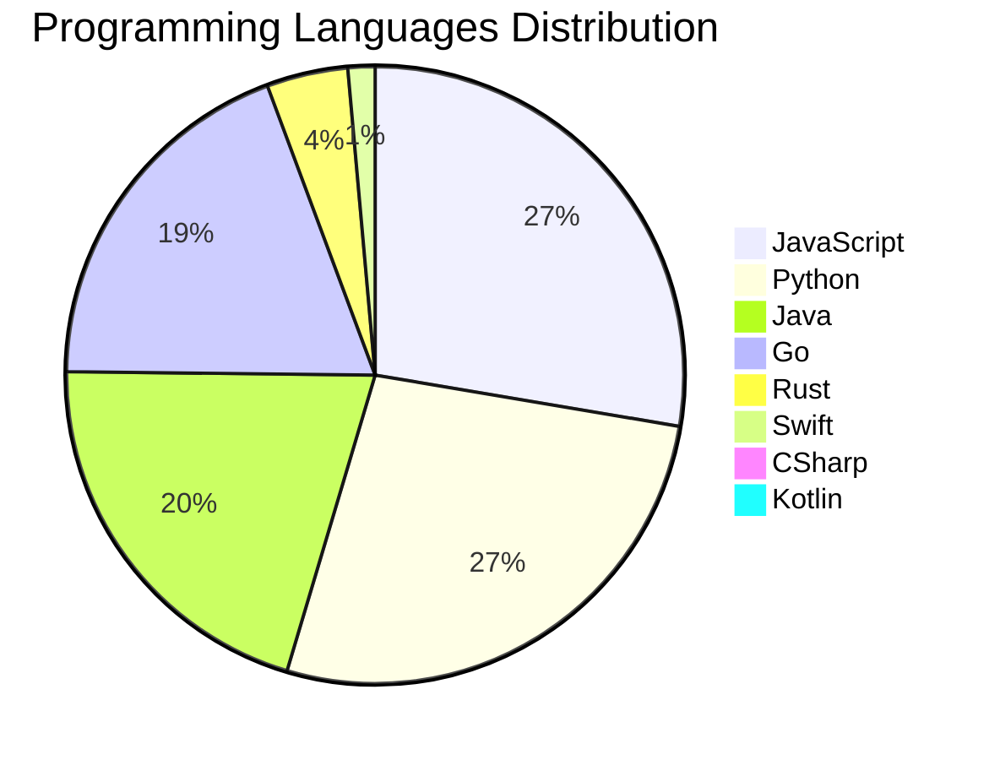

<div align="center">

# 📰 DevTech Auto News

**Your always-fresh digest of developer & AI tech news — curated automatically, around the clock.**


Aggregating [Dev.to](https://dev.to) · [Hacker News](https://news.ycombinator.com) · [GitHub Trending](https://github.com/trending) · [Lobste.rs](https://lobste.rs) · [Stack Overflow](https://stackoverflow.com) · [TechCrunch](https://techcrunch.com) · [freeCodeCamp](https://www.freecodecamp.org/news) — refreshed by GitHub Actions around the clock.

**[📰 Headlines](#-latest-headlines) · [💡 Interview Prep](#-interview-question-of-the-hour) · [📊 Statistics](#-statistics) · [⚙️ How It Works](#%EF%B8%8F-how-it-works)**

</div>

---

## 📰 Latest Headlines

> 🕐 Edition of **2026-09-23 21:00 CAT** — refreshed automatically, all day, every day.

### ✨ Featured Stories

<table>
<tr>
  <td align="center" width="33%">
    <a href="https://dev.to/mikachu/i-turned-devto-into-a-walkable-3d-library-debugging-it-has-been-a-nightmare-4lkd">
      
      <br/>
      <b>I Turned DEV.to Into a Walkable 3D Library — Debug...</b>
    </a>
    <br/>
    <sub>Dev.to</sub>
  </td>
  <td align="center" width="33%">
    <a href="https://dev.to/maame-codes/disappeared-since-march-taking-a-long-break-was-my-best-decision-yet-1n45">
      
      <br/>
      <b>Disappeared Since March: Taking a Long Break Was M...</b>
    </a>
    <br/>
    <sub>Dev.to</sub>
  </td>
  <td align="center" width="33%">
    <a href="https://dev.to/playfulprogramming/the-grand-unifying-architecture-of-frontend-bhk">
      
      <br/>
      <b>The Grand Unifying Architecture of Frontend</b>
    </a>
    <br/>
    <sub>Dev.to</sub>
  </td>
</tr>
<tr>
  <td align="center" width="33%">
    <a href="https://dev.to/gde/a-4-gb-laptop-gpu-vs-a-6-core-cpu-on-gemma-4-re-measured-in-abba-order-41x-5g56">
      
      <br/>
      <b>A 4 GB Laptop GPU vs a 6-Core CPU on Gemma 4, Re-M...</b>
    </a>
    <br/>
    <sub>Dev.to</sub>
  </td>
  <td align="center" width="33%">
    <a href="https://dev.to/uri_shmueli_a403e7acc04a8/the-missing-layer-in-ai-tooling-sharing-what-your-assistant-already-knows-1nch">
      
      <br/>
      <b>The missing layer in AI tooling: sharing what your...</b>
    </a>
    <br/>
    <sub>Dev.to</sub>
  </td>
  <td align="center" width="33%">
    <a href="https://dev.to/sloan/welcome-thread-v-394-22l2">
      
      <br/>
      <b>Welcome Thread - v 394</b>
    </a>
    <br/>
    <sub>Dev.to</sub>
  </td>
</tr>
</table>


### 🗞️ Top Stories

| # | Headline | Source |
|---|----------|--------|
| 1 | [I Turned DEV.to Into a Walkable 3D Library — Debugging It Has Been a Nightmare](https://dev.to/mikachu/i-turned-devto-into-a-walkable-3d-library-debugging-it-has-been-a-nightmare-4lkd) | Dev.to |
| 2 | [Disappeared Since March: Taking a Long Break Was My Best Decision Yet](https://dev.to/maame-codes/disappeared-since-march-taking-a-long-break-was-my-best-decision-yet-1n45) | Dev.to |
| 3 | [The Grand Unifying Architecture of Frontend](https://dev.to/playfulprogramming/the-grand-unifying-architecture-of-frontend-bhk) | Dev.to |
| 4 | [A 4 GB Laptop GPU vs a 6-Core CPU on Gemma 4, Re-Measured in ABBA Order: 4.1x](https://dev.to/gde/a-4-gb-laptop-gpu-vs-a-6-core-cpu-on-gemma-4-re-measured-in-abba-order-41x-5g56) | Dev.to |
| 5 | [The missing layer in AI tooling: sharing what your assistant already knows](https://dev.to/uri_shmueli_a403e7acc04a8/the-missing-layer-in-ai-tooling-sharing-what-your-assistant-already-knows-1nch) | Dev.to |
| 6 | [Welcome Thread - v 394](https://dev.to/sloan/welcome-thread-v-394-22l2) | Dev.to |
| 7 | [Production RAG on the Lakehouse with BigQuery Vector Search and Apache Iceberg](https://dev.to/gde/production-rag-on-the-lakehouse-with-bigquery-vector-search-and-apache-iceberg-5g3) | Dev.to |
| 8 | [Top 7 Featured DEV Posts of the Week](https://dev.to/devteam/top-7-featured-dev-posts-of-the-week-2agl) | Dev.to |
| 9 | [Gemma 4 on a Tesla T4, Part 2: The Minimum GCE VM and a Script to Drive It](https://dev.to/gde/gemma-4-on-a-tesla-t4-part-2-the-minimum-gce-vm-and-a-script-to-drive-it-3gk1) | Dev.to |
| 10 | [Claude Opus 5.5 is now available on Google Cloud](https://dev.to/googleai/claude-opus-55-is-now-available-on-google-cloud-2oh) | Dev.to |
| 11 | [What Nobody Is Using in Your Google Cloud Projects, and What It Costs](https://dev.to/gde/what-nobody-is-using-in-your-google-cloud-projects-and-what-it-costs-1k0) | Dev.to |
| 12 | [Congrats to the DEV Weekend Challenge: Dog Days Edition Winners!](https://dev.to/devteam/congrats-to-the-dev-weekend-challenge-dog-days-edition-winners-300g) | Dev.to |
| 13 | [Architecting a Resilient DevSecOps Pipeline for Enterprise AI Agents](https://dev.to/gde/architecting-a-resilient-devsecops-pipeline-for-enterprise-ai-agents-on4) | Dev.to |
| 14 | [MCP vs. API Explained: Do We Still Need APIs After MCP?](https://dev.to/thesnehamk/mcp-vs-api-explained-do-we-still-need-apis-after-mcp-2kkk) | Dev.to |
| 15 | [What was your win this week?!](https://dev.to/devteam/what-was-your-win-this-week-2hcb) | Dev.to |
| 16 | [Dart Enhanced Enums Are Secretly Factories: Unlocking Constructor Tearoffs](https://dev.to/gde/dart-enhanced-enums-are-secretly-factories-unlocking-constructor-tearoffs-54n9) | Dev.to |
| 17 | [Stop Paying the build_runner Tax: Why I Refuse to Use Mockito in Modern Dart](https://dev.to/gde/stop-paying-the-buildrunner-tax-why-i-refuse-to-use-mockito-in-modern-dart-4cif) | Dev.to |
| 18 | [Share State Across Dart Isolates Without Losing Your Mind: Enter shared_map](https://dev.to/gde/share-state-across-dart-isolates-without-losing-your-mind-enter-sharedmap-221b) | Dev.to |
| 19 | [20 Agentic AI Terms Every Developer Should Know (Explained Simply)](https://dev.to/sylwia-lask/20-agentic-ai-terms-every-developer-should-know-explained-simply-jii) | Dev.to |
| 20 | [A 16-second clock drift falsely tripped my trading bot's kill switch. A postmortem.](https://dev.to/wataru_suda_d295dab9cca4f/a-16-second-clock-drift-falsely-tripped-my-trading-bots-kill-switch-a-postmortem-4k2f) | Dev.to |

<sub>Last fetched: Wed, 23 Sep 2026 21:01:24 CAT</sub>


---

## 💡 Interview Question of the Hour

> Sharpen your skills — new questions selected on every update. Try answering before opening the hint!

**1. `DataStructures` — Implement LRU Cache**

&nbsp;&nbsp;&nbsp;&nbsp;🎯 Hard · 🏷 design, hash map, linked list

<details>
<summary>&nbsp;&nbsp;&nbsp;&nbsp;💡 Show hint</summary>

> Doubly linked list + hash map, O(1) operations

</details>

**2. `Database` — What is database normalization and denormalization?**

&nbsp;&nbsp;&nbsp;&nbsp;🎯 Medium · 🏷 design, optimization

<details>
<summary>&nbsp;&nbsp;&nbsp;&nbsp;💡 Show hint</summary>

> Normal forms, redundancy, performance trade-offs

</details>

**3. `SystemDesign` — Design Twitter's timeline feature**

&nbsp;&nbsp;&nbsp;&nbsp;🎯 Hard · 🏷 system design, scalability

<details>
<summary>&nbsp;&nbsp;&nbsp;&nbsp;💡 Show hint</summary>

> Fan-out, caching, ranking, real-time updates

</details>


---

## 📊 Statistics

#### 🗂 Articles by Category

| Category | Articles | Share | |
|----------|---------:|------:|---|
| **AI** | 78 | 42.4% | `████████████████████` |
| **Tools** | 45 | 24.5% | `████████████░░░░░░░░` |
| **JavaScript** | 39 | 21.2% | `██████████░░░░░░░░░░` |
| **Python** | 38 | 20.7% | `██████████░░░░░░░░░░` |
| **Security** | 17 | 9.2% | `████░░░░░░░░░░░░░░░░` |
| **Cloud** | 15 | 8.2% | `████░░░░░░░░░░░░░░░░` |
| **DevOps** | 14 | 7.6% | `████░░░░░░░░░░░░░░░░` |
| **Mobile** | 8 | 4.3% | `██░░░░░░░░░░░░░░░░░░` |
| **WebDev** | 7 | 3.8% | `██░░░░░░░░░░░░░░░░░░` |
| **Database** | 3 | 1.6% | `█░░░░░░░░░░░░░░░░░░░` |

<sub>Articles can match more than one category, so shares may sum to over 100%.</sub>


#### 📡 Articles by Source

| Source | Articles |
|--------|---------:|
| Dev.to | 60 |
| HackerNews | 49 |
| GitHub | 25 |
| Lobste.rs | 10 |
| StackOverflow | 20 |
| TechCrunch | 10 |
| freeCodeCamp | 10 |


#### 💻 Programming Language Trends

```
JavaScript      ██████████████████████████████ 27.3%
Python          █████████████████████████████ 26.6%
Java            ██████████████████████ 20.3%
Go              █████████████████████ 18.9%
Rust            █████ 4.2%
Swift           ██ 1.4%
CSharp          █ 0.7%
Kotlin          █ 0.7%

```




#### 🏷 Trending Topics

            


---

## ⚙️ How It Works

This repository is a fully automated news pipeline. On every run, GitHub Actions:

1. **Fetches** the latest articles from seven sources: Dev.to, Hacker News, GitHub Trending, Lobste.rs, Stack Overflow, TechCrunch, and freeCodeCamp
2. **Deduplicates and categorizes** them across 10+ topics using keyword matching
3. **Extracts cover images** and computes language & category statistics
4. **Rebuilds this README** and appends everything to the [full archive](./data/news_log.md)
5. **Commits and pushes** the result — no human intervention needed

<details>
<summary><b>🚀 Run it yourself</b></summary>

```bash
git clone https://github.com/Derrick-MUGISHA/github-activity-bot.git
cd github-activity-bot
npm install
npm start
```

Fork the repo, enable GitHub Actions, and you have your own self-updating news feed.

</details>

<details>
<summary><b>📚 Data & resources</b></summary>

- [Full news archive](./data/news_log.md) — complete history of every fetched article
- [Statistics](./data/stats.json) — raw stats data (JSON)
- [Categorized articles](./data/categorized.json) — articles grouped by topic
- [Interview question bank](./data/interview_questions.json) — the full question set

</details>

---

## 🤝 Contributing

Ideas for new sources, categories, or interview questions are welcome — [open an issue](https://github.com/Derrick-MUGISHA/github-activity-bot/issues/new) or submit a pull request.

## 📄 License

Released under the [MIT License](https://opensource.org/licenses/MIT) — free to use, fork, and modify.

---

<div align="center">
  <sub>🤖 Last automated update: <b>Wed, 23 Sep 2026 19:01:24 GMT</b></sub><br/>
  <sub>Powered by GitHub Actions · Built with ❤️ by <a href="https://github.com/Derrick-MUGISHA">Derrick MUGISHA</a></sub>
</div>
