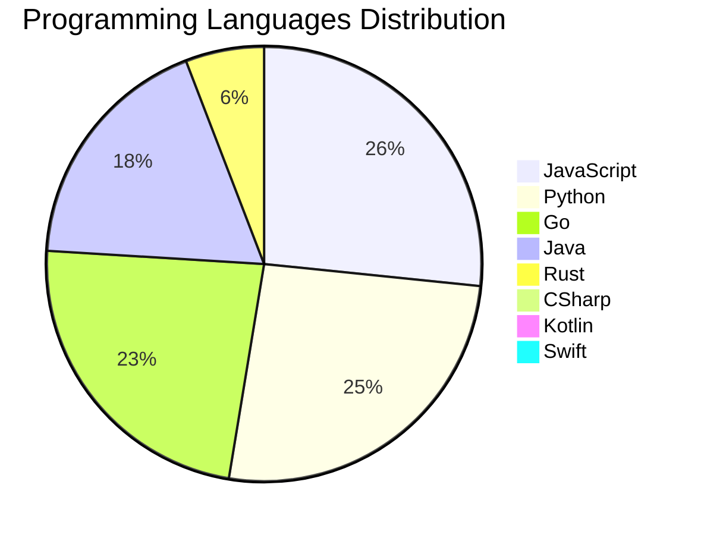

<div align="center">

# 📰 DevTech Auto News

**Your always-fresh digest of developer & AI tech news — curated automatically, around the clock.**


Aggregating [Dev.to](https://dev.to) · [Hacker News](https://news.ycombinator.com) · [GitHub Trending](https://github.com/trending) · [Lobste.rs](https://lobste.rs) · [Stack Overflow](https://stackoverflow.com) · [TechCrunch](https://techcrunch.com) · [freeCodeCamp](https://www.freecodecamp.org/news) — refreshed by GitHub Actions around the clock.

**[📰 Headlines](#-latest-headlines) · [💡 Interview Prep](#-interview-question-of-the-hour) · [📊 Statistics](#-statistics) · [⚙️ How It Works](#%EF%B8%8F-how-it-works)**

</div>

---

## 📰 Latest Headlines

> 🕐 Edition of **2026-09-22 8:00 CAT** — refreshed automatically, all day, every day.

### ✨ Featured Stories

<table>
<tr>
  <td align="center" width="33%">
    <a href="https://dev.to/devteam/congrats-to-the-dev-weekend-challenge-dog-days-edition-winners-300g">
      
      <br/>
      <b>Congrats to the DEV Weekend Challenge: Dog Days Ed...</b>
    </a>
    <br/>
    <sub>Dev.to</sub>
  </td>
  <td align="center" width="33%">
    <a href="https://dev.to/wataru_suda_d295dab9cca4f/a-16-second-clock-drift-falsely-tripped-my-trading-bots-kill-switch-a-postmortem-4k2f">
      
      <br/>
      <b>A 16-second clock drift falsely tripped my trading...</b>
    </a>
    <br/>
    <sub>Dev.to</sub>
  </td>
  <td align="center" width="33%">
    <a href="https://dev.to/gde/one-iceberg-mcp-server-seven-catalogs-what-it-takes-to-reach-each-one-2605">
      
      <br/>
      <b>One Iceberg MCP Server, Seven Catalogs: What It Ta...</b>
    </a>
    <br/>
    <sub>Dev.to</sub>
  </td>
</tr>
<tr>
  <td align="center" width="33%">
    <a href="https://dev.to/gde/architecting-a-resilient-devsecops-pipeline-for-enterprise-ai-agents-on4">
      
      <br/>
      <b>Architecting a Resilient DevSecOps Pipeline for En...</b>
    </a>
    <br/>
    <sub>Dev.to</sub>
  </td>
  <td align="center" width="33%">
    <a href="https://dev.to/devteam/what-was-your-win-this-week-2hcb">
      
      <br/>
      <b>What was your win this week?!</b>
    </a>
    <br/>
    <sub>Dev.to</sub>
  </td>
  <td align="center" width="33%">
    <a href="https://dev.to/gde/dart-enhanced-enums-are-secretly-factories-unlocking-constructor-tearoffs-54n9">
      
      <br/>
      <b>Dart Enhanced Enums Are Secretly Factories: Unlock...</b>
    </a>
    <br/>
    <sub>Dev.to</sub>
  </td>
</tr>
</table>


### 🗞️ Top Stories

| # | Headline | Source |
|---|----------|--------|
| 1 | [Congrats to the DEV Weekend Challenge: Dog Days Edition Winners!](https://dev.to/devteam/congrats-to-the-dev-weekend-challenge-dog-days-edition-winners-300g) | Dev.to |
| 2 | [A 16-second clock drift falsely tripped my trading bot's kill switch. A postmortem.](https://dev.to/wataru_suda_d295dab9cca4f/a-16-second-clock-drift-falsely-tripped-my-trading-bots-kill-switch-a-postmortem-4k2f) | Dev.to |
| 3 | [One Iceberg MCP Server, Seven Catalogs: What It Takes to Reach Each One](https://dev.to/gde/one-iceberg-mcp-server-seven-catalogs-what-it-takes-to-reach-each-one-2605) | Dev.to |
| 4 | [Architecting a Resilient DevSecOps Pipeline for Enterprise AI Agents](https://dev.to/gde/architecting-a-resilient-devsecops-pipeline-for-enterprise-ai-agents-on4) | Dev.to |
| 5 | [What was your win this week?!](https://dev.to/devteam/what-was-your-win-this-week-2hcb) | Dev.to |
| 6 | [Dart Enhanced Enums Are Secretly Factories: Unlocking Constructor Tearoffs](https://dev.to/gde/dart-enhanced-enums-are-secretly-factories-unlocking-constructor-tearoffs-54n9) | Dev.to |
| 7 | [Stop Paying the build_runner Tax: Why I Refuse to Use Mockito in Modern Dart](https://dev.to/gde/stop-paying-the-buildrunner-tax-why-i-refuse-to-use-mockito-in-modern-dart-4cif) | Dev.to |
| 8 | [Share State Across Dart Isolates Without Losing Your Mind: Enter shared_map](https://dev.to/gde/share-state-across-dart-isolates-without-losing-your-mind-enter-sharedmap-221b) | Dev.to |
| 9 | [The Symmetry of State: Why Flutter Deserves context.value and context.state](https://dev.to/gde/the-symmetry-of-state-why-flutter-deserves-contextvalue-and-contextstate-4250) | Dev.to |
| 10 | [Build in the VM, Think on the Mac GPU: Debian 13 on Apple container With a Local Gemma 4](https://dev.to/gde/build-in-the-vm-think-on-the-mac-gpu-debian-13-on-apple-container-with-a-local-gemma-4-2d8b) | Dev.to |
| 11 | [Gemma 4 on an 2021 4 GB Laptop GPU: QAT Takes It From 9.5 GiB to 1.6](https://dev.to/gde/gemma-4-on-an-old-4-gb-laptop-gpu-qat-takes-it-from-95-gib-to-16-b5l) | Dev.to |
| 12 | [Valid Schema, Wrong Content: Using Jev to Guard a Google ADK Agent](https://dev.to/gde/valid-schema-wrong-content-using-jev-to-guard-a-google-adk-agent-57o6) | Dev.to |
| 13 | [The beauty and terror of negative feedback](https://dev.to/amandamayfield/the-beauty-and-terror-of-negative-feedback-2g4d) | Dev.to |
| 14 | [The Only Container Orchestrator with Built-In Compliance: How Gubernator Enforces ENS, NIS 2, DORA, CIS Benchmark, and ISO 27001](https://dev.to/gde/the-only-container-orchestrator-with-built-in-compliance-how-gubernator-enforces-ens-nis-2-cis-mbf) | Dev.to |
| 15 | [Nano Banana 2 Lite, Revisited: MCP 2.0, the New Interactions API, and Three Agent CLIs](https://dev.to/gde/nano-banana-2-lite-revisited-mcp-20-the-new-interactions-api-and-three-agent-clis-37g5) | Dev.to |
| 16 | [Harness engineering doesn't mean building your own harness](https://dev.to/annthurium/harness-engineering-doesnt-mean-building-your-own-harness-16pk) | Dev.to |
| 17 | [20 Agentic AI Terms Every Developer Should Know (Explained Simply)](https://dev.to/sylwia-lask/20-agentic-ai-terms-every-developer-should-know-explained-simply-jii) | Dev.to |
| 18 | [Why AI Coding Agents Crash at 3 AM: The Happy-Path Mirage & The Forced Continuity Defect](https://dev.to/gde/why-ai-coding-agents-crash-at-3-am-the-happy-path-mirage-the-forced-continuity-defect-46pd) | Dev.to |
| 19 | [What Happens When AI Outgrows the Tests We Use to Measure It?](https://dev.to/hemapriya_kanagala/what-happens-when-ai-outgrows-the-tests-we-use-to-measure-it-30al) | Dev.to |
| 20 | [An MI300X Over MCP: What the Matrix Cores Execute, and What They Don't](https://dev.to/gde/an-mi300x-over-mcp-what-the-matrix-cores-execute-and-what-they-dont-1me9) | Dev.to |

<sub>Last fetched: Tue, 22 Sep 2026 08:05:18 CAT</sub>


---

## 💡 Interview Question of the Hour

> Sharpen your skills — new questions selected on every update. Try answering before opening the hint!

**1. `Database` — Explain database indexing and when to use it**

&nbsp;&nbsp;&nbsp;&nbsp;🎯 Medium · 🏷 optimization, performance

<details>
<summary>&nbsp;&nbsp;&nbsp;&nbsp;💡 Show hint</summary>

> B-tree, trade-offs, query performance

</details>

**2. `JavaScript` — What is the difference between `let`, `const`, and `var`?**

&nbsp;&nbsp;&nbsp;&nbsp;🎯 Easy · 🏷 variables, scope

<details>
<summary>&nbsp;&nbsp;&nbsp;&nbsp;💡 Show hint</summary>

> Scope, hoisting, and reassignment capabilities

</details>

**3. `SystemDesign` — How would you design a rate limiter?**

&nbsp;&nbsp;&nbsp;&nbsp;🎯 Medium · 🏷 system design, algorithms

<details>
<summary>&nbsp;&nbsp;&nbsp;&nbsp;💡 Show hint</summary>

> Token bucket, sliding window, distributed systems

</details>


---

## 📊 Statistics

#### 🗂 Articles by Category

| Category | Articles | Share | |
|----------|---------:|------:|---|
| **AI** | 77 | 42.3% | `████████████████████` |
| **Tools** | 46 | 25.3% | `████████████░░░░░░░░` |
| **JavaScript** | 41 | 22.5% | `███████████░░░░░░░░░` |
| **Python** | 40 | 22.0% | `██████████░░░░░░░░░░` |
| **Cloud** | 18 | 9.9% | `█████░░░░░░░░░░░░░░░` |
| **DevOps** | 16 | 8.8% | `████░░░░░░░░░░░░░░░░` |
| **Security** | 15 | 8.2% | `████░░░░░░░░░░░░░░░░` |
| **WebDev** | 10 | 5.5% | `███░░░░░░░░░░░░░░░░░` |
| **Mobile** | 8 | 4.4% | `██░░░░░░░░░░░░░░░░░░` |
| **Database** | 8 | 4.4% | `██░░░░░░░░░░░░░░░░░░` |

<sub>Articles can match more than one category, so shares may sum to over 100%.</sub>


#### 📡 Articles by Source

| Source | Articles |
|--------|---------:|
| Dev.to | 58 |
| HackerNews | 49 |
| GitHub | 25 |
| Lobste.rs | 10 |
| StackOverflow | 20 |
| TechCrunch | 10 |
| freeCodeCamp | 10 |


#### 💻 Programming Language Trends

```
JavaScript      ██████████████████████████████ 26.1%
Python          █████████████████████████████ 25.5%
Go              ██████████████████████████ 22.9%
Java            ████████████████████ 17.8%
Rust            ███████ 5.7%
CSharp          █ 0.6%
Kotlin          █ 0.6%
Swift           █ 0.6%

```




#### 🏷 Trending Topics

            


---

## ⚙️ How It Works

This repository is a fully automated news pipeline. On every run, GitHub Actions:

1. **Fetches** the latest articles from seven sources: Dev.to, Hacker News, GitHub Trending, Lobste.rs, Stack Overflow, TechCrunch, and freeCodeCamp
2. **Deduplicates and categorizes** them across 10+ topics using keyword matching
3. **Extracts cover images** and computes language & category statistics
4. **Rebuilds this README** and appends everything to the [full archive](./data/news_log.md)
5. **Commits and pushes** the result — no human intervention needed

<details>
<summary><b>🚀 Run it yourself</b></summary>

```bash
git clone https://github.com/Derrick-MUGISHA/github-activity-bot.git
cd github-activity-bot
npm install
npm start
```

Fork the repo, enable GitHub Actions, and you have your own self-updating news feed.

</details>

<details>
<summary><b>📚 Data & resources</b></summary>

- [Full news archive](./data/news_log.md) — complete history of every fetched article
- [Statistics](./data/stats.json) — raw stats data (JSON)
- [Categorized articles](./data/categorized.json) — articles grouped by topic
- [Interview question bank](./data/interview_questions.json) — the full question set

</details>

---

## 🤝 Contributing

Ideas for new sources, categories, or interview questions are welcome — [open an issue](https://github.com/Derrick-MUGISHA/github-activity-bot/issues/new) or submit a pull request.

## 📄 License

Released under the [MIT License](https://opensource.org/licenses/MIT) — free to use, fork, and modify.

---

<div align="center">
  <sub>🤖 Last automated update: <b>Tue, 22 Sep 2026 06:05:18 GMT</b></sub><br/>
  <sub>Powered by GitHub Actions · Built with ❤️ by <a href="https://github.com/Derrick-MUGISHA">Derrick MUGISHA</a></sub>
</div>
