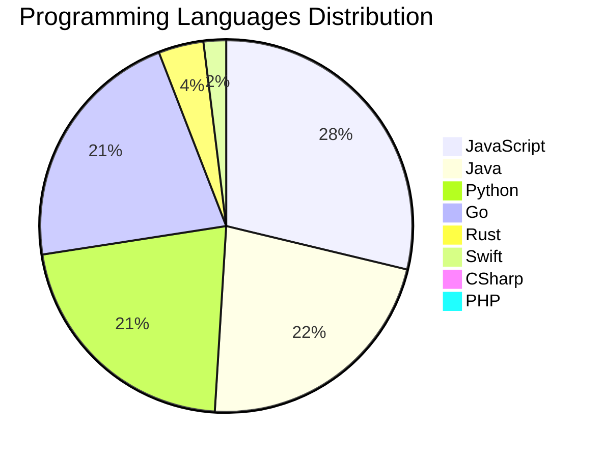

<div align="center">

# 📰 DevTech Auto News

**Your always-fresh digest of developer & AI tech news — curated automatically, around the clock.**


Aggregating [Dev.to](https://dev.to) · [Hacker News](https://news.ycombinator.com) · [GitHub Trending](https://github.com/trending) · [Lobste.rs](https://lobste.rs) · [Stack Overflow](https://stackoverflow.com) · [TechCrunch](https://techcrunch.com) · [freeCodeCamp](https://www.freecodecamp.org/news) — refreshed by GitHub Actions around the clock.

**[📰 Headlines](#-latest-headlines) · [💡 Interview Prep](#-interview-question-of-the-hour) · [📊 Statistics](#-statistics) · [⚙️ How It Works](#%EF%B8%8F-how-it-works)**

</div>

---

## 📰 Latest Headlines

> 🕐 Edition of **2026-08-15 17:00 CAT** — refreshed automatically, all day, every day.

### ✨ Featured Stories

<table>
<tr>
  <td align="center" width="33%">
    <a href="https://dev.to/devteam/what-was-your-win-this-week-23ob">
      
      <br/>
      <b>What was your win this week??</b>
    </a>
    <br/>
    <sub>Dev.to</sub>
  </td>
  <td align="center" width="33%">
    <a href="https://dev.to/gde/reviving-open-source-giants-how-i-brought-weave-scope-back-with-multi-platform-docker-support-in-cmo">
      
      <br/>
      <b>Reviving Open Source Giants: How I Brought Weave S...</b>
    </a>
    <br/>
    <sub>Dev.to</sub>
  </td>
  <td align="center" width="33%">
    <a href="https://dev.to/gde/dev-logpython-create-short-videos-from-photos-and-clips-with-gemini-37-flash-reelcraft-1gc6">
      
      <br/>
      <b>[Dev Log][Python] Create short videos from photos ...</b>
    </a>
    <br/>
    <sub>Dev.to</sub>
  </td>
</tr>
<tr>
  <td align="center" width="33%">
    <a href="https://dev.to/gde/lookers-native-mcp-server-with-claude-code-11j8">
      
      <br/>
      <b>Looker's Native MCP Server with Claude Code</b>
    </a>
    <br/>
    <sub>Dev.to</sub>
  </td>
  <td align="center" width="33%">
    <a href="https://dev.to/gde/running-gemma-4-on-ec2-g5g-graviton2-amd-with-nvidia-gpu-25ci">
      
      <br/>
      <b>Running Gemma 4 on EC2 G5g: Graviton2 AMD with NVI...</b>
    </a>
    <br/>
    <sub>Dev.to</sub>
  </td>
  <td align="center" width="33%">
    <a href="https://dev.to/ben/its-always-doom-httpsooddevpostsdoom-4fpi">
      
      <br/>
      <b>It's always Doom https://ood.dev/posts/doom/</b>
    </a>
    <br/>
    <sub>Dev.to</sub>
  </td>
</tr>
</table>


### 🗞️ Top Stories

| # | Headline | Source |
|---|----------|--------|
| 1 | [What was your win this week??](https://dev.to/devteam/what-was-your-win-this-week-23ob) | Dev.to |
| 2 | [Reviving Open Source Giants: How I Brought Weave Scope Back with Multi-Platform Docker Support in One Afternoon Using Antigravity](https://dev.to/gde/reviving-open-source-giants-how-i-brought-weave-scope-back-with-multi-platform-docker-support-in-cmo) | Dev.to |
| 3 | [[Dev Log][Python] Create short videos from photos and clips with Gemini 3.7 Flash: ReelCraft](https://dev.to/gde/dev-logpython-create-short-videos-from-photos-and-clips-with-gemini-37-flash-reelcraft-1gc6) | Dev.to |
| 4 | [Looker's Native MCP Server with Claude Code](https://dev.to/gde/lookers-native-mcp-server-with-claude-code-11j8) | Dev.to |
| 5 | [Running Gemma 4 on EC2 G5g: Graviton2 AMD with NVIDIA GPU](https://dev.to/gde/running-gemma-4-on-ec2-g5g-graviton2-amd-with-nvidia-gpu-25ci) | Dev.to |
| 6 | [It's always Doom https://ood.dev/posts/doom/](https://dev.to/ben/its-always-doom-httpsooddevpostsdoom-4fpi) | Dev.to |
| 7 | [Dart 3.13 Primary Constructors + BlocSignal: Boilerplate-Free Reactive Architecture](https://dev.to/gde/dart-313-primary-constructors-blocsignal-boilerplate-free-reactive-architecture-5fll) | Dev.to |
| 8 | [Riverpod to BlocSignal: Incremental Migration and Zero-Codegen Signals for Flutter](https://dev.to/gde/riverpod-to-blocsignal-incremental-migration-and-zero-codegen-signals-for-flutter-1gdp) | Dev.to |
| 9 | [I Stopped Trusting AI Agents With Tools. So I Built a Gatekeeper.](https://dev.to/debashish_ghosal/i-stopped-trusting-ai-agents-with-tools-so-i-built-a-gatekeeper-26fb) | Dev.to |
| 10 | [Hey all! I’m Jem, the DEV Community Program Coordinator](https://dev.to/devteam/hey-all-im-jem-the-dev-community-program-coordinator-2g2) | Dev.to |
| 11 | [My (not so pretty) journey in tech](https://dev.to/ishacodes/why-i-joined-devto--5c63) | Dev.to |
| 12 | [I Joined dev.to because...](https://dev.to/francistrdev/i-joined-devto-because-fl0) | Dev.to |
| 13 | [Do I Still Need a Monkey Patch for Gemini Live?](https://dev.to/gde/do-i-still-need-a-monkey-patch-for-gemini-live-4c3e) | Dev.to |
| 14 | [Latency vs. Tokens: What I Learned Optimizing an Agent with Gemma (and What Didn't Work)](https://dev.to/gde/latency-vs-tokens-what-i-learned-optimizing-an-agent-with-gemma-and-what-didnt-work-445g) | Dev.to |
| 15 | [How Many Introductions Away Are You From Pedro Pascal? A Practical Introduction to Graph Search](https://dev.to/ale3oula/how-many-introductions-away-are-you-from-pedro-pascal-a-practical-introduction-to-graph-search-5bfg) | Dev.to |
| 16 | [Serving Gemma 4 2B on a Single TPU v5e Chip with MCP and Antigravity CLI](https://dev.to/gde/serving-gemma-4-2b-on-a-single-tpu-v5e-chip-with-mcp-and-antigravity-cli-33l8) | Dev.to |
| 17 | [Join our DEV Weekend Challenge: Dog Days Edition! $1,000 in Prizes Across FIVE Winners. Submissions Due August 17 at 6:59 AM UTC.](https://dev.to/devteam/join-our-dev-weekend-challenge-dog-days-edition-1000-in-prizes-across-five-winners-submissions-1g4i) | Dev.to |
| 18 | [Backend Engineer (Me) Ships a Browser Game With One Unintentional System Requirement: My Monitor](https://dev.to/georgekobaidze/backend-engineer-me-ships-a-browser-game-with-one-unintentional-system-requirement-my-monitor-1ojd) | Dev.to |
| 19 | [MCP Configuration for Looker with Codex](https://dev.to/gde/mcp-configuration-for-looker-with-codex-30e1) | Dev.to |
| 20 | [Managed Inference on Google Cloud: Pairing the Gemini Enterprise Agent Platform with Cloud Run](https://dev.to/gdg/managed-inference-on-google-cloud-pairing-the-gemini-enterprise-agent-platform-with-cloud-run-246j) | Dev.to |

<sub>Last fetched: Sat, 15 Aug 2026 17:15:30 CAT</sub>


---

## 💡 Interview Question of the Hour

> Sharpen your skills — new questions selected on every update. Try answering before opening the hint!

**1. `NodeJS` — Implement rate limiting for an API**

&nbsp;&nbsp;&nbsp;&nbsp;🎯 Hard · 🏷 security, middleware

<details>
<summary>&nbsp;&nbsp;&nbsp;&nbsp;💡 Show hint</summary>

> Token bucket, sliding window, Redis

</details>

**2. `Database` — Explain database indexing and when to use it**

&nbsp;&nbsp;&nbsp;&nbsp;🎯 Medium · 🏷 optimization, performance

<details>
<summary>&nbsp;&nbsp;&nbsp;&nbsp;💡 Show hint</summary>

> B-tree, trade-offs, query performance

</details>

**3. `React` — Implement a custom hook for fetching data**

&nbsp;&nbsp;&nbsp;&nbsp;🎯 Medium · 🏷 hooks, async

<details>
<summary>&nbsp;&nbsp;&nbsp;&nbsp;💡 Show hint</summary>

> useState, useEffect, loading states, error handling

</details>


---

## 📊 Statistics

#### 🗂 Articles by Category

| Category | Articles | Share | |
|----------|---------:|------:|---|
| **AI** | 66 | 35.9% | `████████████████████` |
| **JavaScript** | 44 | 23.9% | `█████████████░░░░░░░` |
| **Tools** | 37 | 20.1% | `███████████░░░░░░░░░` |
| **Python** | 33 | 17.9% | `██████████░░░░░░░░░░` |
| **WebDev** | 19 | 10.3% | `██████░░░░░░░░░░░░░░` |
| **Security** | 18 | 9.8% | `█████░░░░░░░░░░░░░░░` |
| **Cloud** | 15 | 8.2% | `█████░░░░░░░░░░░░░░░` |
| **DevOps** | 14 | 7.6% | `████░░░░░░░░░░░░░░░░` |
| **Mobile** | 7 | 3.8% | `██░░░░░░░░░░░░░░░░░░` |
| **Database** | 3 | 1.6% | `█░░░░░░░░░░░░░░░░░░░` |

<sub>Articles can match more than one category, so shares may sum to over 100%.</sub>


#### 📡 Articles by Source

| Source | Articles |
|--------|---------:|
| Dev.to | 60 |
| HackerNews | 49 |
| GitHub | 25 |
| Lobste.rs | 10 |
| StackOverflow | 20 |
| TechCrunch | 10 |
| freeCodeCamp | 10 |


#### 💻 Programming Language Trends

```
JavaScript      ██████████████████████████████ 28.4%
Java            ███████████████████████ 21.9%
Python          ███████████████████████ 21.3%
Go              ███████████████████████ 21.3%
Rust            ████ 3.9%
Swift           ██ 1.9%
CSharp          █ 0.6%
PHP             █ 0.6%

```




#### 🏷 Trending Topics

            


---

## ⚙️ How It Works

This repository is a fully automated news pipeline. On every run, GitHub Actions:

1. **Fetches** the latest articles from seven sources: Dev.to, Hacker News, GitHub Trending, Lobste.rs, Stack Overflow, TechCrunch, and freeCodeCamp
2. **Deduplicates and categorizes** them across 10+ topics using keyword matching
3. **Extracts cover images** and computes language & category statistics
4. **Rebuilds this README** and appends everything to the [full archive](./data/news_log.md)
5. **Commits and pushes** the result — no human intervention needed

<details>
<summary><b>🚀 Run it yourself</b></summary>

```bash
git clone https://github.com/Derrick-MUGISHA/github-activity-bot.git
cd github-activity-bot
npm install
npm start
```

Fork the repo, enable GitHub Actions, and you have your own self-updating news feed.

</details>

<details>
<summary><b>📚 Data & resources</b></summary>

- [Full news archive](./data/news_log.md) — complete history of every fetched article
- [Statistics](./data/stats.json) — raw stats data (JSON)
- [Categorized articles](./data/categorized.json) — articles grouped by topic
- [Interview question bank](./data/interview_questions.json) — the full question set

</details>

---

## 🤝 Contributing

Ideas for new sources, categories, or interview questions are welcome — [open an issue](https://github.com/Derrick-MUGISHA/github-activity-bot/issues/new) or submit a pull request.

## 📄 License

Released under the [MIT License](https://opensource.org/licenses/MIT) — free to use, fork, and modify.

---

<div align="center">
  <sub>🤖 Last automated update: <b>Sat, 15 Aug 2026 15:15:30 GMT</b></sub><br/>
  <sub>Powered by GitHub Actions · Built with ❤️ by <a href="https://github.com/Derrick-MUGISHA">Derrick MUGISHA</a></sub>
</div>
