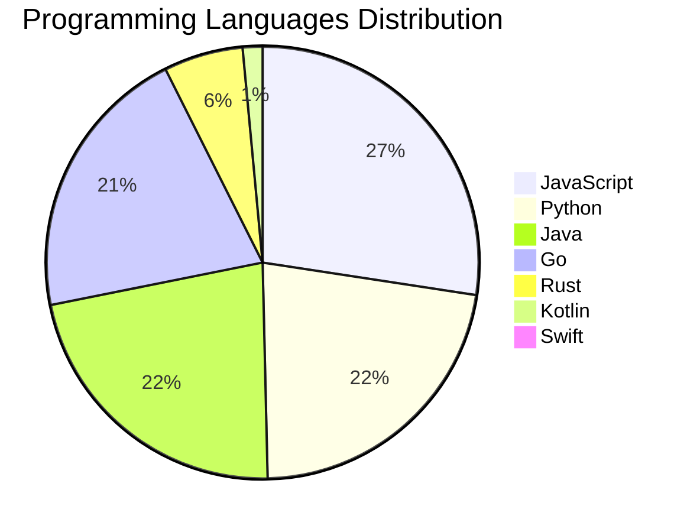

<div align="center">

# 📰 DevTech Auto News

**Your always-fresh digest of developer & AI tech news — curated automatically, around the clock.**


Aggregating [Dev.to](https://dev.to) · [Hacker News](https://news.ycombinator.com) · [GitHub Trending](https://github.com/trending) · [Lobste.rs](https://lobste.rs) · [Stack Overflow](https://stackoverflow.com) · [TechCrunch](https://techcrunch.com) · [freeCodeCamp](https://www.freecodecamp.org/news) — refreshed by GitHub Actions around the clock.

**[📰 Headlines](#-latest-headlines) · [💡 Interview Prep](#-interview-question-of-the-hour) · [📊 Statistics](#-statistics) · [⚙️ How It Works](#%EF%B8%8F-how-it-works)**

</div>

---

## 📰 Latest Headlines

> 🕐 Edition of **2026-07-07 14:00 CAT** — refreshed automatically, all day, every day.

### ✨ Featured Stories

<table>
<tr>
  <td align="center" width="33%">
    <a href="https://dev.to/googleai/master-local-fine-tuning-with-gemma-trainer-3ipp">
      
      <br/>
      <b>Master Local Fine-Tuning with "gemma-trainer"</b>
    </a>
    <br/>
    <sub>Dev.to</sub>
  </td>
  <td align="center" width="33%">
    <a href="https://dev.to/dailycontext/forward-deployed-engineers-and-the-future-of-software-engineering-jll">
      
      <br/>
      <b>Forward Deployed Engineers and the future of softw...</b>
    </a>
    <br/>
    <sub>Dev.to</sub>
  </td>
  <td align="center" width="33%">
    <a href="https://dev.to/ben/meme-monday-5g25">
      
      <br/>
      <b>Meme Monday</b>
    </a>
    <br/>
    <sub>Dev.to</sub>
  </td>
</tr>
<tr>
  <td align="center" width="33%">
    <a href="https://dev.to/gde/omni-flash-preview-with-codex-3h17">
      
      <br/>
      <b>Omni Flash Preview with Codex</b>
    </a>
    <br/>
    <sub>Dev.to</sub>
  </td>
  <td align="center" width="33%">
    <a href="https://dev.to/mattstratton/i-contain-multitudes-and-also-three-git-repos-33pf">
      
      <br/>
      <b>I Contain Multitudes (and Also Three Git Repos)</b>
    </a>
    <br/>
    <sub>Dev.to</sub>
  </td>
  <td align="center" width="33%">
    <a href="https://dev.to/dailycontext/the-fragile-balance-of-ai-development-individual-flow-vs-collective-context-2f49">
      
      <br/>
      <b>The Fragile Balance of AI Development: Individual ...</b>
    </a>
    <br/>
    <sub>Dev.to</sub>
  </td>
</tr>
</table>


### 🗞️ Top Stories

| # | Headline | Source |
|---|----------|--------|
| 1 | [Master Local Fine-Tuning with "gemma-trainer"](https://dev.to/googleai/master-local-fine-tuning-with-gemma-trainer-3ipp) | Dev.to |
| 2 | [Forward Deployed Engineers and the future of software engineering](https://dev.to/dailycontext/forward-deployed-engineers-and-the-future-of-software-engineering-jll) | Dev.to |
| 3 | [Meme Monday](https://dev.to/ben/meme-monday-5g25) | Dev.to |
| 4 | [Omni Flash Preview with Codex](https://dev.to/gde/omni-flash-preview-with-codex-3h17) | Dev.to |
| 5 | [I Contain Multitudes (and Also Three Git Repos)](https://dev.to/mattstratton/i-contain-multitudes-and-also-three-git-repos-33pf) | Dev.to |
| 6 | [The Fragile Balance of AI Development: Individual Flow vs. Collective Context](https://dev.to/dailycontext/the-fragile-balance-of-ai-development-individual-flow-vs-collective-context-2f49) | Dev.to |
| 7 | [My AI agent tried to ship a mistake we'd already reverted](https://dev.to/masondelan/my-ai-agent-tried-to-ship-a-mistake-wed-already-reverted-4737) | Dev.to |
| 8 | [KubeOrchestrator: Autonomous Kubernetes Operations Powered by Antigravity](https://dev.to/gde/kubeorchestrator-autonomous-kubernetes-operations-powered-by-antigravity-1d4p) | Dev.to |
| 9 | [Two-day hackathon kicks off AI Engineer World’s Fair](https://dev.to/dailycontext/two-day-hackathon-kicks-off-ai-engineer-worlds-fair-2l1d) | Dev.to |
| 10 | [What's Next for AI?](https://dev.to/sylwia-lask/whats-next-for-ai-219i) | Dev.to |
| 11 | [[AI in Action] Refining a macOS Meeting Translation App with Claude Code: Auto-reconnect, Floating Captions, and Meeting Minutes Export Evolution](https://dev.to/gde/ai-in-action-refining-a-macos-meeting-translation-app-with-claude-code-auto-reconnect-floating-2856) | Dev.to |
| 12 | [Midsommer Madness with WASM, Rust, and Azure Container Apps](https://dev.to/gde/midsommer-madness-with-wasm-rust-and-azure-container-apps-113b) | Dev.to |
| 13 | [i made a fogger breakdown video](https://dev.to/codebunny20/i-made-a-fogger-breakdown-video-18k1) | Dev.to |
| 14 | [Need a break? Play today's game from The Daily Context.](https://dev.to/devteam/need-a-break-play-todays-game-from-the-daily-context-1fli) | Dev.to |
| 15 | [12B Gemma 4 Deployment with NVIDIA Blackwell 6000, QAT, MTP, and Antigravity CLI](https://dev.to/gde/12b-gemma-4-deployment-with-nvidia-blackwell-6000-qat-mtp-and-antigravity-cli-3gn6) | Dev.to |
| 16 | [12B Gemma 4 Deployment with NVIDIA Blackwell 6000, MCP, Cloud Run, and Antigravity CLI](https://dev.to/gde/12b-gemma-4-deployment-with-nvidia-blackwell-6000-mcp-cloud-run-and-antigravity-cli-3ckn) | Dev.to |
| 17 | [Closing the Trust Gap: Automating GKE Incident Response with Antigravity 2.0, GKE MCP, and Artifacts](https://dev.to/gde/closing-the-trust-gap-automating-gke-incident-response-with-antigravity-20-and-artifacts-21c9) | Dev.to |
| 18 | [Not Enough SMEs or Customers to Make Your Evals? Make Some!](https://dev.to/ohkpond/not-enough-smes-or-customers-to-make-your-evals-make-some-11nc) | Dev.to |
| 19 | [The biggest World’s Fair yet powers down for the moment](https://dev.to/dailycontext/the-biggest-worlds-fair-yet-powers-down-for-the-moment-1jca) | Dev.to |
| 20 | [cuenv: one typed file for your whole project](https://dev.to/peterj/cuenv-one-typed-file-for-your-whole-project-76a) | Dev.to |

<sub>Last fetched: Tue, 07 Jul 2026 14:11:00 CAT</sub>


---

## 💡 Interview Question of the Hour

> Sharpen your skills — new questions selected on every update. Try answering before opening the hint!

**1. `SystemDesign` — Design a distributed cache system**

&nbsp;&nbsp;&nbsp;&nbsp;🎯 Hard · 🏷 distributed systems, caching

<details>
<summary>&nbsp;&nbsp;&nbsp;&nbsp;💡 Show hint</summary>

> Consistency, partitioning, replication, eviction policies

</details>

**2. `NodeJS` — How do you handle errors in async/await?**

&nbsp;&nbsp;&nbsp;&nbsp;🎯 Medium · 🏷 error handling, async

<details>
<summary>&nbsp;&nbsp;&nbsp;&nbsp;💡 Show hint</summary>

> try/catch, .catch(), error middleware

</details>

**3. `DataStructures` — Implement LRU Cache**

&nbsp;&nbsp;&nbsp;&nbsp;🎯 Hard · 🏷 design, hash map, linked list

<details>
<summary>&nbsp;&nbsp;&nbsp;&nbsp;💡 Show hint</summary>

> Doubly linked list + hash map, O(1) operations

</details>


---

## 📊 Statistics

#### 🗂 Articles by Category

| Category | Articles | Share | |
|----------|---------:|------:|---|
| **AI** | 86 | 46.7% | `████████████████████` |
| **Tools** | 50 | 27.2% | `████████████░░░░░░░░` |
| **JavaScript** | 37 | 20.1% | `█████████░░░░░░░░░░░` |
| **Python** | 30 | 16.3% | `███████░░░░░░░░░░░░░` |
| **Security** | 17 | 9.2% | `████░░░░░░░░░░░░░░░░` |
| **DevOps** | 16 | 8.7% | `████░░░░░░░░░░░░░░░░` |
| **WebDev** | 13 | 7.1% | `███░░░░░░░░░░░░░░░░░` |
| **Cloud** | 11 | 6.0% | `███░░░░░░░░░░░░░░░░░` |
| **Mobile** | 3 | 1.6% | `█░░░░░░░░░░░░░░░░░░░` |
| **Database** | 3 | 1.6% | `█░░░░░░░░░░░░░░░░░░░` |

<sub>Articles can match more than one category, so shares may sum to over 100%.</sub>


#### 📡 Articles by Source

| Source | Articles |
|--------|---------:|
| Dev.to | 60 |
| HackerNews | 49 |
| GitHub | 25 |
| Lobste.rs | 10 |
| StackOverflow | 20 |
| TechCrunch | 10 |
| freeCodeCamp | 10 |


#### 💻 Programming Language Trends

```
JavaScript      ██████████████████████████████ 27.2%
Python          ████████████████████████ 22.1%
Java            ████████████████████████ 22.1%
Go              ███████████████████████ 20.6%
Rust            ███████ 5.9%
Kotlin          ██ 1.5%
Swift           █ 0.7%

```




#### 🏷 Trending Topics

            


---

## ⚙️ How It Works

This repository is a fully automated news pipeline. On every run, GitHub Actions:

1. **Fetches** the latest articles from seven sources: Dev.to, Hacker News, GitHub Trending, Lobste.rs, Stack Overflow, TechCrunch, and freeCodeCamp
2. **Deduplicates and categorizes** them across 10+ topics using keyword matching
3. **Extracts cover images** and computes language & category statistics
4. **Rebuilds this README** and appends everything to the [full archive](./data/news_log.md)
5. **Commits and pushes** the result — no human intervention needed

<details>
<summary><b>🚀 Run it yourself</b></summary>

```bash
git clone https://github.com/Derrick-MUGISHA/github-activity-bot.git
cd github-activity-bot
npm install
npm start
```

Fork the repo, enable GitHub Actions, and you have your own self-updating news feed.

</details>

<details>
<summary><b>📚 Data & resources</b></summary>

- [Full news archive](./data/news_log.md) — complete history of every fetched article
- [Statistics](./data/stats.json) — raw stats data (JSON)
- [Categorized articles](./data/categorized.json) — articles grouped by topic
- [Interview question bank](./data/interview_questions.json) — the full question set

</details>

---

## 🤝 Contributing

Ideas for new sources, categories, or interview questions are welcome — [open an issue](https://github.com/Derrick-MUGISHA/github-activity-bot/issues/new) or submit a pull request.

## 📄 License

Released under the [MIT License](https://opensource.org/licenses/MIT) — free to use, fork, and modify.

---

<div align="center">
  <sub>🤖 Last automated update: <b>Tue, 07 Jul 2026 12:11:00 GMT</b></sub><br/>
  <sub>Powered by GitHub Actions · Built with ❤️ by <a href="https://github.com/Derrick-MUGISHA">Derrick MUGISHA</a></sub>
</div>
