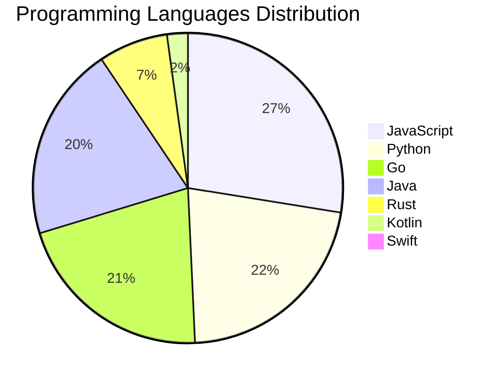

<div align="center">

# 📰 DevTech Auto News

**Your always-fresh digest of developer & AI tech news — curated automatically, around the clock.**


Aggregating [Dev.to](https://dev.to) · [Hacker News](https://news.ycombinator.com) · [GitHub Trending](https://github.com/trending) · [Lobste.rs](https://lobste.rs) · [Stack Overflow](https://stackoverflow.com) · [TechCrunch](https://techcrunch.com) · [freeCodeCamp](https://www.freecodecamp.org/news) — refreshed by GitHub Actions around the clock.

**[📰 Headlines](#-latest-headlines) · [💡 Interview Prep](#-interview-question-of-the-hour) · [📊 Statistics](#-statistics) · [⚙️ How It Works](#%EF%B8%8F-how-it-works)**

</div>

---

## 📰 Latest Headlines

> 🕐 Edition of **2026-10-08 3:00 CAT** — refreshed automatically, all day, every day.

### ✨ Featured Stories

<table>
<tr>
  <td align="center" width="33%">
    <a href="https://dev.to/francistrdev/why-you-still-need-a-website-portfolio-even-though-everyone-can-vibe-code-it-e63">
      
      <br/>
      <b>Why you still need a Website Portfolio, even thoug...</b>
    </a>
    <br/>
    <sub>Dev.to</sub>
  </td>
  <td align="center" width="33%">
    <a href="https://dev.to/devteam/top-7-featured-dev-posts-of-the-week-1682">
      
      <br/>
      <b>Top 7 Featured DEV Posts of the Week</b>
    </a>
    <br/>
    <sub>Dev.to</sub>
  </td>
  <td align="center" width="33%">
    <a href="https://dev.to/heraistudio/build-a-tiny-virtual-pet-on-arduino-in-60-minutes-2cf">
      
      <br/>
      <b>Build a Tiny Virtual Pet on Arduino in 60 Minutes ...</b>
    </a>
    <br/>
    <sub>Dev.to</sub>
  </td>
</tr>
<tr>
  <td align="center" width="33%">
    <a href="https://dev.to/googlecloud/run-hunt-hack-join-the-cloud-run-hackathon-on-product-hunt-3cc">
      
      <br/>
      <b>Run, Hunt, Hack: Join the Cloud Run Hackathon on P...</b>
    </a>
    <br/>
    <sub>Dev.to</sub>
  </td>
  <td align="center" width="33%">
    <a href="https://dev.to/googleai/stop-using-complex-urls-for-your-demosus-central1runapp-2efd">
      
      <br/>
      <b>stop-using-complex-urls-for-your-demos.us-central1...</b>
    </a>
    <br/>
    <sub>Dev.to</sub>
  </td>
  <td align="center" width="33%">
    <a href="https://dev.to/sloan/welcome-thread-v-396-ih4">
      
      <br/>
      <b>Welcome Thread - v 396</b>
    </a>
    <br/>
    <sub>Dev.to</sub>
  </td>
</tr>
</table>


### 🗞️ Top Stories

| # | Headline | Source |
|---|----------|--------|
| 1 | [Why you still need a Website Portfolio, even though everyone can Vibe Code it.](https://dev.to/francistrdev/why-you-still-need-a-website-portfolio-even-though-everyone-can-vibe-code-it-e63) | Dev.to |
| 2 | [Top 7 Featured DEV Posts of the Week](https://dev.to/devteam/top-7-featured-dev-posts-of-the-week-1682) | Dev.to |
| 3 | [Build a Tiny Virtual Pet on Arduino in 60 Minutes 🐾](https://dev.to/heraistudio/build-a-tiny-virtual-pet-on-arduino-in-60-minutes-2cf) | Dev.to |
| 4 | [Run, Hunt, Hack: Join the Cloud Run Hackathon on Product Hunt](https://dev.to/googlecloud/run-hunt-hack-join-the-cloud-run-hackathon-on-product-hunt-3cc) | Dev.to |
| 5 | [stop-using-complex-urls-for-your-demos.us-central1.run.app](https://dev.to/googleai/stop-using-complex-urls-for-your-demosus-central1runapp-2efd) | Dev.to |
| 6 | [Welcome Thread - v 396](https://dev.to/sloan/welcome-thread-v-396-ih4) | Dev.to |
| 7 | [Claude Haiku 5.5 is available on Google Cloud](https://dev.to/googleai/claude-haiku-55-is-available-on-google-cloud-4gn0) | Dev.to |
| 8 | [Meme Monday](https://dev.to/ben/meme-monday-3ib7) | Dev.to |
| 9 | [What was your win this week?](https://dev.to/devteam/what-was-your-win-this-week-4jli) | Dev.to |
| 10 | [Publishing Markdown to Substack from an Agent Skill](https://dev.to/gde/publishing-markdown-to-substack-from-an-agent-skill-258f) | Dev.to |
| 11 | [Activating Your Data Layer for Production-Ready AI](https://dev.to/googleai/activating-your-data-layer-for-production-ready-ai-p3e) | Dev.to |
| 12 | [Gemma 4 Inference on AWS: Bedrock, SageMaker, GPUs, Inferentia and Trainium Behind One Strands Agent](https://dev.to/gde/gemma-4-inference-on-aws-bedrock-sagemaker-gpus-inferentia-and-trainium-behind-one-strands-agent-2lnm) | Dev.to |
| 13 | [MCP Configuration for Google Workspace with Claude Code](https://dev.to/gde/mcp-configuration-for-google-workspace-with-claude-code-11om) | Dev.to |
| 14 | [Event-Driven AI at Cloud Scale: High-Throughput Stream Classification with Pub/Sub, Dataflow, and Jev](https://dev.to/gde/event-driven-ai-at-cloud-scale-high-throughput-stream-classification-with-pubsub-dataflow-and-12ic) | Dev.to |
| 15 | [Disappeared Since March: Taking a Long Break Was My Best Decision Yet](https://dev.to/maame-codes/disappeared-since-march-taking-a-long-break-was-my-best-decision-yet-1n45) | Dev.to |
| 16 | [Claude Opus 5.5 is now available on Google Cloud](https://dev.to/googleai/claude-opus-55-is-now-available-on-google-cloud-2oh) | Dev.to |
| 17 | [Join the Hacktoberfest Open-Source AI Challenge: Touch Grass! $2,450 in Prizes Across 17 Winners.](https://dev.to/devteam/join-the-hacktoberfest-open-source-ai-challenge-week-1-touch-grass-2450-in-prizes-across-17-4pom) | Dev.to |
| 18 | [Views Measure Views](https://dev.to/kenwalger/views-measure-views-4co7) | Dev.to |
| 19 | [Your Type Guard Can Silently Drift from Your TypeScript Type 🔧](https://dev.to/nyaomaru/your-type-guard-can-silently-drift-from-your-typescript-type-o57) | Dev.to |
| 20 | [Claude on Google Cloud workshop | NYC | 9/30](https://dev.to/googleai/claude-on-google-cloud-workshop-nyc-930-17jl) | Dev.to |

<sub>Last fetched: Thu, 08 Oct 2026 03:12:17 CAT</sub>


---

## 💡 Interview Question of the Hour

> Sharpen your skills — new questions selected on every update. Try answering before opening the hint!

**1. `React` — Implement a custom hook for fetching data**

&nbsp;&nbsp;&nbsp;&nbsp;🎯 Medium · 🏷 hooks, async

<details>
<summary>&nbsp;&nbsp;&nbsp;&nbsp;💡 Show hint</summary>

> useState, useEffect, loading states, error handling

</details>

**2. `React` — How would you optimize a React app's performance?**

&nbsp;&nbsp;&nbsp;&nbsp;🎯 Hard · 🏷 optimization, performance

<details>
<summary>&nbsp;&nbsp;&nbsp;&nbsp;💡 Show hint</summary>

> React.memo, useMemo, useCallback, code splitting, lazy loading

</details>

**3. `Database` — What is database normalization and denormalization?**

&nbsp;&nbsp;&nbsp;&nbsp;🎯 Medium · 🏷 design, optimization

<details>
<summary>&nbsp;&nbsp;&nbsp;&nbsp;💡 Show hint</summary>

> Normal forms, redundancy, performance trade-offs

</details>


---

## 📊 Statistics

#### 🗂 Articles by Category

| Category | Articles | Share | |
|----------|---------:|------:|---|
| **AI** | 79 | 43.2% | `████████████████████` |
| **JavaScript** | 38 | 20.8% | `██████████░░░░░░░░░░` |
| **Tools** | 38 | 20.8% | `██████████░░░░░░░░░░` |
| **Python** | 30 | 16.4% | `████████░░░░░░░░░░░░` |
| **Cloud** | 18 | 9.8% | `█████░░░░░░░░░░░░░░░` |
| **Security** | 18 | 9.8% | `█████░░░░░░░░░░░░░░░` |
| **DevOps** | 14 | 7.7% | `████░░░░░░░░░░░░░░░░` |
| **Mobile** | 10 | 5.5% | `███░░░░░░░░░░░░░░░░░` |
| **WebDev** | 8 | 4.4% | `██░░░░░░░░░░░░░░░░░░` |
| **Database** | 5 | 2.7% | `█░░░░░░░░░░░░░░░░░░░` |

<sub>Articles can match more than one category, so shares may sum to over 100%.</sub>


#### 📡 Articles by Source

| Source | Articles |
|--------|---------:|
| Dev.to | 60 |
| HackerNews | 49 |
| GitHub | 25 |
| Lobste.rs | 10 |
| StackOverflow | 19 |
| TechCrunch | 10 |
| freeCodeCamp | 10 |


#### 💻 Programming Language Trends

```
JavaScript      ██████████████████████████████ 27.3%
Python          ████████████████████████ 21.6%
Go              ███████████████████████ 20.9%
Java            ██████████████████████ 20.1%
Rust            ████████ 7.2%
Kotlin          ██ 2.2%
Swift           █ 0.7%

```


```mermaid
pie title Programming Languages Distribution
    "JavaScript" : 38
    "Python" : 30
    "Go" : 29
    "Java" : 28
    "Rust" : 10
    "Kotlin" : 3
    "Swift" : 1
```


#### 🏷 Trending Topics

            


---

## ⚙️ How It Works

This repository is a fully automated news pipeline. On every run, GitHub Actions:

1. **Fetches** the latest articles from seven sources: Dev.to, Hacker News, GitHub Trending, Lobste.rs, Stack Overflow, TechCrunch, and freeCodeCamp
2. **Deduplicates and categorizes** them across 10+ topics using keyword matching
3. **Extracts cover images** and computes language & category statistics
4. **Rebuilds this README** and appends everything to the [full archive](./data/news_log.md)
5. **Commits and pushes** the result — no human intervention needed

<details>
<summary><b>🚀 Run it yourself</b></summary>

```bash
git clone https://github.com/Derrick-MUGISHA/github-activity-bot.git
cd github-activity-bot
npm install
npm start
```

Fork the repo, enable GitHub Actions, and you have your own self-updating news feed.

</details>

<details>
<summary><b>📚 Data & resources</b></summary>

- [Full news archive](./data/news_log.md) — complete history of every fetched article
- [Statistics](./data/stats.json) — raw stats data (JSON)
- [Categorized articles](./data/categorized.json) — articles grouped by topic
- [Interview question bank](./data/interview_questions.json) — the full question set

</details>

---

## 🤝 Contributing

Ideas for new sources, categories, or interview questions are welcome — [open an issue](https://github.com/Derrick-MUGISHA/github-activity-bot/issues/new) or submit a pull request.

## 📄 License

Released under the [MIT License](https://opensource.org/licenses/MIT) — free to use, fork, and modify.

---

<div align="center">
  <sub>🤖 Last automated update: <b>Thu, 08 Oct 2026 01:12:17 GMT</b></sub><br/>
  <sub>Powered by GitHub Actions · Built with ❤️ by <a href="https://github.com/Derrick-MUGISHA">Derrick MUGISHA</a></sub>
</div>
