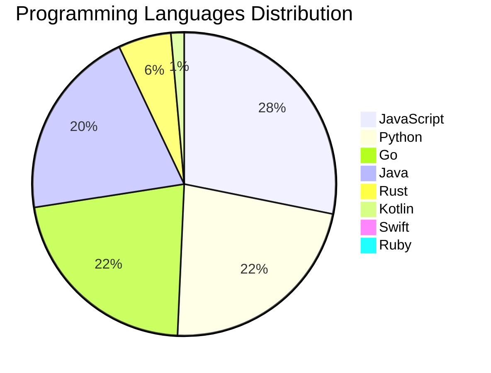

<div align="center">

# 📰 DevTech Auto News

**Your always-fresh digest of developer & AI tech news — curated automatically, around the clock.**


Aggregating [Dev.to](https://dev.to) · [Hacker News](https://news.ycombinator.com) · [GitHub Trending](https://github.com/trending) · [Lobste.rs](https://lobste.rs) · [Stack Overflow](https://stackoverflow.com) · [TechCrunch](https://techcrunch.com) · [freeCodeCamp](https://www.freecodecamp.org/news) — refreshed by GitHub Actions around the clock.

**[📰 Headlines](#-latest-headlines) · [💡 Interview Prep](#-interview-question-of-the-hour) · [📊 Statistics](#-statistics) · [⚙️ How It Works](#%EF%B8%8F-how-it-works)**

</div>

---

## 📰 Latest Headlines

> 🕐 Edition of **2026-10-03 9:00 CAT** — refreshed automatically, all day, every day.

### ✨ Featured Stories

<table>
<tr>
  <td align="center" width="33%">
    <a href="https://dev.to/devteam/what-was-your-win-this-week-4jli">
      
      <br/>
      <b>What was your win this week?</b>
    </a>
    <br/>
    <sub>Dev.to</sub>
  </td>
  <td align="center" width="33%">
    <a href="https://dev.to/gde/rediscovering-the-schwartzian-transform-why-i-had-to-comment-on-a-flutter-performance-article-30l0">
      
      <br/>
      <b>Rediscovering the Schwartzian Transform: Why I Had...</b>
    </a>
    <br/>
    <sub>Dev.to</sub>
  </td>
  <td align="center" width="33%">
    <a href="https://dev.to/gde/repacked-qat-gemma-4-on-one-tpu-v5e-12b-serves-at-675-tokens-per-second-15dd">
      
      <br/>
      <b>Repacked QAT Gemma 4 on One TPU v5e: 12B Serves at...</b>
    </a>
    <br/>
    <sub>Dev.to</sub>
  </td>
</tr>
<tr>
  <td align="center" width="33%">
    <a href="https://dev.to/gde/building-sarrera-self-hosted-enterprise-ai-inference-gateway-with-rbac-token-quotas-telemetry-316o">
      
      <br/>
      <b>Building Sarrera: Self-Hosted Enterprise AI Infere...</b>
    </a>
    <br/>
    <sub>Dev.to</sub>
  </td>
  <td align="center" width="33%">
    <a href="https://dev.to/gde/gemma-4-at-over-70-tokenss-on-a-2021-laptops-4-gb-gpu-the-live-demo-step-by-step-52hg">
      
      <br/>
      <b>Gemma 4 at Over 70 Tokens/s on a 2021 Laptop's 4 G...</b>
    </a>
    <br/>
    <sub>Dev.to</sub>
  </td>
  <td align="center" width="33%">
    <a href="https://dev.to/gde/the-physics-of-socratic-prompting-somatic-recoil-chess-alpha-beta-the-nlp-meta-model-2b6e">
      
      <br/>
      <b>The Physics of Socratic Prompting: Somatic Recoil,...</b>
    </a>
    <br/>
    <sub>Dev.to</sub>
  </td>
</tr>
</table>


### 🗞️ Top Stories

| # | Headline | Source |
|---|----------|--------|
| 1 | [What was your win this week?](https://dev.to/devteam/what-was-your-win-this-week-4jli) | Dev.to |
| 2 | [Rediscovering the Schwartzian Transform: Why I Had to Comment on a Flutter Performance Article](https://dev.to/gde/rediscovering-the-schwartzian-transform-why-i-had-to-comment-on-a-flutter-performance-article-30l0) | Dev.to |
| 3 | [Repacked QAT Gemma 4 on One TPU v5e: 12B Serves at 675 Tokens per Second](https://dev.to/gde/repacked-qat-gemma-4-on-one-tpu-v5e-12b-serves-at-675-tokens-per-second-15dd) | Dev.to |
| 4 | [Building Sarrera: Self-Hosted Enterprise AI Inference Gateway with RBAC, Token Quotas & Telemetry](https://dev.to/gde/building-sarrera-self-hosted-enterprise-ai-inference-gateway-with-rbac-token-quotas-telemetry-316o) | Dev.to |
| 5 | [Gemma 4 at Over 70 Tokens/s on a 2021 Laptop's 4 GB GPU: The Live Demo, Step by Step](https://dev.to/gde/gemma-4-at-over-70-tokenss-on-a-2021-laptops-4-gb-gpu-the-live-demo-step-by-step-52hg) | Dev.to |
| 6 | [The Physics of Socratic Prompting: Somatic Recoil, Chess Alpha-Beta, & The NLP Meta-Model](https://dev.to/gde/the-physics-of-socratic-prompting-somatic-recoil-chess-alpha-beta-the-nlp-meta-model-2b6e) | Dev.to |
| 7 | [Gemma 4 on Amazon SageMaker: The NVIDIA T4 Decodes at 0.8x of the L4 With the Same Answers](https://dev.to/gde/gemma-4-on-amazon-sagemaker-the-nvidia-t4-decodes-at-08x-of-the-l4-with-the-same-answers-19m4) | Dev.to |
| 8 | [Gemma 4 QAT on One TPU v5e: What Runs and What Doesn't](https://dev.to/gde/gemma-4-qat-on-one-tpu-v5e-what-runs-and-what-doesnt-2gii) | Dev.to |
| 9 | [Gemini 4 Argon

https://blog.google/innovation-and-ai/models-and-research/gemini-models/gemini-4-argon/](https://dev.to/ben/gemini-4-argon-5g2l) | Dev.to |
| 10 | [A wine cellar that remembers what you used to believe](https://dev.to/kenwalger/a-wine-cellar-that-remembers-what-you-used-to-believe-4i55) | Dev.to |
| 11 | [Gemma 4 on a Tesla T4, Part 3: Int4 Embeddings Serve E2B in 2.86 GiB at 2.30x bf16](https://dev.to/gde/gemma-4-on-a-tesla-t4-part-3-int4-embeddings-serve-e2b-in-286-gib-at-230x-bf16-3kch) | Dev.to |
| 12 | [Hacktoberfest 2026 DEV Challenges: Five Challenges, One Prompt, a New Theme Every Week](https://dev.to/devteam/hacktoberfest-2026-dev-challenges-five-challenges-one-prompt-a-new-theme-every-week-1e54) | Dev.to |
| 13 | [Everything You Need To Know About Hacktoberfest 2026: AI Belongs to Everyone 🎃](https://blog.mlh.com/everything-you-need-to-know-about-hacktoberfest-2026-ai-belongs-to-everyone-mdk) | Dev.to |
| 14 | [Claude Sonnet 5.5 is now available on Google Cloud](https://dev.to/googleai/claude-sonnet-55-is-now-available-on-google-cloud-168h) | Dev.to |
| 15 | [7 ways to lock down AI agent sandboxes in production (beyond Docker containers)](https://dev.to/googleai/7-ways-to-lock-down-ai-agent-sandboxes-in-production-beyond-docker-containers-2bg3) | Dev.to |
| 16 | [Disappeared Since March: Taking a Long Break Was My Best Decision Yet](https://dev.to/maame-codes/disappeared-since-march-taking-a-long-break-was-my-best-decision-yet-1n45) | Dev.to |
| 17 | [Join the Hacktoberfest Weekend Challenge: Build for a Friend! $2,450 in Prizes Across 17 Winners. Submissions Due October 5 at 6:59 AM UTC.](https://dev.to/devteam/join-the-hacktoberfest-weekend-challenge-build-for-a-friend-2450-in-prizes-across-17-winners-1aj5) | Dev.to |
| 18 | [Claude Opus 5.5 is now available on Google Cloud](https://dev.to/googleai/claude-opus-55-is-now-available-on-google-cloud-2oh) | Dev.to |
| 19 | [🎡 Social Ferris Wheel: Sanity is the Hub](https://dev.to/annavi11arrea1/social-ferris-wheel-sanity-is-the-hub-2m7j) | Dev.to |
| 20 | [Count It or Compute It: When a Tool Returns Rows, the Models That Count Them Right Spend the Tokens](https://dev.to/gde/count-it-or-compute-it-when-a-tool-returns-rows-the-models-that-count-them-right-spend-the-tokens-2hae) | Dev.to |

<sub>Last fetched: Sat, 03 Oct 2026 09:51:09 CAT</sub>


---

## 💡 Interview Question of the Hour

> Sharpen your skills — new questions selected on every update. Try answering before opening the hint!

**1. `NodeJS` — Explain middleware in Express.js**

&nbsp;&nbsp;&nbsp;&nbsp;🎯 Easy · 🏷 express, architecture

<details>
<summary>&nbsp;&nbsp;&nbsp;&nbsp;💡 Show hint</summary>

> Request/response cycle, next(), chain of functions

</details>

**2. `SystemDesign` — Design a URL shortening service like bit.ly**

&nbsp;&nbsp;&nbsp;&nbsp;🎯 Medium · 🏷 system design, scalability

<details>
<summary>&nbsp;&nbsp;&nbsp;&nbsp;💡 Show hint</summary>

> Hash function, database design, caching, analytics

</details>

**3. `Database` — Explain database indexing and when to use it**

&nbsp;&nbsp;&nbsp;&nbsp;🎯 Medium · 🏷 optimization, performance

<details>
<summary>&nbsp;&nbsp;&nbsp;&nbsp;💡 Show hint</summary>

> B-tree, trade-offs, query performance

</details>


---

## 📊 Statistics

#### 🗂 Articles by Category

| Category | Articles | Share | |
|----------|---------:|------:|---|
| **AI** | 82 | 44.6% | `████████████████████` |
| **JavaScript** | 40 | 21.7% | `██████████░░░░░░░░░░` |
| **Tools** | 40 | 21.7% | `██████████░░░░░░░░░░` |
| **Python** | 32 | 17.4% | `████████░░░░░░░░░░░░` |
| **DevOps** | 17 | 9.2% | `████░░░░░░░░░░░░░░░░` |
| **Cloud** | 17 | 9.2% | `████░░░░░░░░░░░░░░░░` |
| **Security** | 15 | 8.2% | `████░░░░░░░░░░░░░░░░` |
| **WebDev** | 11 | 6.0% | `███░░░░░░░░░░░░░░░░░` |
| **Mobile** | 9 | 4.9% | `██░░░░░░░░░░░░░░░░░░` |
| **Database** | 4 | 2.2% | `█░░░░░░░░░░░░░░░░░░░` |

<sub>Articles can match more than one category, so shares may sum to over 100%.</sub>


#### 📡 Articles by Source

| Source | Articles |
|--------|---------:|
| Dev.to | 60 |
| HackerNews | 49 |
| GitHub | 25 |
| Lobste.rs | 10 |
| StackOverflow | 20 |
| TechCrunch | 10 |
| freeCodeCamp | 10 |


#### 💻 Programming Language Trends

```
JavaScript      ██████████████████████████████ 27.6%
Python          ████████████████████████ 22.1%
Go              ███████████████████████ 21.4%
Java            ██████████████████████ 20.0%
Rust            ██████ 5.5%
Kotlin          ██ 1.4%
Swift           █ 0.7%
Ruby            █ 0.7%
CSharp          █ 0.7%

```


```mermaid
pie title Programming Languages Distribution
    "JavaScript" : 40
    "Python" : 32
    "Go" : 31
    "Java" : 29
    "Rust" : 8
    "Kotlin" : 2
    "Swift" : 1
    "Ruby" : 1
```


#### 🏷 Trending Topics

            


---

## ⚙️ How It Works

This repository is a fully automated news pipeline. On every run, GitHub Actions:

1. **Fetches** the latest articles from seven sources: Dev.to, Hacker News, GitHub Trending, Lobste.rs, Stack Overflow, TechCrunch, and freeCodeCamp
2. **Deduplicates and categorizes** them across 10+ topics using keyword matching
3. **Extracts cover images** and computes language & category statistics
4. **Rebuilds this README** and appends everything to the [full archive](./data/news_log.md)
5. **Commits and pushes** the result — no human intervention needed

<details>
<summary><b>🚀 Run it yourself</b></summary>

```bash
git clone https://github.com/Derrick-MUGISHA/github-activity-bot.git
cd github-activity-bot
npm install
npm start
```

Fork the repo, enable GitHub Actions, and you have your own self-updating news feed.

</details>

<details>
<summary><b>📚 Data & resources</b></summary>

- [Full news archive](./data/news_log.md) — complete history of every fetched article
- [Statistics](./data/stats.json) — raw stats data (JSON)
- [Categorized articles](./data/categorized.json) — articles grouped by topic
- [Interview question bank](./data/interview_questions.json) — the full question set

</details>

---

## 🤝 Contributing

Ideas for new sources, categories, or interview questions are welcome — [open an issue](https://github.com/Derrick-MUGISHA/github-activity-bot/issues/new) or submit a pull request.

## 📄 License

Released under the [MIT License](https://opensource.org/licenses/MIT) — free to use, fork, and modify.

---

<div align="center">
  <sub>🤖 Last automated update: <b>Sat, 03 Oct 2026 07:51:09 GMT</b></sub><br/>
  <sub>Powered by GitHub Actions · Built with ❤️ by <a href="https://github.com/Derrick-MUGISHA">Derrick MUGISHA</a></sub>
</div>
