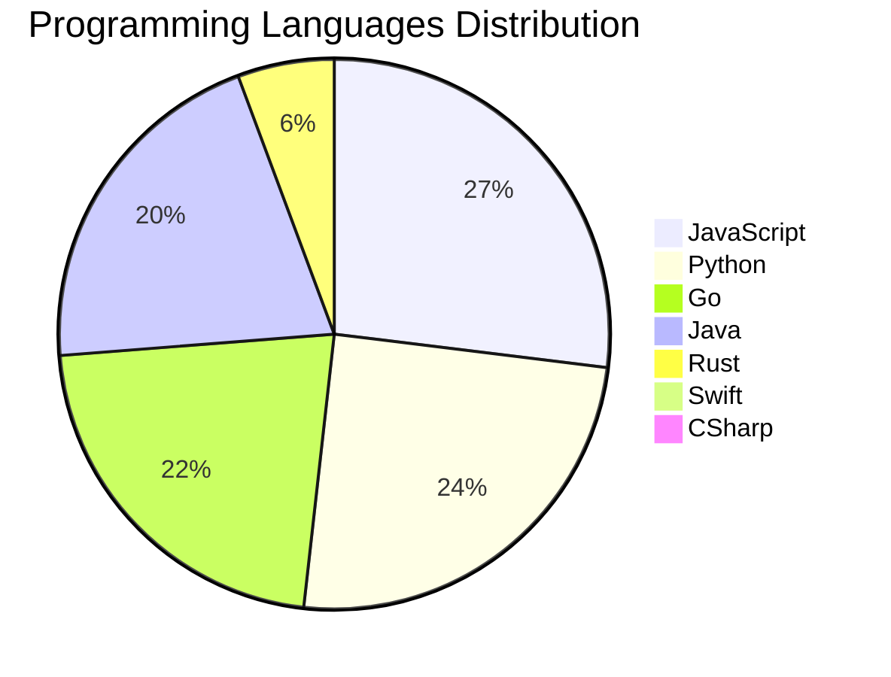

<div align="center">

# 📰 DevTech Auto News

**Your always-fresh digest of developer & AI tech news — curated automatically, around the clock.**


Aggregating [Dev.to](https://dev.to) · [Hacker News](https://news.ycombinator.com) · [GitHub Trending](https://github.com/trending) · [Lobste.rs](https://lobste.rs) · [Stack Overflow](https://stackoverflow.com) · [TechCrunch](https://techcrunch.com) · [freeCodeCamp](https://www.freecodecamp.org/news) — refreshed by GitHub Actions around the clock.

**[📰 Headlines](#-latest-headlines) · [💡 Interview Prep](#-interview-question-of-the-hour) · [📊 Statistics](#-statistics) · [⚙️ How It Works](#%EF%B8%8F-how-it-works)**

</div>

---

## 📰 Latest Headlines

> 🕐 Edition of **2026-09-29 11:00 CAT** — refreshed automatically, all day, every day.

### ✨ Featured Stories

<table>
<tr>
  <td align="center" width="33%">
    <a href="https://dev.to/googleai/how-to-build-a-real-time-voice-ai-agent-with-the-gemini-live-api-1dhe">
      
      <br/>
      <b>How to Build a Real-Time Voice AI Agent with the G...</b>
    </a>
    <br/>
    <sub>Dev.to</sub>
  </td>
  <td align="center" width="33%">
    <a href="https://dev.to/gde/count-it-or-compute-it-when-a-tool-returns-rows-the-models-that-count-them-right-spend-the-tokens-2hae">
      
      <br/>
      <b>Count It or Compute It: When a Tool Returns Rows, ...</b>
    </a>
    <br/>
    <sub>Dev.to</sub>
  </td>
  <td align="center" width="33%">
    <a href="https://dev.to/asyncinnovator/i-connected-a-fruit-fly-connectome-to-tic-tac-toe-with-a-minimax-safety-net-5bc0">
      
      <br/>
      <b>I connected a fruit fly connectome to tic-tac-toe ...</b>
    </a>
    <br/>
    <sub>Dev.to</sub>
  </td>
</tr>
<tr>
  <td align="center" width="33%">
    <a href="https://dev.to/ben/meme-monday-2com">
      
      <br/>
      <b>Meme Monday</b>
    </a>
    <br/>
    <sub>Dev.to</sub>
  </td>
  <td align="center" width="33%">
    <a href="https://dev.to/googleai/7-ways-to-lock-down-ai-agent-sandboxes-in-production-beyond-docker-containers-2bg3">
      
      <br/>
      <b>7 ways to lock down AI agent sandboxes in producti...</b>
    </a>
    <br/>
    <sub>Dev.to</sub>
  </td>
  <td align="center" width="33%">
    <a href="https://dev.to/googleai/claude-sonnet-55-is-now-available-on-google-cloud-168h">
      
      <br/>
      <b>Claude Sonnet 5.5 is now available on Google Cloud</b>
    </a>
    <br/>
    <sub>Dev.to</sub>
  </td>
</tr>
</table>


### 🗞️ Top Stories

| # | Headline | Source |
|---|----------|--------|
| 1 | [How to Build a Real-Time Voice AI Agent with the Gemini Live API](https://dev.to/googleai/how-to-build-a-real-time-voice-ai-agent-with-the-gemini-live-api-1dhe) | Dev.to |
| 2 | [Count It or Compute It: When a Tool Returns Rows, the Models That Count Them Right Spend the Tokens](https://dev.to/gde/count-it-or-compute-it-when-a-tool-returns-rows-the-models-that-count-them-right-spend-the-tokens-2hae) | Dev.to |
| 3 | [I connected a fruit fly connectome to tic-tac-toe (with a minimax safety net)](https://dev.to/asyncinnovator/i-connected-a-fruit-fly-connectome-to-tic-tac-toe-with-a-minimax-safety-net-5bc0) | Dev.to |
| 4 | [Meme Monday](https://dev.to/ben/meme-monday-2com) | Dev.to |
| 5 | [7 ways to lock down AI agent sandboxes in production (beyond Docker containers)](https://dev.to/googleai/7-ways-to-lock-down-ai-agent-sandboxes-in-production-beyond-docker-containers-2bg3) | Dev.to |
| 6 | [Claude Sonnet 5.5 is now available on Google Cloud](https://dev.to/googleai/claude-sonnet-55-is-now-available-on-google-cloud-168h) | Dev.to |
| 7 | [The Sand in the Oyster: Why Riverpod Was Needed, and Why You Don't Need It Any More](https://dev.to/gde/the-sand-in-the-oyster-why-riverpod-was-needed-and-why-you-dont-need-it-any-more-204o) | Dev.to |
| 8 | [8 Posts by Women on DEV That Deserve More Than a Once-a-Year Spotlight](https://dev.to/sheships/8-posts-by-women-on-dev-that-deserve-more-than-a-once-a-year-spotlight-27dc) | Dev.to |
| 9 | [Disappeared Since March: Taking a Long Break Was My Best Decision Yet](https://dev.to/maame-codes/disappeared-since-march-taking-a-long-break-was-my-best-decision-yet-1n45) | Dev.to |
| 10 | [Claude Opus 5.5 is now available on Google Cloud](https://dev.to/googleai/claude-opus-55-is-now-available-on-google-cloud-2oh) | Dev.to |
| 11 | [I Built a Better Codex Pet Than OpenAI Did](https://dev.to/mikachu/i-built-a-better-codex-pet-than-openai-did-eib) | Dev.to |
| 12 | [This video is about how this video was made](https://dev.to/peter/this-video-is-about-how-this-video-was-made-42hl) | Dev.to |
| 13 | [Your Type Guard Can Silently Drift from Your TypeScript Type 🔧](https://dev.to/nyaomaru/your-type-guard-can-silently-drift-from-your-typescript-type-o57) | Dev.to |
| 14 | [Claude on Google Cloud workshop | NYC | 9/30](https://dev.to/googleai/claude-on-google-cloud-workshop-nyc-930-17jl) | Dev.to |
| 15 | [Deploying LiteLLM: An Open-Source AI Gateway](https://dev.to/vultr/deploying-litellm-an-open-source-ai-gateway-2idp) | Dev.to |
| 16 | [I Turned DEV.to Into a Walkable 3D Library — Debugging It Has Been a Nightmare](https://dev.to/mikachu/i-turned-devto-into-a-walkable-3d-library-debugging-it-has-been-a-nightmare-4lkd) | Dev.to |
| 17 | [What was your win this week!?](https://dev.to/devteam/what-was-your-win-this-week-odj) | Dev.to |
| 18 | [Congrats to the DEV Weekend Challenge: Dog Days Edition Winners!](https://dev.to/devteam/congrats-to-the-dev-weekend-challenge-dog-days-edition-winners-300g) | Dev.to |
| 19 | [Welcome Thread - v 394](https://dev.to/sloan/welcome-thread-v-394-22l2) | Dev.to |
| 20 | [A 4 GB Laptop GPU vs a 6-Core CPU on Gemma 4, Re-Measured in ABBA Order: 4.1x](https://dev.to/gde/a-4-gb-laptop-gpu-vs-a-6-core-cpu-on-gemma-4-re-measured-in-abba-order-41x-5g56) | Dev.to |

<sub>Last fetched: Tue, 29 Sep 2026 11:09:17 CAT</sub>


---

## 💡 Interview Question of the Hour

> Sharpen your skills — new questions selected on every update. Try answering before opening the hint!

**1. `SystemDesign` — Design Twitter's timeline feature**

&nbsp;&nbsp;&nbsp;&nbsp;🎯 Hard · 🏷 system design, scalability

<details>
<summary>&nbsp;&nbsp;&nbsp;&nbsp;💡 Show hint</summary>

> Fan-out, caching, ranking, real-time updates

</details>

**2. `Python` — What are generators and when would you use them?**

&nbsp;&nbsp;&nbsp;&nbsp;🎯 Medium · 🏷 iterators, memory

<details>
<summary>&nbsp;&nbsp;&nbsp;&nbsp;💡 Show hint</summary>

> yield keyword, lazy evaluation, memory efficiency

</details>

**3. `SystemDesign` — Design a distributed cache system**

&nbsp;&nbsp;&nbsp;&nbsp;🎯 Hard · 🏷 distributed systems, caching

<details>
<summary>&nbsp;&nbsp;&nbsp;&nbsp;💡 Show hint</summary>

> Consistency, partitioning, replication, eviction policies

</details>


---

## 📊 Statistics

#### 🗂 Articles by Category

| Category | Articles | Share | |
|----------|---------:|------:|---|
| **AI** | 78 | 42.4% | `████████████████████` |
| **Tools** | 39 | 21.2% | `██████████░░░░░░░░░░` |
| **JavaScript** | 38 | 20.7% | `██████████░░░░░░░░░░` |
| **Python** | 35 | 19.0% | `█████████░░░░░░░░░░░` |
| **Cloud** | 17 | 9.2% | `████░░░░░░░░░░░░░░░░` |
| **DevOps** | 16 | 8.7% | `████░░░░░░░░░░░░░░░░` |
| **Security** | 13 | 7.1% | `███░░░░░░░░░░░░░░░░░` |
| **WebDev** | 8 | 4.3% | `██░░░░░░░░░░░░░░░░░░` |
| **Mobile** | 7 | 3.8% | `██░░░░░░░░░░░░░░░░░░` |
| **Database** | 3 | 1.6% | `█░░░░░░░░░░░░░░░░░░░` |

<sub>Articles can match more than one category, so shares may sum to over 100%.</sub>


#### 📡 Articles by Source

| Source | Articles |
|--------|---------:|
| Dev.to | 60 |
| HackerNews | 49 |
| GitHub | 25 |
| Lobste.rs | 10 |
| StackOverflow | 20 |
| TechCrunch | 10 |
| freeCodeCamp | 10 |


#### 💻 Programming Language Trends

```
JavaScript      ██████████████████████████████ 26.6%
Python          ████████████████████████████ 24.5%
Go              ████████████████████████ 21.7%
Java            ███████████████████████ 20.3%
Rust            ██████ 5.6%
Swift           █ 0.7%
CSharp          █ 0.7%

```


```mermaid
pie title Programming Languages Distribution
    "JavaScript" : 38
    "Python" : 35
    "Go" : 31
    "Java" : 29
    "Rust" : 8
    "Swift" : 1
    "CSharp" : 1
```


#### 🏷 Trending Topics

            


---

## ⚙️ How It Works

This repository is a fully automated news pipeline. On every run, GitHub Actions:

1. **Fetches** the latest articles from seven sources: Dev.to, Hacker News, GitHub Trending, Lobste.rs, Stack Overflow, TechCrunch, and freeCodeCamp
2. **Deduplicates and categorizes** them across 10+ topics using keyword matching
3. **Extracts cover images** and computes language & category statistics
4. **Rebuilds this README** and appends everything to the [full archive](./data/news_log.md)
5. **Commits and pushes** the result — no human intervention needed

<details>
<summary><b>🚀 Run it yourself</b></summary>

```bash
git clone https://github.com/Derrick-MUGISHA/github-activity-bot.git
cd github-activity-bot
npm install
npm start
```

Fork the repo, enable GitHub Actions, and you have your own self-updating news feed.

</details>

<details>
<summary><b>📚 Data & resources</b></summary>

- [Full news archive](./data/news_log.md) — complete history of every fetched article
- [Statistics](./data/stats.json) — raw stats data (JSON)
- [Categorized articles](./data/categorized.json) — articles grouped by topic
- [Interview question bank](./data/interview_questions.json) — the full question set

</details>

---

## 🤝 Contributing

Ideas for new sources, categories, or interview questions are welcome — [open an issue](https://github.com/Derrick-MUGISHA/github-activity-bot/issues/new) or submit a pull request.

## 📄 License

Released under the [MIT License](https://opensource.org/licenses/MIT) — free to use, fork, and modify.

---

<div align="center">
  <sub>🤖 Last automated update: <b>Tue, 29 Sep 2026 09:09:17 GMT</b></sub><br/>
  <sub>Powered by GitHub Actions · Built with ❤️ by <a href="https://github.com/Derrick-MUGISHA">Derrick MUGISHA</a></sub>
</div>
