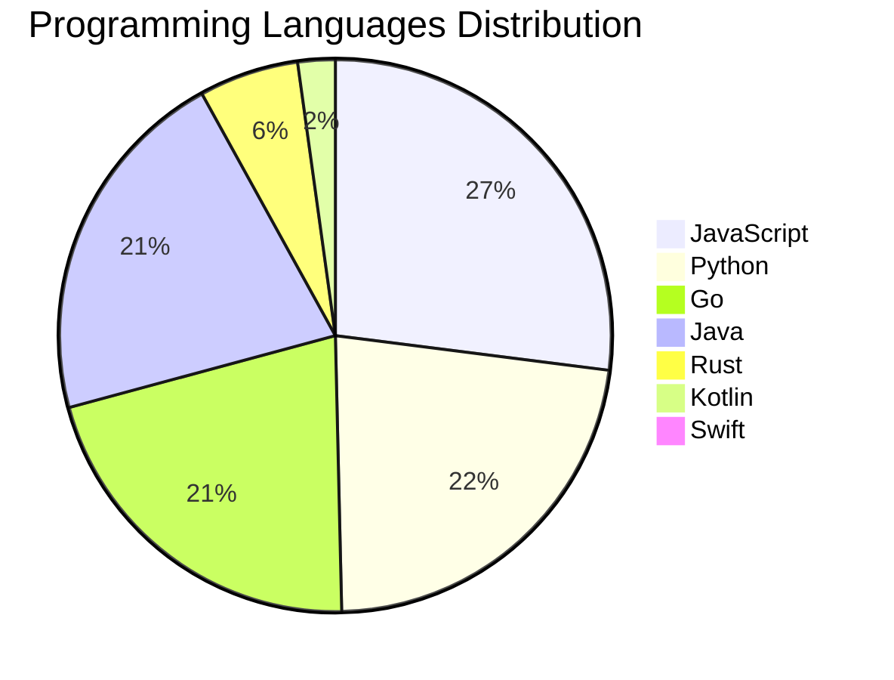

<div align="center">

# 📰 DevTech Auto News

**Your always-fresh digest of developer & AI tech news — curated automatically, around the clock.**


Aggregating [Dev.to](https://dev.to) · [Hacker News](https://news.ycombinator.com) · [GitHub Trending](https://github.com/trending) · [Lobste.rs](https://lobste.rs) · [Stack Overflow](https://stackoverflow.com) · [TechCrunch](https://techcrunch.com) · [freeCodeCamp](https://www.freecodecamp.org/news) — refreshed by GitHub Actions around the clock.

**[📰 Headlines](#-latest-headlines) · [💡 Interview Prep](#-interview-question-of-the-hour) · [📊 Statistics](#-statistics) · [⚙️ How It Works](#%EF%B8%8F-how-it-works)**

</div>

---

## 📰 Latest Headlines

> 🕐 Edition of **2026-10-05 20:00 CAT** — refreshed automatically, all day, every day.

### ✨ Featured Stories

<table>
<tr>
  <td align="center" width="33%">
    <a href="https://dev.to/francistrdev/why-you-still-need-a-website-portfolio-even-though-everyone-can-vibe-code-it-e63">
      
      <br/>
      <b>Why you still need a Website Portfolio, even thoug...</b>
    </a>
    <br/>
    <sub>Dev.to</sub>
  </td>
  <td align="center" width="33%">
    <a href="https://dev.to/ben/meme-monday-3ib7">
      
      <br/>
      <b>Meme Monday</b>
    </a>
    <br/>
    <sub>Dev.to</sub>
  </td>
  <td align="center" width="33%">
    <a href="https://dev.to/devteam/what-was-your-win-this-week-4jli">
      
      <br/>
      <b>What was your win this week?</b>
    </a>
    <br/>
    <sub>Dev.to</sub>
  </td>
</tr>
<tr>
  <td align="center" width="33%">
    <a href="https://dev.to/gde/publishing-markdown-to-substack-from-an-agent-skill-258f">
      
      <br/>
      <b>Publishing Markdown to Substack from an Agent Skil...</b>
    </a>
    <br/>
    <sub>Dev.to</sub>
  </td>
  <td align="center" width="33%">
    <a href="https://dev.to/devteam/join-the-hacktoberfest-open-source-ai-challenge-week-1-touch-grass-2450-in-prizes-across-17-4pom">
      
      <br/>
      <b>Join the Hacktoberfest Open-Source AI Challenge: T...</b>
    </a>
    <br/>
    <sub>Dev.to</sub>
  </td>
  <td align="center" width="33%">
    <a href="https://dev.to/gde/mcp-configuration-for-google-workspace-with-claude-code-11om">
      
      <br/>
      <b>MCP Configuration for Google Workspace with Claude...</b>
    </a>
    <br/>
    <sub>Dev.to</sub>
  </td>
</tr>
</table>


### 🗞️ Top Stories

| # | Headline | Source |
|---|----------|--------|
| 1 | [Why you still need a Website Portfolio, even though everyone can Vibe Code it.](https://dev.to/francistrdev/why-you-still-need-a-website-portfolio-even-though-everyone-can-vibe-code-it-e63) | Dev.to |
| 2 | [Meme Monday](https://dev.to/ben/meme-monday-3ib7) | Dev.to |
| 3 | [What was your win this week?](https://dev.to/devteam/what-was-your-win-this-week-4jli) | Dev.to |
| 4 | [Publishing Markdown to Substack from an Agent Skill](https://dev.to/gde/publishing-markdown-to-substack-from-an-agent-skill-258f) | Dev.to |
| 5 | [Join the Hacktoberfest Open-Source AI Challenge: Touch Grass! $2,450 in Prizes Across 17 Winners.](https://dev.to/devteam/join-the-hacktoberfest-open-source-ai-challenge-week-1-touch-grass-2450-in-prizes-across-17-4pom) | Dev.to |
| 6 | [MCP Configuration for Google Workspace with Claude Code](https://dev.to/gde/mcp-configuration-for-google-workspace-with-claude-code-11om) | Dev.to |
| 7 | [Rediscovering the Schwartzian Transform: Why I Had to Comment on a Flutter Performance Article](https://dev.to/gde/rediscovering-the-schwartzian-transform-why-i-had-to-comment-on-a-flutter-performance-article-30l0) | Dev.to |
| 8 | [Event-Driven AI at Cloud Scale: High-Throughput Stream Classification with Pub/Sub, Dataflow, and Jev](https://dev.to/gde/event-driven-ai-at-cloud-scale-high-throughput-stream-classification-with-pubsub-dataflow-and-12ic) | Dev.to |
| 9 | [The Physics of Socratic Prompting: Somatic Recoil, Chess Alpha-Beta, & The NLP Meta-Model](https://dev.to/gde/the-physics-of-socratic-prompting-somatic-recoil-chess-alpha-beta-the-nlp-meta-model-2b6e) | Dev.to |
| 10 | [Gemma 4 on Amazon SageMaker: The NVIDIA T4 Decodes at 0.8x of the L4 With the Same Answers](https://dev.to/gde/gemma-4-on-amazon-sagemaker-the-nvidia-t4-decodes-at-08x-of-the-l4-with-the-same-answers-19m4) | Dev.to |
| 11 | [Repacked QAT Gemma 4 on One TPU v5e: 12B Serves at 675 Tokens per Second](https://dev.to/gde/repacked-qat-gemma-4-on-one-tpu-v5e-12b-serves-at-675-tokens-per-second-15dd) | Dev.to |
| 12 | [Gemma 4 at Over 70 Tokens/s on a 2021 Laptop's 4 GB GPU: The Live Demo, Step by Step](https://dev.to/gde/gemma-4-at-over-70-tokenss-on-a-2021-laptops-4-gb-gpu-the-live-demo-step-by-step-52hg) | Dev.to |
| 13 | [Gemini 4 Argon

https://blog.google/innovation-and-ai/models-and-research/gemini-models/gemini-4-argon/](https://dev.to/ben/gemini-4-argon-5g2l) | Dev.to |
| 14 | [Gemma 4 on a Tesla T4, Part 3: Int4 Embeddings Serve E2B in 2.86 GiB at 2.30x bf16](https://dev.to/gde/gemma-4-on-a-tesla-t4-part-3-int4-embeddings-serve-e2b-in-286-gib-at-230x-bf16-3kch) | Dev.to |
| 15 | [Views Measure Views](https://dev.to/kenwalger/views-measure-views-4co7) | Dev.to |
| 16 | [Claude Sonnet 5.5 is now available on Google Cloud](https://dev.to/googleai/claude-sonnet-55-is-now-available-on-google-cloud-168h) | Dev.to |
| 17 | [7 ways to lock down AI agent sandboxes in production (beyond Docker containers)](https://dev.to/googleai/7-ways-to-lock-down-ai-agent-sandboxes-in-production-beyond-docker-containers-2bg3) | Dev.to |
| 18 | [Disappeared Since March: Taking a Long Break Was My Best Decision Yet](https://dev.to/maame-codes/disappeared-since-march-taking-a-long-break-was-my-best-decision-yet-1n45) | Dev.to |
| 19 | [Claude Opus 5.5 is now available on Google Cloud](https://dev.to/googleai/claude-opus-55-is-now-available-on-google-cloud-2oh) | Dev.to |
| 20 | [Claude on Google Cloud workshop | NYC | 9/30](https://dev.to/googleai/claude-on-google-cloud-workshop-nyc-930-17jl) | Dev.to |

<sub>Last fetched: Mon, 05 Oct 2026 20:50:45 CAT</sub>


---

## 💡 Interview Question of the Hour

> Sharpen your skills — new questions selected on every update. Try answering before opening the hint!

**1. `React` — What are hooks and why were they introduced?**

&nbsp;&nbsp;&nbsp;&nbsp;🎯 Medium · 🏷 hooks, functional components

<details>
<summary>&nbsp;&nbsp;&nbsp;&nbsp;💡 Show hint</summary>

> State in functional components, reusable logic, cleaner code

</details>

**2. `SystemDesign` — Design a distributed cache system**

&nbsp;&nbsp;&nbsp;&nbsp;🎯 Hard · 🏷 distributed systems, caching

<details>
<summary>&nbsp;&nbsp;&nbsp;&nbsp;💡 Show hint</summary>

> Consistency, partitioning, replication, eviction policies

</details>

**3. `React` — Implement a custom hook for fetching data**

&nbsp;&nbsp;&nbsp;&nbsp;🎯 Medium · 🏷 hooks, async

<details>
<summary>&nbsp;&nbsp;&nbsp;&nbsp;💡 Show hint</summary>

> useState, useEffect, loading states, error handling

</details>


---

## 📊 Statistics

#### 🗂 Articles by Category

| Category | Articles | Share | |
|----------|---------:|------:|---|
| **AI** | 85 | 46.2% | `████████████████████` |
| **JavaScript** | 37 | 20.1% | `█████████░░░░░░░░░░░` |
| **Tools** | 35 | 19.0% | `████████░░░░░░░░░░░░` |
| **Python** | 31 | 16.8% | `███████░░░░░░░░░░░░░` |
| **DevOps** | 17 | 9.2% | `████░░░░░░░░░░░░░░░░` |
| **Security** | 15 | 8.2% | `████░░░░░░░░░░░░░░░░` |
| **Cloud** | 14 | 7.6% | `███░░░░░░░░░░░░░░░░░` |
| **WebDev** | 10 | 5.4% | `██░░░░░░░░░░░░░░░░░░` |
| **Mobile** | 10 | 5.4% | `██░░░░░░░░░░░░░░░░░░` |
| **Database** | 4 | 2.2% | `█░░░░░░░░░░░░░░░░░░░` |

<sub>Articles can match more than one category, so shares may sum to over 100%.</sub>


#### 📡 Articles by Source

| Source | Articles |
|--------|---------:|
| Dev.to | 60 |
| HackerNews | 49 |
| GitHub | 25 |
| Lobste.rs | 10 |
| StackOverflow | 20 |
| TechCrunch | 10 |
| freeCodeCamp | 10 |


#### 💻 Programming Language Trends

```
JavaScript      ██████████████████████████████ 26.8%
Python          █████████████████████████ 22.5%
Go              ████████████████████████ 21.0%
Java            ████████████████████████ 21.0%
Rust            ██████ 5.8%
Kotlin          ██ 2.2%
Swift           █ 0.7%

```


```mermaid
pie title Programming Languages Distribution
    "JavaScript" : 37
    "Python" : 31
    "Go" : 29
    "Java" : 29
    "Rust" : 8
    "Kotlin" : 3
    "Swift" : 1
```


#### 🏷 Trending Topics

            


---

## ⚙️ How It Works

This repository is a fully automated news pipeline. On every run, GitHub Actions:

1. **Fetches** the latest articles from seven sources: Dev.to, Hacker News, GitHub Trending, Lobste.rs, Stack Overflow, TechCrunch, and freeCodeCamp
2. **Deduplicates and categorizes** them across 10+ topics using keyword matching
3. **Extracts cover images** and computes language & category statistics
4. **Rebuilds this README** and appends everything to the [full archive](./data/news_log.md)
5. **Commits and pushes** the result — no human intervention needed

<details>
<summary><b>🚀 Run it yourself</b></summary>

```bash
git clone https://github.com/Derrick-MUGISHA/github-activity-bot.git
cd github-activity-bot
npm install
npm start
```

Fork the repo, enable GitHub Actions, and you have your own self-updating news feed.

</details>

<details>
<summary><b>📚 Data & resources</b></summary>

- [Full news archive](./data/news_log.md) — complete history of every fetched article
- [Statistics](./data/stats.json) — raw stats data (JSON)
- [Categorized articles](./data/categorized.json) — articles grouped by topic
- [Interview question bank](./data/interview_questions.json) — the full question set

</details>

---

## 🤝 Contributing

Ideas for new sources, categories, or interview questions are welcome — [open an issue](https://github.com/Derrick-MUGISHA/github-activity-bot/issues/new) or submit a pull request.

## 📄 License

Released under the [MIT License](https://opensource.org/licenses/MIT) — free to use, fork, and modify.

---

<div align="center">
  <sub>🤖 Last automated update: <b>Mon, 05 Oct 2026 18:50:45 GMT</b></sub><br/>
  <sub>Powered by GitHub Actions · Built with ❤️ by <a href="https://github.com/Derrick-MUGISHA">Derrick MUGISHA</a></sub>
</div>
