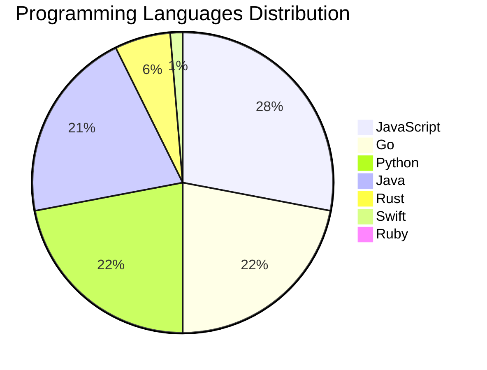

<div align="center">

# 📰 DevTech Auto News

**Your always-fresh digest of developer & AI tech news — curated automatically, around the clock.**


Aggregating [Dev.to](https://dev.to) · [Hacker News](https://news.ycombinator.com) · [GitHub Trending](https://github.com/trending) · [Lobste.rs](https://lobste.rs) · [Stack Overflow](https://stackoverflow.com) · [TechCrunch](https://techcrunch.com) · [freeCodeCamp](https://www.freecodecamp.org/news) — refreshed by GitHub Actions around the clock.

**[📰 Headlines](#-latest-headlines) · [💡 Interview Prep](#-interview-question-of-the-hour) · [📊 Statistics](#-statistics) · [⚙️ How It Works](#%EF%B8%8F-how-it-works)**

</div>

---

## 📰 Latest Headlines

> 🕐 Edition of **2026-10-01 7:00 CAT** — refreshed automatically, all day, every day.

### ✨ Featured Stories

<table>
<tr>
  <td align="center" width="33%">
    <a href="https://dev.to/gde/gemma-4-on-amazon-sagemaker-the-nvidia-t4-decodes-at-08x-of-the-l4-with-the-same-answers-19m4">
      
      <br/>
      <b>Gemma 4 on Amazon SageMaker: The NVIDIA T4 Decodes...</b>
    </a>
    <br/>
    <sub>Dev.to</sub>
  </td>
  <td align="center" width="33%">
    <a href="https://dev.to/devteam/join-us-live-hacktoberfest-2026-launch-with-exclusive-swag-1e25">
      
      <br/>
      <b>Join Us Live: Hacktoberfest 2026 Launch with Exclu...</b>
    </a>
    <br/>
    <sub>Dev.to</sub>
  </td>
  <td align="center" width="33%">
    <a href="https://dev.to/gde/gemma-4-on-a-tesla-t4-part-3-int4-embeddings-serve-e2b-in-286-gib-at-230x-bf16-3kch">
      
      <br/>
      <b>Gemma 4 on a Tesla T4, Part 3: Int4 Embeddings Ser...</b>
    </a>
    <br/>
    <sub>Dev.to</sub>
  </td>
</tr>
<tr>
  <td align="center" width="33%">
    <a href="https://dev.to/ben/gemini-4-argon-5g2l">
      
      <br/>
      <b>Gemini 4 Argon

https://blog.google/innovation-a...</b>
    </a>
    <br/>
    <sub>Dev.to</sub>
  </td>
  <td align="center" width="33%">
    <a href="https://dev.to/sloan/welcome-thread-v-395-55m">
      
      <br/>
      <b>Welcome Thread - v 395</b>
    </a>
    <br/>
    <sub>Dev.to</sub>
  </td>
  <td align="center" width="33%">
    <a href="https://dev.to/devteam/top-7-featured-dev-posts-of-the-week-3egf">
      
      <br/>
      <b>Top 7 Featured DEV Posts of the Week</b>
    </a>
    <br/>
    <sub>Dev.to</sub>
  </td>
</tr>
</table>


### 🗞️ Top Stories

| # | Headline | Source |
|---|----------|--------|
| 1 | [Gemma 4 on Amazon SageMaker: The NVIDIA T4 Decodes at 0.8x of the L4 With the Same Answers](https://dev.to/gde/gemma-4-on-amazon-sagemaker-the-nvidia-t4-decodes-at-08x-of-the-l4-with-the-same-answers-19m4) | Dev.to |
| 2 | [Join Us Live: Hacktoberfest 2026 Launch with Exclusive Swag! 🎃🚀](https://dev.to/devteam/join-us-live-hacktoberfest-2026-launch-with-exclusive-swag-1e25) | Dev.to |
| 3 | [Gemma 4 on a Tesla T4, Part 3: Int4 Embeddings Serve E2B in 2.86 GiB at 2.30x bf16](https://dev.to/gde/gemma-4-on-a-tesla-t4-part-3-int4-embeddings-serve-e2b-in-286-gib-at-230x-bf16-3kch) | Dev.to |
| 4 | [Gemini 4 Argon

https://blog.google/innovation-and-ai/models-and-research/gemini-models/gemini-4-argon/](https://dev.to/ben/gemini-4-argon-5g2l) | Dev.to |
| 5 | [Welcome Thread - v 395](https://dev.to/sloan/welcome-thread-v-395-55m) | Dev.to |
| 6 | [Top 7 Featured DEV Posts of the Week](https://dev.to/devteam/top-7-featured-dev-posts-of-the-week-3egf) | Dev.to |
| 7 | [Count It or Compute It: When a Tool Returns Rows, the Models That Count Them Right Spend the Tokens](https://dev.to/gde/count-it-or-compute-it-when-a-tool-returns-rows-the-models-that-count-them-right-spend-the-tokens-2hae) | Dev.to |
| 8 | [Claude Sonnet 5.5 is now available on Google Cloud](https://dev.to/googleai/claude-sonnet-55-is-now-available-on-google-cloud-168h) | Dev.to |
| 9 | [7 ways to lock down AI agent sandboxes in production (beyond Docker containers)](https://dev.to/googleai/7-ways-to-lock-down-ai-agent-sandboxes-in-production-beyond-docker-containers-2bg3) | Dev.to |
| 10 | [Disappeared Since March: Taking a Long Break Was My Best Decision Yet](https://dev.to/maame-codes/disappeared-since-march-taking-a-long-break-was-my-best-decision-yet-1n45) | Dev.to |
| 11 | [Claude Opus 5.5 is now available on Google Cloud](https://dev.to/googleai/claude-opus-55-is-now-available-on-google-cloud-2oh) | Dev.to |
| 12 | [How to Build a Real-Time Voice AI Agent with the Gemini Live API](https://dev.to/googleai/how-to-build-a-real-time-voice-ai-agent-with-the-gemini-live-api-1dhe) | Dev.to |
| 13 | [The Sand in the Oyster: Why Riverpod Was Needed, and Why You Don't Need It Any More](https://dev.to/gde/the-sand-in-the-oyster-why-riverpod-was-needed-and-why-you-dont-need-it-any-more-204o) | Dev.to |
| 14 | [Claude on Google Cloud workshop | NYC | 9/30](https://dev.to/googleai/claude-on-google-cloud-workshop-nyc-930-17jl) | Dev.to |
| 15 | [Your Type Guard Can Silently Drift from Your TypeScript Type 🔧](https://dev.to/nyaomaru/your-type-guard-can-silently-drift-from-your-typescript-type-o57) | Dev.to |
| 16 | [Deploying LiteLLM: An Open-Source AI Gateway](https://dev.to/vultr/deploying-litellm-an-open-source-ai-gateway-2idp) | Dev.to |
| 17 | [I connected a fruit fly connectome to tic-tac-toe (with a minimax safety net)](https://dev.to/asyncinnovator/i-connected-a-fruit-fly-connectome-to-tic-tac-toe-with-a-minimax-safety-net-5bc0) | Dev.to |
| 18 | [8 Posts by Women on DEV That Deserve More Than a Once-a-Year Spotlight](https://dev.to/sheships/8-posts-by-women-on-dev-that-deserve-more-than-a-once-a-year-spotlight-27dc) | Dev.to |
| 19 | [Congrats to the DEV Weekend Challenge: Dog Days Edition Winners!](https://dev.to/devteam/congrats-to-the-dev-weekend-challenge-dog-days-edition-winners-300g) | Dev.to |
| 20 | [I Turned DEV.to Into a Walkable 3D Library — Debugging It Has Been a Nightmare](https://dev.to/mikachu/i-turned-devto-into-a-walkable-3d-library-debugging-it-has-been-a-nightmare-4lkd) | Dev.to |

<sub>Last fetched: Thu, 01 Oct 2026 07:49:31 CAT</sub>


---

## 💡 Interview Question of the Hour

> Sharpen your skills — new questions selected on every update. Try answering before opening the hint!

**1. `React` — Implement a custom hook for fetching data**

&nbsp;&nbsp;&nbsp;&nbsp;🎯 Medium · 🏷 hooks, async

<details>
<summary>&nbsp;&nbsp;&nbsp;&nbsp;💡 Show hint</summary>

> useState, useEffect, loading states, error handling

</details>

**2. `Database` — What is database normalization and denormalization?**

&nbsp;&nbsp;&nbsp;&nbsp;🎯 Medium · 🏷 design, optimization

<details>
<summary>&nbsp;&nbsp;&nbsp;&nbsp;💡 Show hint</summary>

> Normal forms, redundancy, performance trade-offs

</details>

**3. `SystemDesign` — How would you design a rate limiter?**

&nbsp;&nbsp;&nbsp;&nbsp;🎯 Medium · 🏷 system design, algorithms

<details>
<summary>&nbsp;&nbsp;&nbsp;&nbsp;💡 Show hint</summary>

> Token bucket, sliding window, distributed systems

</details>


---

## 📊 Statistics

#### 🗂 Articles by Category

| Category | Articles | Share | |
|----------|---------:|------:|---|
| **AI** | 75 | 41.0% | `████████████████████` |
| **JavaScript** | 42 | 23.0% | `███████████░░░░░░░░░` |
| **Tools** | 40 | 21.9% | `███████████░░░░░░░░░` |
| **Python** | 33 | 18.0% | `█████████░░░░░░░░░░░` |
| **Cloud** | 17 | 9.3% | `█████░░░░░░░░░░░░░░░` |
| **Security** | 17 | 9.3% | `█████░░░░░░░░░░░░░░░` |
| **DevOps** | 16 | 8.7% | `████░░░░░░░░░░░░░░░░` |
| **WebDev** | 11 | 6.0% | `███░░░░░░░░░░░░░░░░░` |
| **Mobile** | 7 | 3.8% | `██░░░░░░░░░░░░░░░░░░` |
| **Database** | 6 | 3.3% | `██░░░░░░░░░░░░░░░░░░` |

<sub>Articles can match more than one category, so shares may sum to over 100%.</sub>


#### 📡 Articles by Source

| Source | Articles |
|--------|---------:|
| Dev.to | 60 |
| HackerNews | 49 |
| GitHub | 25 |
| Lobste.rs | 10 |
| StackOverflow | 19 |
| TechCrunch | 10 |
| freeCodeCamp | 10 |


#### 💻 Programming Language Trends

```
JavaScript      ██████████████████████████████ 27.8%
Go              ████████████████████████ 21.9%
Python          ████████████████████████ 21.9%
Java            ██████████████████████ 20.5%
Rust            ██████ 6.0%
Swift           █ 1.3%
Ruby            █ 0.7%

```


```mermaid
pie title Programming Languages Distribution
    "JavaScript" : 42
    "Go" : 33
    "Python" : 33
    "Java" : 31
    "Rust" : 9
    "Swift" : 2
    "Ruby" : 1
```


#### 🏷 Trending Topics

            


---

## ⚙️ How It Works

This repository is a fully automated news pipeline. On every run, GitHub Actions:

1. **Fetches** the latest articles from seven sources: Dev.to, Hacker News, GitHub Trending, Lobste.rs, Stack Overflow, TechCrunch, and freeCodeCamp
2. **Deduplicates and categorizes** them across 10+ topics using keyword matching
3. **Extracts cover images** and computes language & category statistics
4. **Rebuilds this README** and appends everything to the [full archive](./data/news_log.md)
5. **Commits and pushes** the result — no human intervention needed

<details>
<summary><b>🚀 Run it yourself</b></summary>

```bash
git clone https://github.com/Derrick-MUGISHA/github-activity-bot.git
cd github-activity-bot
npm install
npm start
```

Fork the repo, enable GitHub Actions, and you have your own self-updating news feed.

</details>

<details>
<summary><b>📚 Data & resources</b></summary>

- [Full news archive](./data/news_log.md) — complete history of every fetched article
- [Statistics](./data/stats.json) — raw stats data (JSON)
- [Categorized articles](./data/categorized.json) — articles grouped by topic
- [Interview question bank](./data/interview_questions.json) — the full question set

</details>

---

## 🤝 Contributing

Ideas for new sources, categories, or interview questions are welcome — [open an issue](https://github.com/Derrick-MUGISHA/github-activity-bot/issues/new) or submit a pull request.

## 📄 License

Released under the [MIT License](https://opensource.org/licenses/MIT) — free to use, fork, and modify.

---

<div align="center">
  <sub>🤖 Last automated update: <b>Thu, 01 Oct 2026 05:49:31 GMT</b></sub><br/>
  <sub>Powered by GitHub Actions · Built with ❤️ by <a href="https://github.com/Derrick-MUGISHA">Derrick MUGISHA</a></sub>
</div>
