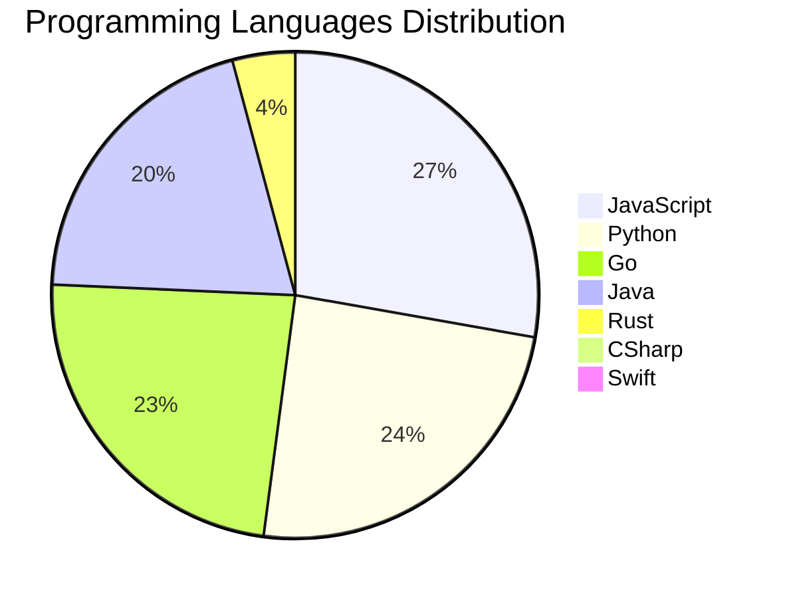

<div align="center">

# 📰 DevTech Auto News

**Your always-fresh digest of developer & AI tech news — curated automatically, around the clock.**


Aggregating [Dev.to](https://dev.to) · [Hacker News](https://news.ycombinator.com) · [GitHub Trending](https://github.com/trending) · [Lobste.rs](https://lobste.rs) · [Stack Overflow](https://stackoverflow.com) · [TechCrunch](https://techcrunch.com) · [freeCodeCamp](https://www.freecodecamp.org/news) — refreshed by GitHub Actions around the clock.

**[📰 Headlines](#-latest-headlines) · [💡 Interview Prep](#-interview-question-of-the-hour) · [📊 Statistics](#-statistics) · [⚙️ How It Works](#%EF%B8%8F-how-it-works)**

</div>

---

## 📰 Latest Headlines

> 🕐 Edition of **2026-09-27 10:00 CAT** — refreshed automatically, all day, every day.

### ✨ Featured Stories

<table>
<tr>
  <td align="center" width="33%">
    <a href="https://dev.to/maame-codes/disappeared-since-march-taking-a-long-break-was-my-best-decision-yet-1n45">
      
      <br/>
      <b>Disappeared Since March: Taking a Long Break Was M...</b>
    </a>
    <br/>
    <sub>Dev.to</sub>
  </td>
  <td align="center" width="33%">
    <a href="https://dev.to/mikachu/i-turned-devto-into-a-walkable-3d-library-debugging-it-has-been-a-nightmare-4lkd">
      
      <br/>
      <b>I Turned DEV.to Into a Walkable 3D Library — Debug...</b>
    </a>
    <br/>
    <sub>Dev.to</sub>
  </td>
  <td align="center" width="33%">
    <a href="https://dev.to/gde/building-file4base-the-modern-open-source-alternative-to-file4base-powered-by-antigravity-47g7">
      
      <br/>
      <b>Building File4Base: The Modern, Open-Source Altern...</b>
    </a>
    <br/>
    <sub>Dev.to</sub>
  </td>
</tr>
<tr>
  <td align="center" width="33%">
    <a href="https://dev.to/gde/running-a-jev-style-decision-model-on-one-tpu-v6e-what-fits-what-it-costs-and-what-changes-from-1j0g">
      
      <br/>
      <b>Running a Jev-Style Decision Model on One TPU v6e:...</b>
    </a>
    <br/>
    <sub>Dev.to</sub>
  </td>
  <td align="center" width="33%">
    <a href="https://dev.to/googleai/claude-opus-55-is-now-available-on-google-cloud-2oh">
      
      <br/>
      <b>Claude Opus 5.5 is now available on Google Cloud</b>
    </a>
    <br/>
    <sub>Dev.to</sub>
  </td>
  <td align="center" width="33%">
    <a href="https://dev.to/devteam/what-was-your-win-this-week-odj">
      
      <br/>
      <b>What was your win this week!?</b>
    </a>
    <br/>
    <sub>Dev.to</sub>
  </td>
</tr>
</table>


### 🗞️ Top Stories

| # | Headline | Source |
|---|----------|--------|
| 1 | [Disappeared Since March: Taking a Long Break Was My Best Decision Yet](https://dev.to/maame-codes/disappeared-since-march-taking-a-long-break-was-my-best-decision-yet-1n45) | Dev.to |
| 2 | [I Turned DEV.to Into a Walkable 3D Library — Debugging It Has Been a Nightmare](https://dev.to/mikachu/i-turned-devto-into-a-walkable-3d-library-debugging-it-has-been-a-nightmare-4lkd) | Dev.to |
| 3 | [Building File4Base: The Modern, Open-Source Alternative to old file bases (Powered by Antigravity)](https://dev.to/gde/building-file4base-the-modern-open-source-alternative-to-file4base-powered-by-antigravity-47g7) | Dev.to |
| 4 | [Running a Jev-Style Decision Model on One TPU v6e: What Fits, What It Costs, and What Changes From a GPU](https://dev.to/gde/running-a-jev-style-decision-model-on-one-tpu-v6e-what-fits-what-it-costs-and-what-changes-from-1j0g) | Dev.to |
| 5 | [Claude Opus 5.5 is now available on Google Cloud](https://dev.to/googleai/claude-opus-55-is-now-available-on-google-cloud-2oh) | Dev.to |
| 6 | [What was your win this week!?](https://dev.to/devteam/what-was-your-win-this-week-odj) | Dev.to |
| 7 | [Welcome Thread - v 394](https://dev.to/sloan/welcome-thread-v-394-22l2) | Dev.to |
| 8 | [This video is about how this video was made](https://dev.to/peter/this-video-is-about-how-this-video-was-made-42hl) | Dev.to |
| 9 | [Claude on Google Cloud workshop | NYC | 9/30](https://dev.to/googleai/claude-on-google-cloud-workshop-nyc-930-17jl) | Dev.to |
| 10 | [Plain Gemma 4 26B vs Jev on One EC2 L4: 2.1 Points Behind Overall, Level on Yes/No, 4.5 Behind on Multiple Choice](https://dev.to/gde/plain-gemma-4-26b-vs-jev-on-one-ec2-l4-21-points-behind-overall-level-on-yesno-45-behind-on-15k6) | Dev.to |
| 11 | [Jev After Eight Days of Independent Tests: Level With Mid-Price LLMs, Behind the Frontier](https://dev.to/gde/jev-after-eight-days-of-independent-tests-level-with-mid-price-llms-behind-the-frontier-1kln) | Dev.to |
| 12 | [Deploying LiteLLM: An Open-Source AI Gateway](https://dev.to/vultr/deploying-litellm-an-open-source-ai-gateway-2idp) | Dev.to |
| 13 | [Congrats to the DEV Weekend Challenge: Dog Days Edition Winners!](https://dev.to/devteam/congrats-to-the-dev-weekend-challenge-dog-days-edition-winners-300g) | Dev.to |
| 14 | [The missing layer in AI tooling: sharing what your assistant already knows](https://dev.to/uri_shmueli_a403e7acc04a8/the-missing-layer-in-ai-tooling-sharing-what-your-assistant-already-knows-1nch) | Dev.to |
| 15 | [A 4 GB Laptop GPU vs a 6-Core CPU on Gemma 4, Re-Measured in ABBA Order: 4.1x](https://dev.to/gde/a-4-gb-laptop-gpu-vs-a-6-core-cpu-on-gemma-4-re-measured-in-abba-order-41x-5g56) | Dev.to |
| 16 | [Top 7 Featured DEV Posts of the Week](https://dev.to/devteam/top-7-featured-dev-posts-of-the-week-2agl) | Dev.to |
| 17 | [What Nobody Is Using in Your Google Cloud Projects, and What It Costs](https://dev.to/gde/what-nobody-is-using-in-your-google-cloud-projects-and-what-it-costs-1k0) | Dev.to |
| 18 | [Dart Enhanced Enums Are Secretly Factories: Unlocking Constructor Tearoffs](https://dev.to/gde/dart-enhanced-enums-are-secretly-factories-unlocking-constructor-tearoffs-54n9) | Dev.to |
| 19 | [Stop Paying the build_runner Tax: Why I Refuse to Use Mockito in Modern Dart](https://dev.to/gde/stop-paying-the-buildrunner-tax-why-i-refuse-to-use-mockito-in-modern-dart-4cif) | Dev.to |
| 20 | [What was your win this week?!](https://dev.to/devteam/what-was-your-win-this-week-2hcb) | Dev.to |

<sub>Last fetched: Sun, 27 Sep 2026 10:36:54 CAT</sub>


---

## 💡 Interview Question of the Hour

> Sharpen your skills — new questions selected on every update. Try answering before opening the hint!

**1. `SystemDesign` — Design a distributed cache system**

&nbsp;&nbsp;&nbsp;&nbsp;🎯 Hard · 🏷 distributed systems, caching

<details>
<summary>&nbsp;&nbsp;&nbsp;&nbsp;💡 Show hint</summary>

> Consistency, partitioning, replication, eviction policies

</details>

**2. `SystemDesign` — Design a distributed cache system**

&nbsp;&nbsp;&nbsp;&nbsp;🎯 Hard · 🏷 distributed systems, caching

<details>
<summary>&nbsp;&nbsp;&nbsp;&nbsp;💡 Show hint</summary>

> Consistency, partitioning, replication, eviction policies

</details>

**3. `Python` — Implement a context manager using __enter__ and __exit__**

&nbsp;&nbsp;&nbsp;&nbsp;🎯 Hard · 🏷 context managers, resource management

<details>
<summary>&nbsp;&nbsp;&nbsp;&nbsp;💡 Show hint</summary>

> with statement, setup/teardown, exception handling

</details>


---

## 📊 Statistics

#### 🗂 Articles by Category

| Category | Articles | Share | |
|----------|---------:|------:|---|
| **AI** | 78 | 42.4% | `████████████████████` |
| **Tools** | 47 | 25.5% | `████████████░░░░░░░░` |
| **JavaScript** | 40 | 21.7% | `██████████░░░░░░░░░░` |
| **Python** | 35 | 19.0% | `█████████░░░░░░░░░░░` |
| **DevOps** | 16 | 8.7% | `████░░░░░░░░░░░░░░░░` |
| **Cloud** | 16 | 8.7% | `████░░░░░░░░░░░░░░░░` |
| **Security** | 12 | 6.5% | `███░░░░░░░░░░░░░░░░░` |
| **Mobile** | 6 | 3.3% | `██░░░░░░░░░░░░░░░░░░` |
| **WebDev** | 5 | 2.7% | `█░░░░░░░░░░░░░░░░░░░` |
| **Database** | 3 | 1.6% | `█░░░░░░░░░░░░░░░░░░░` |

<sub>Articles can match more than one category, so shares may sum to over 100%.</sub>


#### 📡 Articles by Source

| Source | Articles |
|--------|---------:|
| Dev.to | 60 |
| HackerNews | 49 |
| GitHub | 25 |
| Lobste.rs | 10 |
| StackOverflow | 20 |
| TechCrunch | 10 |
| freeCodeCamp | 10 |


#### 💻 Programming Language Trends

```
JavaScript      ██████████████████████████████ 27.4%
Python          ██████████████████████████ 24.0%
Go              ██████████████████████████ 23.3%
Java            ██████████████████████ 19.9%
Rust            ████ 4.1%
CSharp          █ 0.7%
Swift           █ 0.7%

```


```mermaid
pie title Programming Languages Distribution
    "JavaScript" : 40
    "Python" : 35
    "Go" : 34
    "Java" : 29
    "Rust" : 6
    "CSharp" : 1
    "Swift" : 1
```


#### 🏷 Trending Topics

            


---

## ⚙️ How It Works

This repository is a fully automated news pipeline. On every run, GitHub Actions:

1. **Fetches** the latest articles from seven sources: Dev.to, Hacker News, GitHub Trending, Lobste.rs, Stack Overflow, TechCrunch, and freeCodeCamp
2. **Deduplicates and categorizes** them across 10+ topics using keyword matching
3. **Extracts cover images** and computes language & category statistics
4. **Rebuilds this README** and appends everything to the [full archive](./data/news_log.md)
5. **Commits and pushes** the result — no human intervention needed

<details>
<summary><b>🚀 Run it yourself</b></summary>

```bash
git clone https://github.com/Derrick-MUGISHA/github-activity-bot.git
cd github-activity-bot
npm install
npm start
```

Fork the repo, enable GitHub Actions, and you have your own self-updating news feed.

</details>

<details>
<summary><b>📚 Data & resources</b></summary>

- [Full news archive](./data/news_log.md) — complete history of every fetched article
- [Statistics](./data/stats.json) — raw stats data (JSON)
- [Categorized articles](./data/categorized.json) — articles grouped by topic
- [Interview question bank](./data/interview_questions.json) — the full question set

</details>

---

## 🤝 Contributing

Ideas for new sources, categories, or interview questions are welcome — [open an issue](https://github.com/Derrick-MUGISHA/github-activity-bot/issues/new) or submit a pull request.

## 📄 License

Released under the [MIT License](https://opensource.org/licenses/MIT) — free to use, fork, and modify.

---

<div align="center">
  <sub>🤖 Last automated update: <b>Sun, 27 Sep 2026 08:36:54 GMT</b></sub><br/>
  <sub>Powered by GitHub Actions · Built with ❤️ by <a href="https://github.com/Derrick-MUGISHA">Derrick MUGISHA</a></sub>
</div>
