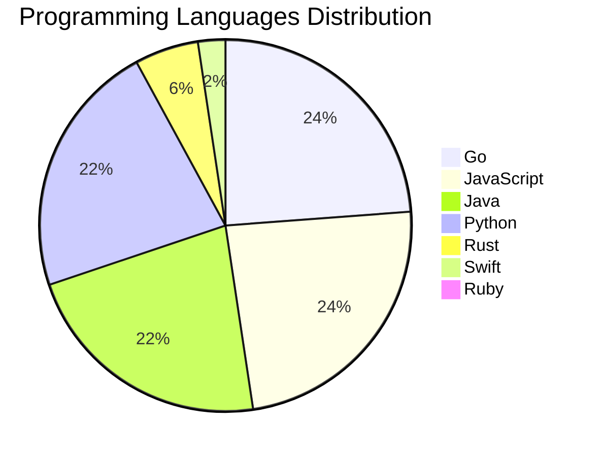

<div align="center">

# 📰 DevTech Auto News

**Your always-fresh digest of developer & AI tech news — curated automatically, around the clock.**


Aggregating [Dev.to](https://dev.to) · [Hacker News](https://news.ycombinator.com) · [GitHub Trending](https://github.com/trending) · [Lobste.rs](https://lobste.rs) · [Stack Overflow](https://stackoverflow.com) · [TechCrunch](https://techcrunch.com) · [freeCodeCamp](https://www.freecodecamp.org/news) — refreshed by GitHub Actions around the clock.

**[📰 Headlines](#-latest-headlines) · [💡 Interview Prep](#-interview-question-of-the-hour) · [📊 Statistics](#-statistics) · [⚙️ How It Works](#%EF%B8%8F-how-it-works)**

</div>

---

## 📰 Latest Headlines

> 🕐 Edition of **2026-10-16 15:00 CAT** — refreshed automatically, all day, every day.

### ✨ Featured Stories

<table>
<tr>
  <td align="center" width="33%">
    <a href="https://dev.to/jess/how-i-feel-about-the-grace-hopper-celebration-getting-cancelled-3l2k">
      
      <br/>
      <b>How I Feel about the Grace Hopper Celebration Gett...</b>
    </a>
    <br/>
    <sub>Dev.to</sub>
  </td>
  <td align="center" width="33%">
    <a href="https://dev.to/devteam/what-was-your-win-this-week-36am">
      
      <br/>
      <b>What was your win this week?!</b>
    </a>
    <br/>
    <sub>Dev.to</sub>
  </td>
  <td align="center" width="33%">
    <a href="https://dev.to/dailycontext/are-you-smarter-than-a-fruit-fly-2c04">
      
      <br/>
      <b>Are You Smarter Than a Fruit Fly?</b>
    </a>
    <br/>
    <sub>Dev.to</sub>
  </td>
</tr>
<tr>
  <td align="center" width="33%">
    <a href="https://dev.to/gde/requests-promises-assertions-and-declarations-rewriting-our-ai-agent-workflow-as-a-1986-4k4c">
      
      <br/>
      <b>Requests, Promises, Assertions, and Declarations: ...</b>
    </a>
    <br/>
    <sub>Dev.to</sub>
  </td>
  <td align="center" width="33%">
    <a href="https://dev.to/dailycontext/inside-the-30-a-week-self-improving-agents-eliminating-enterprise-back-office-friction-c4p">
      
      <br/>
      <b>Inside the $30-a-Week Self-Improving Agents Elimin...</b>
    </a>
    <br/>
    <sub>Dev.to</sub>
  </td>
  <td align="center" width="33%">
    <a href="https://dev.to/dailycontext/the-ai-data-paradox-the-safer-you-make-the-data-the-worse-the-ai-gets-1ek7">
      
      <br/>
      <b>The AI Data Paradox: The Safer You Make the Data, ...</b>
    </a>
    <br/>
    <sub>Dev.to</sub>
  </td>
</tr>
</table>


### 🗞️ Top Stories

| # | Headline | Source |
|---|----------|--------|
| 1 | [How I Feel about the Grace Hopper Celebration Getting Cancelled](https://dev.to/jess/how-i-feel-about-the-grace-hopper-celebration-getting-cancelled-3l2k) | Dev.to |
| 2 | [What was your win this week?!](https://dev.to/devteam/what-was-your-win-this-week-36am) | Dev.to |
| 3 | [Are You Smarter Than a Fruit Fly?](https://dev.to/dailycontext/are-you-smarter-than-a-fruit-fly-2c04) | Dev.to |
| 4 | [Requests, Promises, Assertions, and Declarations: Rewriting Our AI Agent Workflow as a 1986 'Committed Speech' Machine](https://dev.to/gde/requests-promises-assertions-and-declarations-rewriting-our-ai-agent-workflow-as-a-1986-4k4c) | Dev.to |
| 5 | [Inside the $30-a-Week Self-Improving Agents Eliminating Enterprise Back-Office Friction](https://dev.to/dailycontext/inside-the-30-a-week-self-improving-agents-eliminating-enterprise-back-office-friction-c4p) | Dev.to |
| 6 | [The AI Data Paradox: The Safer You Make the Data, the Worse the AI Gets](https://dev.to/dailycontext/the-ai-data-paradox-the-safer-you-make-the-data-the-worse-the-ai-gets-1ek7) | Dev.to |
| 7 | [Design for Churn](https://dev.to/dailycontext/design-for-churn-5c6h) | Dev.to |
| 8 | [DuckLess: serverless DuckDB on Google Cloud, in your own project](https://dev.to/gde/duckless-serverless-duckdb-on-google-cloud-in-your-own-project-4o5a) | Dev.to |
| 9 | [Local image generation with llamadart for the Llama Village storybook](https://dev.to/gde/local-image-generation-with-llamadart-for-the-llama-village-storybook-p28) | Dev.to |
| 10 | [Your AI Agent Just Got a Passport: Agent Identity on Google Cloud and the Redeploy Trap Nobody Talks About](https://dev.to/gde/your-ai-agent-just-got-a-passport-agent-identity-on-google-cloud-and-the-redeploy-trap-nobody-52ip) | Dev.to |
| 11 | [Beyond the Prompt Box: How Bloomberg is Architecting the Era of “Multiplayer AI”](https://dev.to/dailycontext/beyond-the-prompt-box-how-bloomberg-is-architecting-the-era-of-multiplayer-ai-569a) | Dev.to |
| 12 | [Nobody’s winning the AI race yet](https://dev.to/dailycontext/nobodys-winning-the-ai-race-yet-24h4) | Dev.to |
| 13 | [What a 48-Hour Hackathon Can Do for LLM Reliability](https://dev.to/dailycontext/what-a-48-hour-hackathon-can-do-for-llm-reliability-9j6) | Dev.to |
| 14 | [Operational intelligence is sociotechnical](https://dev.to/dailycontext/operational-intelligence-is-sociotechnical-1627) | Dev.to |
| 15 | [Where to Spend Your Week at AI Engineer New York](https://dev.to/dailycontext/where-to-spend-your-week-at-ai-engineer-new-york-3lg) | Dev.to |
| 16 | [Gemini 4 Under the Microscope: Red-Teaming AI Agents and Deterministic Dual-Port Remote Control Gemini 4 Architecture Banner](https://dev.to/gde/gemini-4-under-the-microscope-red-teaming-ai-agents-and-deterministic-dual-port-remote-control-4567) | Dev.to |
| 17 | [Six Months After Cloud Next ‘26: A Builder’s Tour of the Gemini Enterprise Agent Platform](https://dev.to/gde/six-months-after-cloud-next-26-a-builders-tour-of-the-gemini-enterprise-agent-platform-3hib) | Dev.to |
| 18 | [Building Better Agents through End-to-End Evals](https://dev.to/dailycontext/building-better-agents-through-end-to-end-evals-pgh) | Dev.to |
| 19 | [AlphaEvolve and Gemini: Autonomous Algorithm Discovery for Unified Disaster Prediction](https://dev.to/gde/alphaevolve-and-gemini-autonomous-algorithm-discovery-for-unified-disaster-prediction-20f4) | Dev.to |
| 20 | [LangChainJS and Gemini 4 Argon: What's here and what's coming?](https://dev.to/gde/langchainjs-and-gemini-4-argon-whats-here-and-whats-coming-2kod) | Dev.to |

<sub>Last fetched: Fri, 16 Oct 2026 15:59:31 CAT</sub>


---

## 💡 Interview Question of the Hour

> Sharpen your skills — new questions selected on every update. Try answering before opening the hint!

**1. `SystemDesign` — Design Twitter's timeline feature**

&nbsp;&nbsp;&nbsp;&nbsp;🎯 Hard · 🏷 system design, scalability

<details>
<summary>&nbsp;&nbsp;&nbsp;&nbsp;💡 Show hint</summary>

> Fan-out, caching, ranking, real-time updates

</details>

**2. `NodeJS` — Explain middleware in Express.js**

&nbsp;&nbsp;&nbsp;&nbsp;🎯 Easy · 🏷 express, architecture

<details>
<summary>&nbsp;&nbsp;&nbsp;&nbsp;💡 Show hint</summary>

> Request/response cycle, next(), chain of functions

</details>

**3. `SystemDesign` — Design a distributed cache system**

&nbsp;&nbsp;&nbsp;&nbsp;🎯 Hard · 🏷 distributed systems, caching

<details>
<summary>&nbsp;&nbsp;&nbsp;&nbsp;💡 Show hint</summary>

> Consistency, partitioning, replication, eviction policies

</details>


---

## 📊 Statistics

#### 🗂 Articles by Category

| Category | Articles | Share | |
|----------|---------:|------:|---|
| **AI** | 92 | 51.4% | `████████████████████` |
| **Tools** | 33 | 18.4% | `███████░░░░░░░░░░░░░` |
| **JavaScript** | 30 | 16.8% | `███████░░░░░░░░░░░░░` |
| **Python** | 28 | 15.6% | `██████░░░░░░░░░░░░░░` |
| **Security** | 20 | 11.2% | `████░░░░░░░░░░░░░░░░` |
| **DevOps** | 14 | 7.8% | `███░░░░░░░░░░░░░░░░░` |
| **Cloud** | 10 | 5.6% | `██░░░░░░░░░░░░░░░░░░` |
| **Mobile** | 6 | 3.4% | `█░░░░░░░░░░░░░░░░░░░` |
| **WebDev** | 4 | 2.2% | `█░░░░░░░░░░░░░░░░░░░` |
| **Database** | 4 | 2.2% | `█░░░░░░░░░░░░░░░░░░░` |

<sub>Articles can match more than one category, so shares may sum to over 100%.</sub>


#### 📡 Articles by Source

| Source | Articles |
|--------|---------:|
| Dev.to | 60 |
| HackerNews | 49 |
| GitHub | 20 |
| Lobste.rs | 10 |
| StackOverflow | 20 |
| TechCrunch | 10 |
| freeCodeCamp | 10 |


#### 💻 Programming Language Trends

```
Go              ██████████████████████████████ 23.6%
JavaScript      ██████████████████████████████ 23.6%
Java            ████████████████████████████ 22.0%
Python          ████████████████████████████ 22.0%
Rust            ███████ 5.5%
Swift           ███ 2.4%
Ruby            █ 0.8%

```


```mermaid
pie title Programming Languages Distribution
    "Go" : 30
    "JavaScript" : 30
    "Java" : 28
    "Python" : 28
    "Rust" : 7
    "Swift" : 3
    "Ruby" : 1
```


#### 🏷 Trending Topics

            


---

## ⚙️ How It Works

This repository is a fully automated news pipeline. On every run, GitHub Actions:

1. **Fetches** the latest articles from seven sources: Dev.to, Hacker News, GitHub Trending, Lobste.rs, Stack Overflow, TechCrunch, and freeCodeCamp
2. **Deduplicates and categorizes** them across 10+ topics using keyword matching
3. **Extracts cover images** and computes language & category statistics
4. **Rebuilds this README** and appends everything to the [full archive](./data/news_log.md)
5. **Commits and pushes** the result — no human intervention needed

<details>
<summary><b>🚀 Run it yourself</b></summary>

```bash
git clone https://github.com/Derrick-MUGISHA/github-activity-bot.git
cd github-activity-bot
npm install
npm start
```

Fork the repo, enable GitHub Actions, and you have your own self-updating news feed.

</details>

<details>
<summary><b>📚 Data & resources</b></summary>

- [Full news archive](./data/news_log.md) — complete history of every fetched article
- [Statistics](./data/stats.json) — raw stats data (JSON)
- [Categorized articles](./data/categorized.json) — articles grouped by topic
- [Interview question bank](./data/interview_questions.json) — the full question set

</details>

---

## 🤝 Contributing

Ideas for new sources, categories, or interview questions are welcome — [open an issue](https://github.com/Derrick-MUGISHA/github-activity-bot/issues/new) or submit a pull request.

## 📄 License

Released under the [MIT License](https://opensource.org/licenses/MIT) — free to use, fork, and modify.

---

<div align="center">
  <sub>🤖 Last automated update: <b>Fri, 16 Oct 2026 13:59:31 GMT</b></sub><br/>
  <sub>Powered by GitHub Actions · Built with ❤️ by <a href="https://github.com/Derrick-MUGISHA">Derrick MUGISHA</a></sub>
</div>
