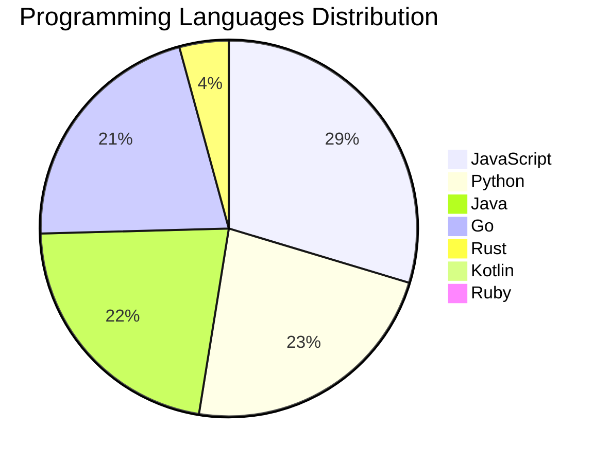

<div align="center">

# 📰 DevTech Auto News

**Your always-fresh digest of developer & AI tech news — curated automatically, around the clock.**


Aggregating [Dev.to](https://dev.to) · [Hacker News](https://news.ycombinator.com) · [GitHub Trending](https://github.com/trending) · [Lobste.rs](https://lobste.rs) · [Stack Overflow](https://stackoverflow.com) · [TechCrunch](https://techcrunch.com) · [freeCodeCamp](https://www.freecodecamp.org/news) — refreshed by GitHub Actions around the clock.

**[📰 Headlines](#-latest-headlines) · [💡 Interview Prep](#-interview-question-of-the-hour) · [📊 Statistics](#-statistics) · [⚙️ How It Works](#%EF%B8%8F-how-it-works)**

</div>

---

## 📰 Latest Headlines

> 🕐 Edition of **2026-10-13 9:00 CAT** — refreshed automatically, all day, every day.

### ✨ Featured Stories

<table>
<tr>
  <td align="center" width="33%">
    <a href="https://dev.to/gde/if-you-never-do-anything-else-to-fix-your-prompts-do-this-one-thing-3069">
      
      <br/>
      <b>If You Never Do Anything Else to Fix Your Prompts,...</b>
    </a>
    <br/>
    <sub>Dev.to</sub>
  </td>
  <td align="center" width="33%">
    <a href="https://dev.to/gde/local-embeddings-with-llamadart-how-llamas-share-secrets-46o">
      
      <br/>
      <b>Local embeddings with llamadart: how llamas share ...</b>
    </a>
    <br/>
    <sub>Dev.to</sub>
  </td>
  <td align="center" width="33%">
    <a href="https://dev.to/gde/safe-autonomy-in-kubernetes-building-ai-troubleshooting-agents-with-google-cloud-and-h8l">
      
      <br/>
      <b>Safe Autonomy in Kubernetes: Building AI Troublesh...</b>
    </a>
    <br/>
    <sub>Dev.to</sub>
  </td>
</tr>
<tr>
  <td align="center" width="33%">
    <a href="https://dev.to/dailycontext/one-weekend-3000-open-source-ai-projects-3g65">
      
      <br/>
      <b>One Weekend: 3,000 Open-Source AI Projects</b>
    </a>
    <br/>
    <sub>Dev.to</sub>
  </td>
  <td align="center" width="33%">
    <a href="https://dev.to/devteam/join-the-hacktoberfest-open-source-ai-challenge-side-hustle-2550-in-prizes-across-18-winners-55ba">
      
      <br/>
      <b>Join the Hacktoberfest Open-Source AI Challenge: S...</b>
    </a>
    <br/>
    <sub>Dev.to</sub>
  </td>
  <td align="center" width="33%">
    <a href="https://dev.to/dailycontext/its-not-the-model-its-you-1ngi">
      
      <br/>
      <b>It's Not the Model, It's You</b>
    </a>
    <br/>
    <sub>Dev.to</sub>
  </td>
</tr>
</table>


### 🗞️ Top Stories

| # | Headline | Source |
|---|----------|--------|
| 1 | [If You Never Do Anything Else to Fix Your Prompts, Do This One Thing](https://dev.to/gde/if-you-never-do-anything-else-to-fix-your-prompts-do-this-one-thing-3069) | Dev.to |
| 2 | [Local embeddings with llamadart: how llamas share secrets](https://dev.to/gde/local-embeddings-with-llamadart-how-llamas-share-secrets-46o) | Dev.to |
| 3 | [Safe Autonomy in Kubernetes: Building AI Troubleshooting Agents with Google Cloud and Human-in-the-Loop Controls](https://dev.to/gde/safe-autonomy-in-kubernetes-building-ai-troubleshooting-agents-with-google-cloud-and-h8l) | Dev.to |
| 4 | [One Weekend: 3,000 Open-Source AI Projects](https://dev.to/dailycontext/one-weekend-3000-open-source-ai-projects-3g65) | Dev.to |
| 5 | [Join the Hacktoberfest Open-Source AI Challenge: Side Hustle! $2,550 in Prizes Across 18 Winners.](https://dev.to/devteam/join-the-hacktoberfest-open-source-ai-challenge-side-hustle-2550-in-prizes-across-18-winners-55ba) | Dev.to |
| 6 | [It's Not the Model, It's You](https://dev.to/dailycontext/its-not-the-model-its-you-1ngi) | Dev.to |
| 7 | [ROI That Survives the Second Question](https://dev.to/dailycontext/roi-that-survives-the-second-question-4na0) | Dev.to |
| 8 | [Your Guide to AI Engineer New York 2026](https://dev.to/dailycontext/your-guide-to-ai-engineer-new-york-2026-2aol) | Dev.to |
| 9 | [Where to Spend Your Week at AI Engineer New York](https://dev.to/dailycontext/where-to-spend-your-week-at-ai-engineer-new-york-3lg) | Dev.to |
| 10 | [A/B testing AI products is weird](https://dev.to/dailycontext/ab-testing-ai-products-is-weird-576h) | Dev.to |
| 11 | [Meme Monday](https://dev.to/ben/meme-monday-4e47) | Dev.to |
| 12 | [Does your agent have ID?](https://dev.to/dailycontext/does-your-agent-have-id-58ok) | Dev.to |
| 13 | [Building AI Analysts for Wall Street: A Q&A with Compound Co-Founder Yijia Liang](https://dev.to/dailycontext/building-ai-analysts-for-wall-street-a-qa-with-compound-co-founder-yijia-liang-29c3) | Dev.to |
| 14 | [Q&A with Al Chen, Software Engineering Leader at Cisco](https://dev.to/dailycontext/qa-with-al-chen-software-engineering-leader-at-cisco-jj7) | Dev.to |
| 15 | [Why Smaller AI Models Can Win in the Enterprise](https://dev.to/dailycontext/why-smaller-ai-models-can-win-in-the-enterprise-1m57) | Dev.to |
| 16 | [A World Worth Understanding](https://dev.to/dailycontext/a-world-worth-understanding-f08) | Dev.to |
| 17 | [What LLMs 'Know' That You Don't Know They Know: Stop Inventing Prompt DSLs and Ride 50 Years of Unix Pre-Training Gravity](https://dev.to/gde/what-llms-know-that-you-dont-know-they-know-stop-inventing-prompt-dsls-and-ride-50-years-of-2bl6) | Dev.to |
| 18 | [Dev Opportunity Radar #20: $2M AI Reasoning Challenge, PayPal AI Hackathon, and Coinbase Analytics Challenge](https://dev.to/devengers/dev-opportunity-radar-20-2m-ai-reasoning-challenge-paypal-ai-hackathon-and-coinbase-analytics-1fec) | Dev.to |
| 19 | [THE UNHEARD: A Game That Sends You Outside, Teaches a Machine to Listen, and Makes It Prove Every Word](https://dev.to/iclaldogan/the-unheard-a-game-that-sends-you-outside-teaches-a-machine-to-listen-and-makes-it-prove-every-43go) | Dev.to |
| 20 | [Why you still need a Website Portfolio, even though everyone can Vibe Code it.](https://dev.to/francistrdev/why-you-still-need-a-website-portfolio-even-though-everyone-can-vibe-code-it-e63) | Dev.to |

<sub>Last fetched: Tue, 13 Oct 2026 09:12:34 CAT</sub>


---

## 💡 Interview Question of the Hour

> Sharpen your skills — new questions selected on every update. Try answering before opening the hint!

**1. `SystemDesign` — How would you design a rate limiter?**

&nbsp;&nbsp;&nbsp;&nbsp;🎯 Medium · 🏷 system design, algorithms

<details>
<summary>&nbsp;&nbsp;&nbsp;&nbsp;💡 Show hint</summary>

> Token bucket, sliding window, distributed systems

</details>

**2. `Java` — Explain the Java memory model**

&nbsp;&nbsp;&nbsp;&nbsp;🎯 Hard · 🏷 memory, JVM

<details>
<summary>&nbsp;&nbsp;&nbsp;&nbsp;💡 Show hint</summary>

> Heap, stack, garbage collection

</details>

**3. `Database` — What is database normalization and denormalization?**

&nbsp;&nbsp;&nbsp;&nbsp;🎯 Medium · 🏷 design, optimization

<details>
<summary>&nbsp;&nbsp;&nbsp;&nbsp;💡 Show hint</summary>

> Normal forms, redundancy, performance trade-offs

</details>


---

## 📊 Statistics

#### 🗂 Articles by Category

| Category | Articles | Share | |
|----------|---------:|------:|---|
| **AI** | 94 | 51.1% | `████████████████████` |
| **Tools** | 44 | 23.9% | `█████████░░░░░░░░░░░` |
| **JavaScript** | 35 | 19.0% | `███████░░░░░░░░░░░░░` |
| **Python** | 27 | 14.7% | `██████░░░░░░░░░░░░░░` |
| **Security** | 17 | 9.2% | `████░░░░░░░░░░░░░░░░` |
| **DevOps** | 15 | 8.2% | `███░░░░░░░░░░░░░░░░░` |
| **WebDev** | 11 | 6.0% | `██░░░░░░░░░░░░░░░░░░` |
| **Cloud** | 7 | 3.8% | `█░░░░░░░░░░░░░░░░░░░` |
| **Mobile** | 4 | 2.2% | `█░░░░░░░░░░░░░░░░░░░` |
| **Database** | 3 | 1.6% | `█░░░░░░░░░░░░░░░░░░░` |

<sub>Articles can match more than one category, so shares may sum to over 100%.</sub>


#### 📡 Articles by Source

| Source | Articles |
|--------|---------:|
| Dev.to | 60 |
| HackerNews | 49 |
| GitHub | 25 |
| Lobste.rs | 10 |
| StackOverflow | 20 |
| TechCrunch | 10 |
| freeCodeCamp | 10 |


#### 💻 Programming Language Trends

```
JavaScript      ██████████████████████████████ 29.2%
Python          ███████████████████████ 22.5%
Java            ██████████████████████ 21.7%
Go              █████████████████████ 20.8%
Rust            ████ 4.2%
Kotlin          █ 0.8%
Ruby            █ 0.8%

```


```mermaid
pie title Programming Languages Distribution
    "JavaScript" : 35
    "Python" : 27
    "Java" : 26
    "Go" : 25
    "Rust" : 5
    "Kotlin" : 1
    "Ruby" : 1
```


#### 🏷 Trending Topics

            


---

## ⚙️ How It Works

This repository is a fully automated news pipeline. On every run, GitHub Actions:

1. **Fetches** the latest articles from seven sources: Dev.to, Hacker News, GitHub Trending, Lobste.rs, Stack Overflow, TechCrunch, and freeCodeCamp
2. **Deduplicates and categorizes** them across 10+ topics using keyword matching
3. **Extracts cover images** and computes language & category statistics
4. **Rebuilds this README** and appends everything to the [full archive](./data/news_log.md)
5. **Commits and pushes** the result — no human intervention needed

<details>
<summary><b>🚀 Run it yourself</b></summary>

```bash
git clone https://github.com/Derrick-MUGISHA/github-activity-bot.git
cd github-activity-bot
npm install
npm start
```

Fork the repo, enable GitHub Actions, and you have your own self-updating news feed.

</details>

<details>
<summary><b>📚 Data & resources</b></summary>

- [Full news archive](./data/news_log.md) — complete history of every fetched article
- [Statistics](./data/stats.json) — raw stats data (JSON)
- [Categorized articles](./data/categorized.json) — articles grouped by topic
- [Interview question bank](./data/interview_questions.json) — the full question set

</details>

---

## 🤝 Contributing

Ideas for new sources, categories, or interview questions are welcome — [open an issue](https://github.com/Derrick-MUGISHA/github-activity-bot/issues/new) or submit a pull request.

## 📄 License

Released under the [MIT License](https://opensource.org/licenses/MIT) — free to use, fork, and modify.

---

<div align="center">
  <sub>🤖 Last automated update: <b>Tue, 13 Oct 2026 07:12:34 GMT</b></sub><br/>
  <sub>Powered by GitHub Actions · Built with ❤️ by <a href="https://github.com/Derrick-MUGISHA">Derrick MUGISHA</a></sub>
</div>
