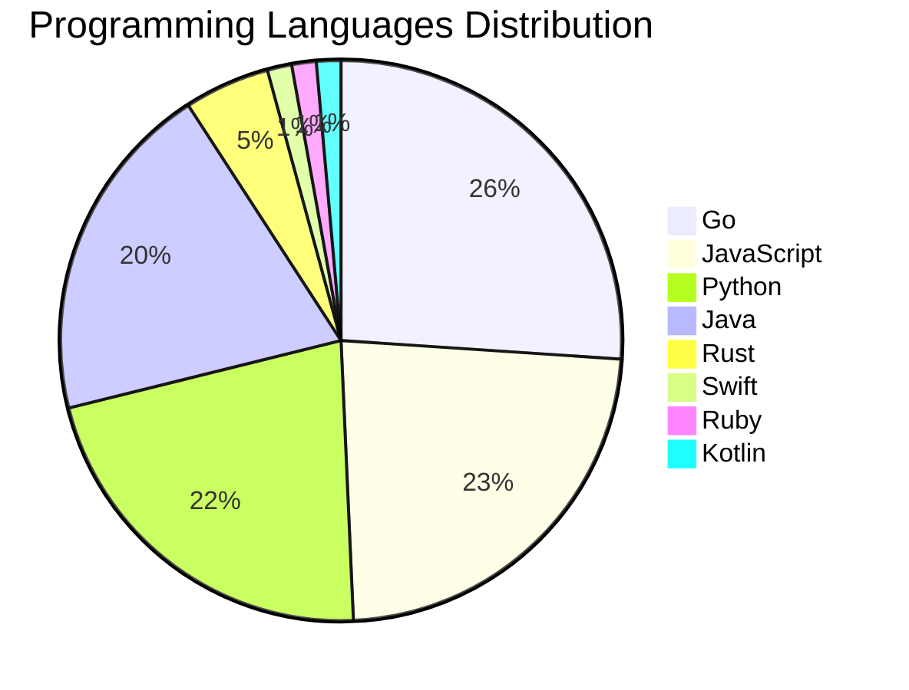

<div align="center">

# 📰 DevTech Auto News

**Your always-fresh digest of developer & AI tech news — curated automatically, around the clock.**


Aggregating [Dev.to](https://dev.to) · [Hacker News](https://news.ycombinator.com) · [GitHub Trending](https://github.com/trending) · [Lobste.rs](https://lobste.rs) · [Stack Overflow](https://stackoverflow.com) · [TechCrunch](https://techcrunch.com) · [freeCodeCamp](https://www.freecodecamp.org/news) — refreshed by GitHub Actions around the clock.

**[📰 Headlines](#-latest-headlines) · [💡 Interview Prep](#-interview-question-of-the-hour) · [📊 Statistics](#-statistics) · [⚙️ How It Works](#%EF%B8%8F-how-it-works)**

</div>

---

## 📰 Latest Headlines

> 🕐 Edition of **2026-10-19 3:00 CAT** — refreshed automatically, all day, every day.

### ✨ Featured Stories

<table>
<tr>
  <td align="center" width="33%">
    <a href="https://dev.to/georgekobaidze/promise-delivered-welcome-to-the-dev-hall-of-fame-65-authors-65-masterpieces-15fa">
      
      <br/>
      <b>Promise Delivered: Welcome to the DEV Hall of Fame...</b>
    </a>
    <br/>
    <sub>Dev.to</sub>
  </td>
  <td align="center" width="33%">
    <a href="https://dev.to/devengers/dev-opportunity-radar-21-500k-y-combinator-funding-bolt-builders-week-and-ai-safety-research-12b8">
      
      <br/>
      <b>Dev Opportunity Radar #21: $500K Y Combinator Fund...</b>
    </a>
    <br/>
    <sub>Dev.to</sub>
  </td>
  <td align="center" width="33%">
    <a href="https://dev.to/gde/ai-in-practice-upgrading-from-gemini-3536-to-gemini-4-argon-migration-notes-and-pitfalls-for-hli">
      
      <br/>
      <b>[AI in Practice] Upgrading from Gemini 3.5/3.6 to ...</b>
    </a>
    <br/>
    <sub>Dev.to</sub>
  </td>
</tr>
<tr>
  <td align="center" width="33%">
    <a href="https://dev.to/gde/building-ora-tui-with-google-antigravity-gemini-4-argon-an-ms-dos-retro-tui-opentelemetry-4d02">
      
      <br/>
      <b>Building ora-tui with Google Antigravity & Gemini ...</b>
    </a>
    <br/>
    <sub>Dev.to</sub>
  </td>
  <td align="center" width="33%">
    <a href="https://dev.to/gde/duckless-serverless-duckdb-on-google-cloud-in-your-own-project-4o5a">
      
      <br/>
      <b>DuckLess: serverless DuckDB on Google Cloud, in yo...</b>
    </a>
    <br/>
    <sub>Dev.to</sub>
  </td>
  <td align="center" width="33%">
    <a href="https://dev.to/dailycontext/nobodys-winning-the-ai-race-yet-24h4">
      
      <br/>
      <b>Nobody’s winning the AI race yet</b>
    </a>
    <br/>
    <sub>Dev.to</sub>
  </td>
</tr>
</table>


### 🗞️ Top Stories

| # | Headline | Source |
|---|----------|--------|
| 1 | [Promise Delivered: Welcome to the DEV Hall of Fame (65 Authors, 65 Masterpieces)](https://dev.to/georgekobaidze/promise-delivered-welcome-to-the-dev-hall-of-fame-65-authors-65-masterpieces-15fa) | Dev.to |
| 2 | [Dev Opportunity Radar #21: $500K Y Combinator Funding, Bolt Builders Week, and AI Safety Research Residency](https://dev.to/devengers/dev-opportunity-radar-21-500k-y-combinator-funding-bolt-builders-week-and-ai-safety-research-12b8) | Dev.to |
| 3 | [[AI in Practice] Upgrading from Gemini 3.5/3.6 to Gemini 4 Argon: Migration Notes and Pitfalls for LINE Bot Developers](https://dev.to/gde/ai-in-practice-upgrading-from-gemini-3536-to-gemini-4-argon-migration-notes-and-pitfalls-for-hli) | Dev.to |
| 4 | [Building ora-tui with Google Antigravity & Gemini 4 Argon: An MS-DOS Retro TUI & OpenTelemetry Exporter for Oracle RAC, DB & SAN Multipath](https://dev.to/gde/building-ora-tui-with-google-antigravity-gemini-4-argon-an-ms-dos-retro-tui-opentelemetry-4d02) | Dev.to |
| 5 | [DuckLess: serverless DuckDB on Google Cloud, in your own project](https://dev.to/gde/duckless-serverless-duckdb-on-google-cloud-in-your-own-project-4o5a) | Dev.to |
| 6 | [Nobody’s winning the AI race yet](https://dev.to/dailycontext/nobodys-winning-the-ai-race-yet-24h4) | Dev.to |
| 7 | [Gemini 4 Under the Microscope: Red-Teaming AI Agents and Deterministic Dual-Port Remote Control Gemini 4 Architecture Banner](https://dev.to/gde/gemini-4-under-the-microscope-red-teaming-ai-agents-and-deterministic-dual-port-remote-control-4567) | Dev.to |
| 8 | [Six Months After Cloud Next ‘26: A Builder’s Tour of the Gemini Enterprise Agent Platform](https://dev.to/gde/six-months-after-cloud-next-26-a-builders-tour-of-the-gemini-enterprise-agent-platform-3hib) | Dev.to |
| 9 | [AlphaEvolve and Gemini: Autonomous Algorithm Discovery for Unified Disaster Prediction](https://dev.to/gde/alphaevolve-and-gemini-autonomous-algorithm-discovery-for-unified-disaster-prediction-20f4) | Dev.to |
| 10 | [What was your win this week?!](https://dev.to/devteam/what-was-your-win-this-week-36am) | Dev.to |
| 11 | [Don't Assume Your Cloud T4 Runs at Spec: Gemma 4 Decode Falls 7% as the Card Warms](https://dev.to/gde/dont-assume-your-cloud-t4-runs-at-spec-gemma-4-decode-falls-7-as-the-card-warms-3fd3) | Dev.to |
| 12 | [How I Feel about the Grace Hopper Celebration Getting Cancelled](https://dev.to/jess/how-i-feel-about-the-grace-hopper-celebration-getting-cancelled-3l2k) | Dev.to |
| 13 | [Your Financial Agent Passed Every Eval. Can You Defend Its Decision?](https://dev.to/dailycontext/your-financial-agent-passed-every-eval-can-you-defend-its-decision-1npg) | Dev.to |
| 14 | [A World Worth Understanding](https://dev.to/dailycontext/a-world-worth-understanding-f08) | Dev.to |
| 15 | [Why Smaller AI Models Can Win in the Enterprise](https://dev.to/dailycontext/why-smaller-ai-models-can-win-in-the-enterprise-1m57) | Dev.to |
| 16 | [Q&A with Al Chen, Software Engineering Leader at Cisco](https://dev.to/dailycontext/qa-with-al-chen-software-engineering-leader-at-cisco-jj7) | Dev.to |
| 17 | [💅 Keyboard Makeover](https://dev.to/annavi11arrea1/keyboard-makeover-i6a) | Dev.to |
| 18 | [Do Drafters Work on Small Models? Gemma 4 E2B and E4B on Two Small GPUs](https://dev.to/gde/do-drafters-work-on-small-models-gemma-4-e2b-and-e4b-on-two-small-gpus-1b4g) | Dev.to |
| 19 | [🌑 Blue October](https://dev.to/annavi11arrea1/blue-october-1jia) | Dev.to |
| 20 | [Small Apache-2.0 Models Against Gemma 4 E2B on One TPU v5e: Which Ones Keep Up?](https://dev.to/gde/small-apache-20-models-against-gemma-4-e2b-on-one-tpu-v5e-which-ones-keep-up-mm4) | Dev.to |

<sub>Last fetched: Mon, 19 Oct 2026 03:52:05 CAT</sub>


---

## 💡 Interview Question of the Hour

> Sharpen your skills — new questions selected on every update. Try answering before opening the hint!

**1. `Java` — What is the difference between abstract class and interface?**

&nbsp;&nbsp;&nbsp;&nbsp;🎯 Easy · 🏷 OOP, design

<details>
<summary>&nbsp;&nbsp;&nbsp;&nbsp;💡 Show hint</summary>

> Multiple inheritance, method implementation, use cases

</details>

**2. `SystemDesign` — Design a URL shortening service like bit.ly**

&nbsp;&nbsp;&nbsp;&nbsp;🎯 Medium · 🏷 system design, scalability

<details>
<summary>&nbsp;&nbsp;&nbsp;&nbsp;💡 Show hint</summary>

> Hash function, database design, caching, analytics

</details>

**3. `Database` — Explain database indexing and when to use it**

&nbsp;&nbsp;&nbsp;&nbsp;🎯 Medium · 🏷 optimization, performance

<details>
<summary>&nbsp;&nbsp;&nbsp;&nbsp;💡 Show hint</summary>

> B-tree, trade-offs, query performance

</details>


---

## 📊 Statistics

#### 🗂 Articles by Category

| Category | Articles | Share | |
|----------|---------:|------:|---|
| **AI** | 89 | 48.6% | `████████████████████` |
| **Tools** | 39 | 21.3% | `█████████░░░░░░░░░░░` |
| **JavaScript** | 33 | 18.0% | `███████░░░░░░░░░░░░░` |
| **Python** | 31 | 16.9% | `███████░░░░░░░░░░░░░` |
| **Security** | 19 | 10.4% | `████░░░░░░░░░░░░░░░░` |
| **DevOps** | 13 | 7.1% | `███░░░░░░░░░░░░░░░░░` |
| **Cloud** | 10 | 5.5% | `██░░░░░░░░░░░░░░░░░░` |
| **WebDev** | 7 | 3.8% | `██░░░░░░░░░░░░░░░░░░` |
| **Database** | 7 | 3.8% | `██░░░░░░░░░░░░░░░░░░` |
| **Mobile** | 5 | 2.7% | `█░░░░░░░░░░░░░░░░░░░` |

<sub>Articles can match more than one category, so shares may sum to over 100%.</sub>


#### 📡 Articles by Source

| Source | Articles |
|--------|---------:|
| Dev.to | 59 |
| HackerNews | 49 |
| GitHub | 25 |
| Lobste.rs | 10 |
| StackOverflow | 20 |
| TechCrunch | 10 |
| freeCodeCamp | 10 |


#### 💻 Programming Language Trends

```
Go              ██████████████████████████████ 26.1%
JavaScript      ███████████████████████████ 23.2%
Python          █████████████████████████ 21.8%
Java            ███████████████████████ 19.7%
Rust            ██████ 4.9%
Swift           ██ 1.4%
Ruby            ██ 1.4%
Kotlin          ██ 1.4%

```


```mermaid
pie title Programming Languages Distribution
    "Go" : 37
    "JavaScript" : 33
    "Python" : 31
    "Java" : 28
    "Rust" : 7
    "Swift" : 2
    "Ruby" : 2
    "Kotlin" : 2
```


#### 🏷 Trending Topics

            


---

## ⚙️ How It Works

This repository is a fully automated news pipeline. On every run, GitHub Actions:

1. **Fetches** the latest articles from seven sources: Dev.to, Hacker News, GitHub Trending, Lobste.rs, Stack Overflow, TechCrunch, and freeCodeCamp
2. **Deduplicates and categorizes** them across 10+ topics using keyword matching
3. **Extracts cover images** and computes language & category statistics
4. **Rebuilds this README** and appends everything to the [full archive](./data/news_log.md)
5. **Commits and pushes** the result — no human intervention needed

<details>
<summary><b>🚀 Run it yourself</b></summary>

```bash
git clone https://github.com/Derrick-MUGISHA/github-activity-bot.git
cd github-activity-bot
npm install
npm start
```

Fork the repo, enable GitHub Actions, and you have your own self-updating news feed.

</details>

<details>
<summary><b>📚 Data & resources</b></summary>

- [Full news archive](./data/news_log.md) — complete history of every fetched article
- [Statistics](./data/stats.json) — raw stats data (JSON)
- [Categorized articles](./data/categorized.json) — articles grouped by topic
- [Interview question bank](./data/interview_questions.json) — the full question set

</details>

---

## 🤝 Contributing

Ideas for new sources, categories, or interview questions are welcome — [open an issue](https://github.com/Derrick-MUGISHA/github-activity-bot/issues/new) or submit a pull request.

## 📄 License

Released under the [MIT License](https://opensource.org/licenses/MIT) — free to use, fork, and modify.

---

<div align="center">
  <sub>🤖 Last automated update: <b>Mon, 19 Oct 2026 01:52:05 GMT</b></sub><br/>
  <sub>Powered by GitHub Actions · Built with ❤️ by <a href="https://github.com/Derrick-MUGISHA">Derrick MUGISHA</a></sub>
</div>
