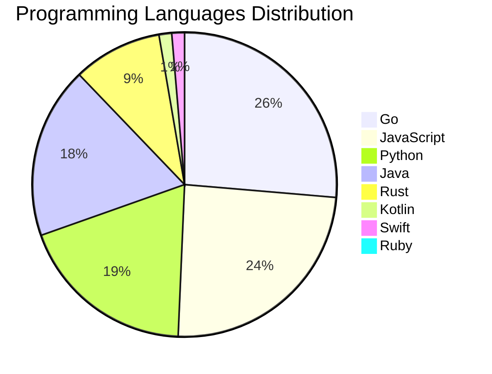

<div align="center">

# 📰 DevTech Auto News

**Your always-fresh digest of developer & AI tech news — curated automatically, around the clock.**


Aggregating [Dev.to](https://dev.to) · [Hacker News](https://news.ycombinator.com) · [GitHub Trending](https://github.com/trending) · [Lobste.rs](https://lobste.rs) · [Stack Overflow](https://stackoverflow.com) · [TechCrunch](https://techcrunch.com) · [freeCodeCamp](https://www.freecodecamp.org/news) — refreshed by GitHub Actions around the clock.

**[📰 Headlines](#-latest-headlines) · [💡 Interview Prep](#-interview-question-of-the-hour) · [📊 Statistics](#-statistics) · [⚙️ How It Works](#%EF%B8%8F-how-it-works)**

</div>

---

## 📰 Latest Headlines

> 🕐 Edition of **2026-11-09 8:00 CAT** — refreshed automatically, all day, every day.

### ✨ Featured Stories

<table>
<tr>
  <td align="center" width="33%">
    <a href="https://dev.to/devteam/congrats-to-the-kaggle-benchmarking-challenge-winners-2moh">
      
      <br/>
      <b>Congrats to the Kaggle Benchmarking Challenge Winn...</b>
    </a>
    <br/>
    <sub>Dev.to</sub>
  </td>
  <td align="center" width="33%">
    <a href="https://dev.to/gde/mobile-data-on-android-17-and-a-49-kernel-google-fi-on-the-pixel-3a-4cdc">
      
      <br/>
      <b>Mobile Data on Android 17 and a 4.9 Kernel: Google...</b>
    </a>
    <br/>
    <sub>Dev.to</sub>
  </td>
  <td align="center" width="33%">
    <a href="https://dev.to/gde/six-serving-engines-one-8-gb-gpu-gemma-4-e2b-on-an-rtx-3050-ad7">
      
      <br/>
      <b>Six Serving Engines, One 8 GB GPU: Gemma 4 E2B on ...</b>
    </a>
    <br/>
    <sub>Dev.to</sub>
  </td>
</tr>
<tr>
  <td align="center" width="33%">
    <a href="https://dev.to/devteam/what-was-your-win-this-week-28dh">
      
      <br/>
      <b>What was your win this week?</b>
    </a>
    <br/>
    <sub>Dev.to</sub>
  </td>
  <td align="center" width="33%">
    <a href="https://dev.to/gde/stop-asking-llms-to-do-math-client-side-functions-in-flutter-genui-with-blocsignals-23bh">
      
      <br/>
      <b>Stop Asking LLMs to Do Math: Client-Side Functions...</b>
    </a>
    <br/>
    <sub>Dev.to</sub>
  </td>
  <td align="center" width="33%">
    <a href="https://dev.to/gde/measuring-real-world-response-latency-on-16gb-apple-silicon-for-agent-workflows-24e5">
      
      <br/>
      <b>Measuring Gemma & On-Device Latency on 16GB Apple ...</b>
    </a>
    <br/>
    <sub>Dev.to</sub>
  </td>
</tr>
</table>


### 🗞️ Top Stories

| # | Headline | Source |
|---|----------|--------|
| 1 | [Congrats to the Kaggle Benchmarking Challenge Winners!](https://dev.to/devteam/congrats-to-the-kaggle-benchmarking-challenge-winners-2moh) | Dev.to |
| 2 | [Mobile Data on Android 17 and a 4.9 Kernel: Google Fi on the Pixel 3a](https://dev.to/gde/mobile-data-on-android-17-and-a-49-kernel-google-fi-on-the-pixel-3a-4cdc) | Dev.to |
| 3 | [Six Serving Engines, One 8 GB GPU: Gemma 4 E2B on an RTX 3050](https://dev.to/gde/six-serving-engines-one-8-gb-gpu-gemma-4-e2b-on-an-rtx-3050-ad7) | Dev.to |
| 4 | [What was your win this week?](https://dev.to/devteam/what-was-your-win-this-week-28dh) | Dev.to |
| 5 | [Stop Asking LLMs to Do Math: Client-Side Functions in Flutter GenUI with bloc_signals](https://dev.to/gde/stop-asking-llms-to-do-math-client-side-functions-in-flutter-genui-with-blocsignals-23bh) | Dev.to |
| 6 | [Measuring Gemma & On-Device Latency on 16GB Apple Silicon for Agent Workflows](https://dev.to/gde/measuring-real-world-response-latency-on-16gb-apple-silicon-for-agent-workflows-24e5) | Dev.to |
| 7 | [Building RailPulse AI: Deploying an Open-Source Railway Dispatch Agent with Gemma and Google Cloud Run](https://dev.to/gde/building-railpulse-ai-deploying-an-open-source-railway-dispatch-agent-with-gemma-and-google-cloud-2b9g) | Dev.to |
| 8 | [Prompt Pad: What Are Open-Weight Models?](https://blog.mlh.com/prompt-pad-what-are-open-weight-models-1ghh) | Dev.to |
| 9 | [Leveling the Playing Field: Building a 100% Offline Kubernetes Docs RAG Exam Assistant with Web AI, Gemma 4, and WebGPU](https://dev.to/gde/leveling-the-playing-field-building-a-100-offline-kubernetes-docs-rag-exam-assistant-with-web-ai-53bi) | Dev.to |
| 10 | [How I Made a Voice Clone in Minutes, Using Google Antigravity, Gemini 3.8 Flash TTS and My Harness](https://dev.to/gde/how-i-made-a-voice-clone-in-minutes-using-google-antigravity-gemini-38-flash-tts-and-my-harness-10j3) | Dev.to |
| 11 | [Stop Passive AI Rewrites: Agentic Coaching in Google Docs with gdocumentor](https://dev.to/gde/stop-passive-ai-rewrites-agentic-coaching-in-google-docs-with-gdocumentor-2448) | Dev.to |
| 12 | [What I Learned Managing a Full Project with Antigravity](https://dev.to/gde/what-i-learned-managing-a-full-project-with-antigravity-1ppc) | Dev.to |
| 13 | [Thank you to everyone who pointed out the phishing posts we got yesterday. We're working on improved mechanisms to automatically reject those types of attacks.](https://dev.to/ben/thank-you-to-everyone-who-pointed-out-the-phishing-posts-we-got-yesterday-were-working-on-1h9b) | Dev.to |
| 14 | [Containing the Autonomous Mind: Sub-Second Zero-Trust Execution with GKE Agent Sandbox](https://dev.to/gde/containing-the-autonomous-mind-sub-second-zero-trust-execution-with-gke-agent-sandbox-5e6b) | Dev.to |
| 15 | [Prompt Pad: Show Your AI How to Respond with Few-Shot Examples](https://blog.mlh.com/prompt-pad-show-your-ai-how-to-respond-with-few-shot-examples-2869) | Dev.to |
| 16 | [Who is building solutions with documents?](https://dev.to/missamarakay/who-is-building-solutions-for-documents-4d58) | Dev.to |
| 17 | [Find the production agent failures that every health check misses](https://dev.to/googlecloud/find-the-production-agent-failures-that-every-health-check-misses-39j8) | Dev.to |
| 18 | [Being, Doing, Having: Why 50 Years of Senior Craft Lives in Context, Not Code](https://dev.to/gde/being-doing-having-why-50-years-of-senior-craft-lives-in-context-not-code-29dl) | Dev.to |
| 19 | [One Word, Two GPUs: Why Gemma 4 Answers the Same Question Differently on a Laptop and a Tesla T4](https://dev.to/gde/one-word-two-gpus-why-gemma-4-answers-the-same-question-differently-on-a-laptop-and-a-tesla-t4-1dj2) | Dev.to |
| 20 | [Prompt Pad: Lock Your AI's Output Schema in Google AI Studio](https://blog.mlh.com/prompt-pad-lock-your-ais-output-schema-in-google-ai-studio-53io) | Dev.to |

<sub>Last fetched: Mon, 09 Nov 2026 08:14:02 CAT</sub>


---

## 💡 Interview Question of the Hour

> Sharpen your skills — new questions selected on every update. Try answering before opening the hint!

**1. `NodeJS` — Explain middleware in Express.js**

&nbsp;&nbsp;&nbsp;&nbsp;🎯 Easy · 🏷 express, architecture

<details>
<summary>&nbsp;&nbsp;&nbsp;&nbsp;💡 Show hint</summary>

> Request/response cycle, next(), chain of functions

</details>

**2. `React` — Implement a custom hook for fetching data**

&nbsp;&nbsp;&nbsp;&nbsp;🎯 Medium · 🏷 hooks, async

<details>
<summary>&nbsp;&nbsp;&nbsp;&nbsp;💡 Show hint</summary>

> useState, useEffect, loading states, error handling

</details>

**3. `SystemDesign` — Design Twitter's timeline feature**

&nbsp;&nbsp;&nbsp;&nbsp;🎯 Hard · 🏷 system design, scalability

<details>
<summary>&nbsp;&nbsp;&nbsp;&nbsp;💡 Show hint</summary>

> Fan-out, caching, ranking, real-time updates

</details>


---

## 📊 Statistics

#### 🗂 Articles by Category

| Category | Articles | Share | |
|----------|---------:|------:|---|
| **AI** | 75 | 40.8% | `████████████████████` |
| **Tools** | 38 | 20.7% | `██████████░░░░░░░░░░` |
| **JavaScript** | 36 | 19.6% | `██████████░░░░░░░░░░` |
| **Python** | 29 | 15.8% | `████████░░░░░░░░░░░░` |
| **Security** | 18 | 9.8% | `█████░░░░░░░░░░░░░░░` |
| **DevOps** | 17 | 9.2% | `█████░░░░░░░░░░░░░░░` |
| **Cloud** | 14 | 7.6% | `████░░░░░░░░░░░░░░░░` |
| **WebDev** | 11 | 6.0% | `███░░░░░░░░░░░░░░░░░` |
| **Mobile** | 7 | 3.8% | `██░░░░░░░░░░░░░░░░░░` |
| **Database** | 4 | 2.2% | `█░░░░░░░░░░░░░░░░░░░` |

<sub>Articles can match more than one category, so shares may sum to over 100%.</sub>


#### 📡 Articles by Source

| Source | Articles |
|--------|---------:|
| Dev.to | 60 |
| HackerNews | 49 |
| GitHub | 25 |
| Lobste.rs | 10 |
| StackOverflow | 20 |
| TechCrunch | 10 |
| freeCodeCamp | 10 |


#### 💻 Programming Language Trends

```
Go              ██████████████████████████████ 26.2%
JavaScript      ████████████████████████████ 24.2%
Python          ██████████████████████ 18.8%
Java            █████████████████████ 18.1%
Rust            ███████████ 9.4%
Kotlin          █ 1.3%
Swift           █ 1.3%
Ruby            █ 0.7%

```


```mermaid
pie title Programming Languages Distribution
    "Go" : 39
    "JavaScript" : 36
    "Python" : 28
    "Java" : 27
    "Rust" : 14
    "Kotlin" : 2
    "Swift" : 2
    "Ruby" : 1
```


#### 🏷 Trending Topics

            


---

## ⚙️ How It Works

This repository is a fully automated news pipeline. On every run, GitHub Actions:

1. **Fetches** the latest articles from seven sources: Dev.to, Hacker News, GitHub Trending, Lobste.rs, Stack Overflow, TechCrunch, and freeCodeCamp
2. **Deduplicates and categorizes** them across 10+ topics using keyword matching
3. **Extracts cover images** and computes language & category statistics
4. **Rebuilds this README** and appends everything to the [full archive](./data/news_log.md)
5. **Commits and pushes** the result — no human intervention needed

<details>
<summary><b>🚀 Run it yourself</b></summary>

```bash
git clone https://github.com/Derrick-MUGISHA/github-activity-bot.git
cd github-activity-bot
npm install
npm start
```

Fork the repo, enable GitHub Actions, and you have your own self-updating news feed.

</details>

<details>
<summary><b>📚 Data & resources</b></summary>

- [Full news archive](./data/news_log.md) — complete history of every fetched article
- [Statistics](./data/stats.json) — raw stats data (JSON)
- [Categorized articles](./data/categorized.json) — articles grouped by topic
- [Interview question bank](./data/interview_questions.json) — the full question set

</details>

---

## 🤝 Contributing

Ideas for new sources, categories, or interview questions are welcome — [open an issue](https://github.com/Derrick-MUGISHA/github-activity-bot/issues/new) or submit a pull request.

## 📄 License

Released under the [MIT License](https://opensource.org/licenses/MIT) — free to use, fork, and modify.

---

<div align="center">
  <sub>🤖 Last automated update: <b>Mon, 09 Nov 2026 06:14:02 GMT</b></sub><br/>
  <sub>Powered by GitHub Actions · Built with ❤️ by <a href="https://github.com/Derrick-MUGISHA">Derrick MUGISHA</a></sub>
</div>
