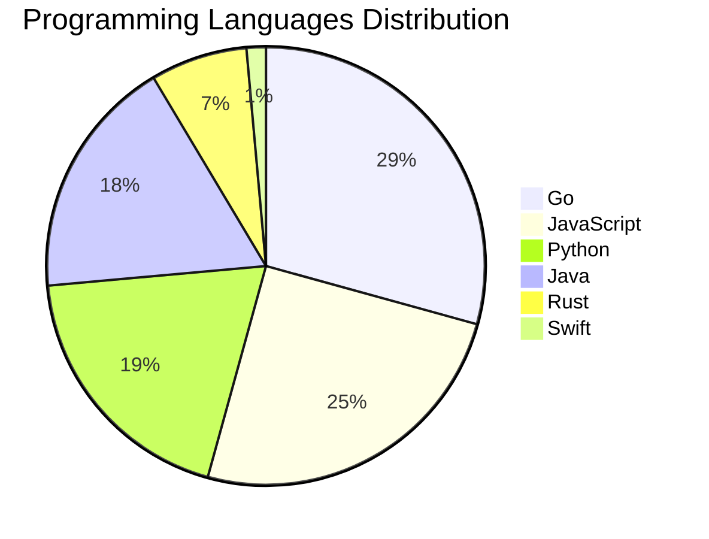

<div align="center">

# 📰 DevTech Auto News

**Your always-fresh digest of developer & AI tech news — curated automatically, around the clock.**


Aggregating [Dev.to](https://dev.to) · [Hacker News](https://news.ycombinator.com) · [GitHub Trending](https://github.com/trending) · [Lobste.rs](https://lobste.rs) · [Stack Overflow](https://stackoverflow.com) · [TechCrunch](https://techcrunch.com) · [freeCodeCamp](https://www.freecodecamp.org/news) — refreshed by GitHub Actions around the clock.

**[📰 Headlines](#-latest-headlines) · [💡 Interview Prep](#-interview-question-of-the-hour) · [📊 Statistics](#-statistics) · [⚙️ How It Works](#%EF%B8%8F-how-it-works)**

</div>

---

## 📰 Latest Headlines

> 🕐 Edition of **2026-11-03 23:00 CAT** — refreshed automatically, all day, every day.

### ✨ Featured Stories

<table>
<tr>
  <td align="center" width="33%">
    <a href="https://dev.to/maame-codes/lets-see-where-you-code-147">
      
      <br/>
      <b>Let's see where you code!</b>
    </a>
    <br/>
    <sub>Dev.to</sub>
  </td>
  <td align="center" width="33%">
    <a href="https://dev.to/devteam/top-7-featured-dev-posts-of-the-week-cio">
      
      <br/>
      <b>Top 7 Featured DEV Posts of the Week</b>
    </a>
    <br/>
    <sub>Dev.to</sub>
  </td>
  <td align="center" width="33%">
    <a href="https://blog.mlh.com/prompt-pad-lock-your-ais-output-schema-in-google-ai-studio-53io">
      
      <br/>
      <b>Prompt Pad: Lock Your AI's Output Schema in Google...</b>
    </a>
    <br/>
    <sub>Dev.to</sub>
  </td>
</tr>
<tr>
  <td align="center" width="33%">
    <a href="https://dev.to/gde/gemma-4-in-rust-on-torchtpu-a-native-tpu-rig-with-pyo3-and-mcp-47j1">
      
      <br/>
      <b>Gemma 4 in Rust on TorchTPU: A Native TPU Rig With...</b>
    </a>
    <br/>
    <sub>Dev.to</sub>
  </td>
  <td align="center" width="33%">
    <a href="https://blog.mlh.com/prompt-pad-frame-your-persona-for-better-ai-answers-eg3">
      
      <br/>
      <b>Prompt Pad: Frame Your Persona for Better AI Answe...</b>
    </a>
    <br/>
    <sub>Dev.to</sub>
  </td>
  <td align="center" width="33%">
    <a href="https://dev.to/pengeszikra/singularity-news-ccg-5ejk">
      
      <br/>
      <b>Singularity News :: CCG</b>
    </a>
    <br/>
    <sub>Dev.to</sub>
  </td>
</tr>
</table>


### 🗞️ Top Stories

| # | Headline | Source |
|---|----------|--------|
| 1 | [Let's see where you code!](https://dev.to/maame-codes/lets-see-where-you-code-147) | Dev.to |
| 2 | [Top 7 Featured DEV Posts of the Week](https://dev.to/devteam/top-7-featured-dev-posts-of-the-week-cio) | Dev.to |
| 3 | [Prompt Pad: Lock Your AI's Output Schema in Google AI Studio](https://blog.mlh.com/prompt-pad-lock-your-ais-output-schema-in-google-ai-studio-53io) | Dev.to |
| 4 | [Gemma 4 in Rust on TorchTPU: A Native TPU Rig With PyO3 and MCP](https://dev.to/gde/gemma-4-in-rust-on-torchtpu-a-native-tpu-rig-with-pyo3-and-mcp-47j1) | Dev.to |
| 5 | [Prompt Pad: Frame Your Persona for Better AI Answers](https://blog.mlh.com/prompt-pad-frame-your-persona-for-better-ai-answers-eg3) | Dev.to |
| 6 | [Singularity News :: CCG](https://dev.to/pengeszikra/singularity-news-ccg-5ejk) | Dev.to |
| 7 | [Gemma 4 in Rust on TorchTPU: Hands On With Colab](https://dev.to/gde/gemma-4-in-rust-on-torchtpu-hands-on-with-colab-44hi) | Dev.to |
| 8 | [Your DEV posts have a beautiful new share card ✨](https://dev.to/devteam/your-dev-posts-have-a-beautiful-new-share-card-4be8) | Dev.to |
| 9 | [[Agent Platform in Action (7)] When ADK Go Graph Workflow Meets Google Research Harness (Part 1): Two-Layer Recursive Agent Fram](https://dev.to/gde/agent-platform-in-action-7-when-adk-go-graph-workflow-meets-google-research-harness-part-1-28c1) | Dev.to |
| 10 | [Profile Sprawl: Solving a Problem You Didn't Know You Had](https://dev.to/gde/profile-sprawl-solving-a-problem-you-didnt-know-you-had-19k5) | Dev.to |
| 11 | [From `main.js` Leaks to Hidden Tailwind CSS v4 Bloat — How I Built `angular-bundle-guard` with Antigravity `/learn` [GDE]](https://dev.to/gde/from-mainjs-leaks-to-hidden-tailwind-css-v4-bloat-how-i-built-angular-bundle-guard-with-geg) | Dev.to |
| 12 | [Securing an Angular Firebase AI App with Email/Password Authentication (Part 1: Emulator, AuthService, and Route Guard) [GDE]](https://dev.to/gde/securing-an-angular-firebase-ai-app-with-emailpassword-authentication-part-1-emulator-4jm) | Dev.to |
| 13 | [All That Glisters Is Softmax: Shiny-Object Interns, Airplane-Magazine Execs, and Why AI Labs Can Only Bake In Half the Scars](https://dev.to/gde/all-that-glisters-is-softmax-shiny-object-interns-airplane-magazine-execs-and-why-ai-labs-can-18af) | Dev.to |
| 14 | [What was your win this week?](https://dev.to/devteam/what-was-your-win-this-week-47ci) | Dev.to |
| 15 | [RackDoc DCIM v1.1: Background Multi-Protocol Heartbeat, 48-Port CAD Geometry, NOC Kiosk Mode & Decoupled Remote Connect](https://dev.to/gde/rackdoc-dcim-v11-background-multi-protocol-heartbeat-48-port-cad-geometry-noc-kiosk-mode--2j7k) | Dev.to |
| 16 | [Giving AI Pain: The Architecture of Synthetic Scars & The Rapid-Regret Miner](https://dev.to/gde/giving-ai-pain-the-architecture-of-synthetic-scars-the-rapid-regret-miner-1740) | Dev.to |
| 17 | [Don't Be a Proxy Between Me and Your AI](https://dev.to/adamthedeveloper/dont-be-a-proxy-between-me-and-your-ai-mcn) | Dev.to |
| 18 | [Promise Delivered: Welcome to the DEV Hall of Fame (65 Authors, 65 Masterpieces)](https://dev.to/georgekobaidze/promise-delivered-welcome-to-the-dev-hall-of-fame-65-authors-65-masterpieces-15fa) | Dev.to |
| 19 | [Agent Skills Drift: A Feedback Loop for Keeping One True](https://dev.to/gde/agent-skills-drift-a-feedback-loop-for-keeping-one-true-2il7) | Dev.to |
| 20 | [Natural Languages Have Design Trade-offs Too: Georgian Is Dynamically Typed, English Is Statically Typed](https://dev.to/georgekobaidze/natural-languages-have-design-trade-offs-too-georgian-is-dynamically-typed-english-is-statically-emi) | Dev.to |

<sub>Last fetched: Tue, 03 Nov 2026 23:59:08 CAT</sub>


---

## 💡 Interview Question of the Hour

> Sharpen your skills — new questions selected on every update. Try answering before opening the hint!

**1. `NodeJS` — Explain middleware in Express.js**

&nbsp;&nbsp;&nbsp;&nbsp;🎯 Easy · 🏷 express, architecture

<details>
<summary>&nbsp;&nbsp;&nbsp;&nbsp;💡 Show hint</summary>

> Request/response cycle, next(), chain of functions

</details>

**2. `Database` — Design a database schema for a social media platform**

&nbsp;&nbsp;&nbsp;&nbsp;🎯 Hard · 🏷 design, scalability

<details>
<summary>&nbsp;&nbsp;&nbsp;&nbsp;💡 Show hint</summary>

> Users, posts, relationships, indexes, partitioning

</details>

**3. `SystemDesign` — Design Twitter's timeline feature**

&nbsp;&nbsp;&nbsp;&nbsp;🎯 Hard · 🏷 system design, scalability

<details>
<summary>&nbsp;&nbsp;&nbsp;&nbsp;💡 Show hint</summary>

> Fan-out, caching, ranking, real-time updates

</details>


---

## 📊 Statistics

#### 🗂 Articles by Category

| Category | Articles | Share | |
|----------|---------:|------:|---|
| **AI** | 77 | 42.3% | `████████████████████` |
| **Tools** | 38 | 20.9% | `██████████░░░░░░░░░░` |
| **JavaScript** | 35 | 19.2% | `█████████░░░░░░░░░░░` |
| **Python** | 28 | 15.4% | `███████░░░░░░░░░░░░░` |
| **Security** | 22 | 12.1% | `██████░░░░░░░░░░░░░░` |
| **DevOps** | 17 | 9.3% | `████░░░░░░░░░░░░░░░░` |
| **Cloud** | 14 | 7.7% | `████░░░░░░░░░░░░░░░░` |
| **WebDev** | 10 | 5.5% | `███░░░░░░░░░░░░░░░░░` |
| **Database** | 8 | 4.4% | `██░░░░░░░░░░░░░░░░░░` |
| **Mobile** | 6 | 3.3% | `██░░░░░░░░░░░░░░░░░░` |

<sub>Articles can match more than one category, so shares may sum to over 100%.</sub>


#### 📡 Articles by Source

| Source | Articles |
|--------|---------:|
| Dev.to | 59 |
| HackerNews | 49 |
| GitHub | 25 |
| Lobste.rs | 10 |
| StackOverflow | 19 |
| TechCrunch | 10 |
| freeCodeCamp | 10 |


#### 💻 Programming Language Trends

```
Go              ██████████████████████████████ 29.3%
JavaScript      ██████████████████████████ 25.0%
Python          ████████████████████ 19.3%
Java            ██████████████████ 17.9%
Rust            ███████ 7.1%
Swift           █ 1.4%

```


```mermaid
pie title Programming Languages Distribution
    "Go" : 41
    "JavaScript" : 35
    "Python" : 27
    "Java" : 25
    "Rust" : 10
    "Swift" : 2
```


#### 🏷 Trending Topics

            


---

## ⚙️ How It Works

This repository is a fully automated news pipeline. On every run, GitHub Actions:

1. **Fetches** the latest articles from seven sources: Dev.to, Hacker News, GitHub Trending, Lobste.rs, Stack Overflow, TechCrunch, and freeCodeCamp
2. **Deduplicates and categorizes** them across 10+ topics using keyword matching
3. **Extracts cover images** and computes language & category statistics
4. **Rebuilds this README** and appends everything to the [full archive](./data/news_log.md)
5. **Commits and pushes** the result — no human intervention needed

<details>
<summary><b>🚀 Run it yourself</b></summary>

```bash
git clone https://github.com/Derrick-MUGISHA/github-activity-bot.git
cd github-activity-bot
npm install
npm start
```

Fork the repo, enable GitHub Actions, and you have your own self-updating news feed.

</details>

<details>
<summary><b>📚 Data & resources</b></summary>

- [Full news archive](./data/news_log.md) — complete history of every fetched article
- [Statistics](./data/stats.json) — raw stats data (JSON)
- [Categorized articles](./data/categorized.json) — articles grouped by topic
- [Interview question bank](./data/interview_questions.json) — the full question set

</details>

---

## 🤝 Contributing

Ideas for new sources, categories, or interview questions are welcome — [open an issue](https://github.com/Derrick-MUGISHA/github-activity-bot/issues/new) or submit a pull request.

## 📄 License

Released under the [MIT License](https://opensource.org/licenses/MIT) — free to use, fork, and modify.

---

<div align="center">
  <sub>🤖 Last automated update: <b>Tue, 03 Nov 2026 21:59:08 GMT</b></sub><br/>
  <sub>Powered by GitHub Actions · Built with ❤️ by <a href="https://github.com/Derrick-MUGISHA">Derrick MUGISHA</a></sub>
</div>
