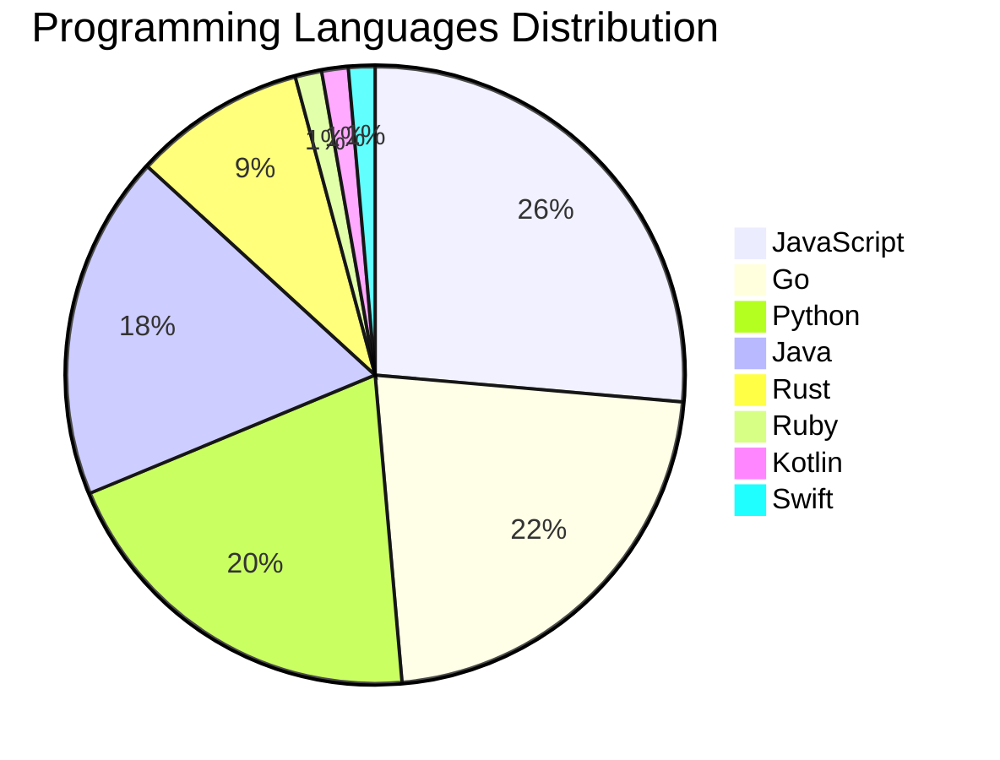

<div align="center">

# 📰 DevTech Auto News

**Your always-fresh digest of developer & AI tech news — curated automatically, around the clock.**


Aggregating [Dev.to](https://dev.to) · [Hacker News](https://news.ycombinator.com) · [GitHub Trending](https://github.com/trending) · [Lobste.rs](https://lobste.rs) · [Stack Overflow](https://stackoverflow.com) · [TechCrunch](https://techcrunch.com) · [freeCodeCamp](https://www.freecodecamp.org/news) — refreshed by GitHub Actions around the clock.

**[📰 Headlines](#-latest-headlines) · [💡 Interview Prep](#-interview-question-of-the-hour) · [📊 Statistics](#-statistics) · [⚙️ How It Works](#%EF%B8%8F-how-it-works)**

</div>

---

## 📰 Latest Headlines

> 🕐 Edition of **2026-11-12 21:00 CAT** — refreshed automatically, all day, every day.

### ✨ Featured Stories

<table>
<tr>
  <td align="center" width="33%">
    <a href="https://dev.to/ben/long-live-rails-3p21">
      
      <br/>
      <b>Long Live Rails</b>
    </a>
    <br/>
    <sub>Dev.to</sub>
  </td>
  <td align="center" width="33%">
    <a href="https://dev.to/maame-codes/how-did-you-end-up-in-tech-and-are-you-staying-4l9b">
      
      <br/>
      <b>How did you end up in tech, and are you staying?</b>
    </a>
    <br/>
    <sub>Dev.to</sub>
  </td>
  <td align="center" width="33%">
    <a href="https://dev.to/jamilxt/nvidia-says-its-roadmap-will-continue-ai-teams-should-verify-the-dependencies-3c8d">
      
      <br/>
      <b>Nvidia Says Its Roadmap Will Continue. AI Teams Sh...</b>
    </a>
    <br/>
    <sub>Dev.to</sub>
  </td>
</tr>
<tr>
  <td align="center" width="33%">
    <a href="https://dev.to/gde/what-changes-with-the-a2ui-10-release-31eo">
      
      <br/>
      <b>What Changes With the A2UI 1.0 Release</b>
    </a>
    <br/>
    <sub>Dev.to</sub>
  </td>
  <td align="center" width="33%">
    <a href="https://dev.to/dannwaneri/ai-code-is-unmaintainable-so-is-ours-3mek">
      
      <br/>
      <b>AI Code Is Unmaintainable? So Is Ours.</b>
    </a>
    <br/>
    <sub>Dev.to</sub>
  </td>
  <td align="center" width="33%">
    <a href="https://dev.to/dailycontext/your-agent-needs-a-schema-not-a-better-prompt-53bm">
      
      <br/>
      <b>Your Agent Needs a Schema, Not a Better Prompt</b>
    </a>
    <br/>
    <sub>Dev.to</sub>
  </td>
</tr>
</table>


### 🗞️ Top Stories

| # | Headline | Source |
|---|----------|--------|
| 1 | [Long Live Rails](https://dev.to/ben/long-live-rails-3p21) | Dev.to |
| 2 | [How did you end up in tech, and are you staying?](https://dev.to/maame-codes/how-did-you-end-up-in-tech-and-are-you-staying-4l9b) | Dev.to |
| 3 | [Nvidia Says Its Roadmap Will Continue. AI Teams Should Verify the Dependencies](https://dev.to/jamilxt/nvidia-says-its-roadmap-will-continue-ai-teams-should-verify-the-dependencies-3c8d) | Dev.to |
| 4 | [What Changes With the A2UI 1.0 Release](https://dev.to/gde/what-changes-with-the-a2ui-10-release-31eo) | Dev.to |
| 5 | [AI Code Is Unmaintainable? So Is Ours.](https://dev.to/dannwaneri/ai-code-is-unmaintainable-so-is-ours-3mek) | Dev.to |
| 6 | [Your Agent Needs a Schema, Not a Better Prompt](https://dev.to/dailycontext/your-agent-needs-a-schema-not-a-better-prompt-53bm) | Dev.to |
| 7 | [Ask More of Your UI](https://dev.to/dailycontext/ask-more-of-your-ui-2nf7) | Dev.to |
| 8 | [The Case for Smart Software](https://dev.to/swyx/the-case-for-smart-software-329f) | Dev.to |
| 9 | [Use your eval as a CI gate with Agents CLI](https://dev.to/googlecloud/use-your-eval-as-a-ci-gate-with-agents-cli-1ha1) | Dev.to |
| 10 | [Software Engineering Is Becoming Factory Engineering](https://dev.to/dailycontext/software-engineering-is-becoming-factory-engineering-22ll) | Dev.to |
| 11 | [Six Serving Engines on One Tesla T4: Gemma 4 E2B on a Turing GPU](https://dev.to/gde/six-serving-engines-on-one-tesla-t4-gemma-4-e2b-on-a-turing-gpu-3a6i) | Dev.to |
| 12 | [What It Actually Takes to Roll Out AI Across Netflix](https://dev.to/dailycontext/what-it-actually-takes-to-roll-out-ai-across-netflix-18h8) | Dev.to |
| 13 | [Detecting WasmPlugin version drift in Cloud Load Balancing Service Extensions](https://dev.to/googlecloud/detecting-wasmplugin-version-drift-in-cloud-load-balancing-service-extensions-52p5) | Dev.to |
| 14 | [The Fastest LLM Call Is The One You Never Make](https://dev.to/dailycontext/the-fastest-llm-call-is-the-one-you-never-make-34lo) | Dev.to |
| 15 | [Prompt Pad: What Are Open-Weight Models?](https://blog.mlh.com/prompt-pad-what-are-open-weight-models-1ghh) | Dev.to |
| 16 | [Kent C. Dodds Hasn't Looked at His Code All Year](https://dev.to/dailycontext/kent-c-dodds-hasnt-looked-at-his-code-all-year-gd5) | Dev.to |
| 17 | [What I Learned Managing a Full Project with Antigravity](https://dev.to/gde/what-i-learned-managing-a-full-project-with-antigravity-1ppc) | Dev.to |
| 18 | [Containing the Autonomous Mind: Sub-Second Zero-Trust Execution with GKE Agent Sandbox](https://dev.to/gde/containing-the-autonomous-mind-sub-second-zero-trust-execution-with-gke-agent-sandbox-5e6b) | Dev.to |
| 19 | [Vue.js Is My Workhorse. Now It's an Agent Skill.](https://dev.to/playfulprogramming/vuejs-is-my-workhorse-now-its-an-agent-skill-1pfk) | Dev.to |
| 20 | [Prompt Pad: Show Your AI How to Respond with Few-Shot Examples](https://blog.mlh.com/prompt-pad-show-your-ai-how-to-respond-with-few-shot-examples-2869) | Dev.to |

<sub>Last fetched: Thu, 12 Nov 2026 21:18:47 CAT</sub>


---

## 💡 Interview Question of the Hour

> Sharpen your skills — new questions selected on every update. Try answering before opening the hint!

**1. `Database` — Design a database schema for a social media platform**

&nbsp;&nbsp;&nbsp;&nbsp;🎯 Hard · 🏷 design, scalability

<details>
<summary>&nbsp;&nbsp;&nbsp;&nbsp;💡 Show hint</summary>

> Users, posts, relationships, indexes, partitioning

</details>

**2. `Python` — Explain GIL and its implications for multithreading**

&nbsp;&nbsp;&nbsp;&nbsp;🎯 Hard · 🏷 concurrency, performance

<details>
<summary>&nbsp;&nbsp;&nbsp;&nbsp;💡 Show hint</summary>

> Global Interpreter Lock, multiprocessing alternatives

</details>

**3. `Python` — Implement a context manager using __enter__ and __exit__**

&nbsp;&nbsp;&nbsp;&nbsp;🎯 Hard · 🏷 context managers, resource management

<details>
<summary>&nbsp;&nbsp;&nbsp;&nbsp;💡 Show hint</summary>

> with statement, setup/teardown, exception handling

</details>


---

## 📊 Statistics

#### 🗂 Articles by Category

| Category | Articles | Share | |
|----------|---------:|------:|---|
| **AI** | 82 | 44.6% | `████████████████████` |
| **Tools** | 43 | 23.4% | `██████████░░░░░░░░░░` |
| **JavaScript** | 38 | 20.7% | `█████████░░░░░░░░░░░` |
| **Python** | 30 | 16.3% | `███████░░░░░░░░░░░░░` |
| **DevOps** | 17 | 9.2% | `████░░░░░░░░░░░░░░░░` |
| **Security** | 17 | 9.2% | `████░░░░░░░░░░░░░░░░` |
| **Cloud** | 14 | 7.6% | `███░░░░░░░░░░░░░░░░░` |
| **WebDev** | 12 | 6.5% | `███░░░░░░░░░░░░░░░░░` |
| **Mobile** | 7 | 3.8% | `██░░░░░░░░░░░░░░░░░░` |
| **Database** | 2 | 1.1% | `░░░░░░░░░░░░░░░░░░░░` |

<sub>Articles can match more than one category, so shares may sum to over 100%.</sub>


#### 📡 Articles by Source

| Source | Articles |
|--------|---------:|
| Dev.to | 60 |
| HackerNews | 49 |
| GitHub | 25 |
| Lobste.rs | 10 |
| StackOverflow | 20 |
| TechCrunch | 10 |
| freeCodeCamp | 10 |


#### 💻 Programming Language Trends

```
JavaScript      ██████████████████████████████ 26.2%
Go              █████████████████████████ 22.1%
Python          ███████████████████████ 20.0%
Java            ████████████████████ 17.9%
Rust            ██████████ 9.0%
Ruby            ██ 1.4%
Kotlin          ██ 1.4%
Swift           ██ 1.4%
CSharp          █ 0.7%

```


```mermaid
pie title Programming Languages Distribution
    "JavaScript" : 38
    "Go" : 32
    "Python" : 29
    "Java" : 26
    "Rust" : 13
    "Ruby" : 2
    "Kotlin" : 2
    "Swift" : 2
```


#### 🏷 Trending Topics

            


---

## ⚙️ How It Works

This repository is a fully automated news pipeline. On every run, GitHub Actions:

1. **Fetches** the latest articles from seven sources: Dev.to, Hacker News, GitHub Trending, Lobste.rs, Stack Overflow, TechCrunch, and freeCodeCamp
2. **Deduplicates and categorizes** them across 10+ topics using keyword matching
3. **Extracts cover images** and computes language & category statistics
4. **Rebuilds this README** and appends everything to the [full archive](./data/news_log.md)
5. **Commits and pushes** the result — no human intervention needed

<details>
<summary><b>🚀 Run it yourself</b></summary>

```bash
git clone https://github.com/Derrick-MUGISHA/github-activity-bot.git
cd github-activity-bot
npm install
npm start
```

Fork the repo, enable GitHub Actions, and you have your own self-updating news feed.

</details>

<details>
<summary><b>📚 Data & resources</b></summary>

- [Full news archive](./data/news_log.md) — complete history of every fetched article
- [Statistics](./data/stats.json) — raw stats data (JSON)
- [Categorized articles](./data/categorized.json) — articles grouped by topic
- [Interview question bank](./data/interview_questions.json) — the full question set

</details>

---

## 🤝 Contributing

Ideas for new sources, categories, or interview questions are welcome — [open an issue](https://github.com/Derrick-MUGISHA/github-activity-bot/issues/new) or submit a pull request.

## 📄 License

Released under the [MIT License](https://opensource.org/licenses/MIT) — free to use, fork, and modify.

---

<div align="center">
  <sub>🤖 Last automated update: <b>Thu, 12 Nov 2026 19:18:47 GMT</b></sub><br/>
  <sub>Powered by GitHub Actions · Built with ❤️ by <a href="https://github.com/Derrick-MUGISHA">Derrick MUGISHA</a></sub>
</div>
